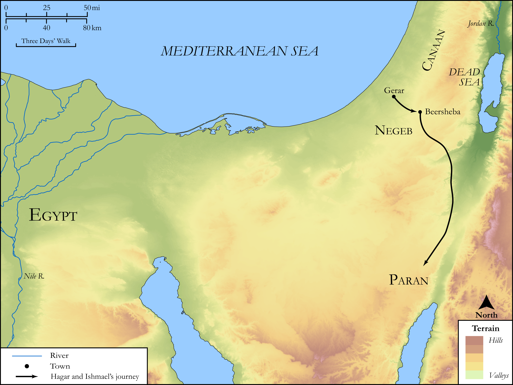

# Biblica Open Bible Maps

## License Information

Biblica Open Bible Maps, © 2023–2025 Biblica, Inc. This work is licensed under Creative Commons Attribution-ShareAlike 4.0 International (https://creativecommons.org/licenses/by-sa/4.0/). More Information: https://docs.google.com/document/d/1Pp44yZ0Zdnd59vJHTrt2rPYq0SppfX5rZbPBt6mz37U/edit?tab=t.0#heading=h.oev9aj1ksvk2

--------------------------------

## SRV Genesis: Gen. 21:1–20 (id: OT273)

### Image Content

[link](images/OT273.png)

Original: [SRV Genesis: Gen. 21:1\-20](https://drive.google.com/open?id=1c2lwd_JTvrFijxwJfJiCCTYke2jylNtG&usp=drive_copy)

* **Associated Passages:** Genesis 21:1-34

* **Associated ACAI Concepts:** Abraham (ID: `person:Abraham`); LORD (ID: `deity:Lord`); Sarah (ID: `person:Sarah`); Isaac (ID: `person:Isaac`); Abimelech (ID: `person:Abimelech`); Beersheba (ID: `place:Beersheba`); Swear (ID: `keyterm:Swear`); Hagar (ID: `person:Hagar`); Phicol (ID: `person:Phicol`); Skin-Bottle (ID: `realia:Skin-bottle`); Sheep (ID: `fauna:Lamb`); Philistines (ID: `group:Philistine`); Philistia (ID: `place:Philistine`); Egypt (ID: `place:Egypt`); Covenant (ID: `keyterm:Covenant`); Bow (ID: `realia:Bow`); Paran (ID: `place:Paran`); Flock (ID: `fauna:Flock`); Goat (ID: `fauna:Goat`); Witness (ID: `keyterm:Witness`); An Angel (ID: `deity:Angel`); Kindness (ID: `keyterm:Kindness`); Fear (ID: `keyterm:Fear`); Circumcision (ID: `keyterm:Circumcision`); Egyptians (ID: `group:Egypt`); Dispossess (ID: `keyterm:Dispossess`); Appoint (ID: `keyterm:Appoint`); Tamarisk (ID: `flora:Tamarisk`); Cattle (ID: `fauna:Bull`)
