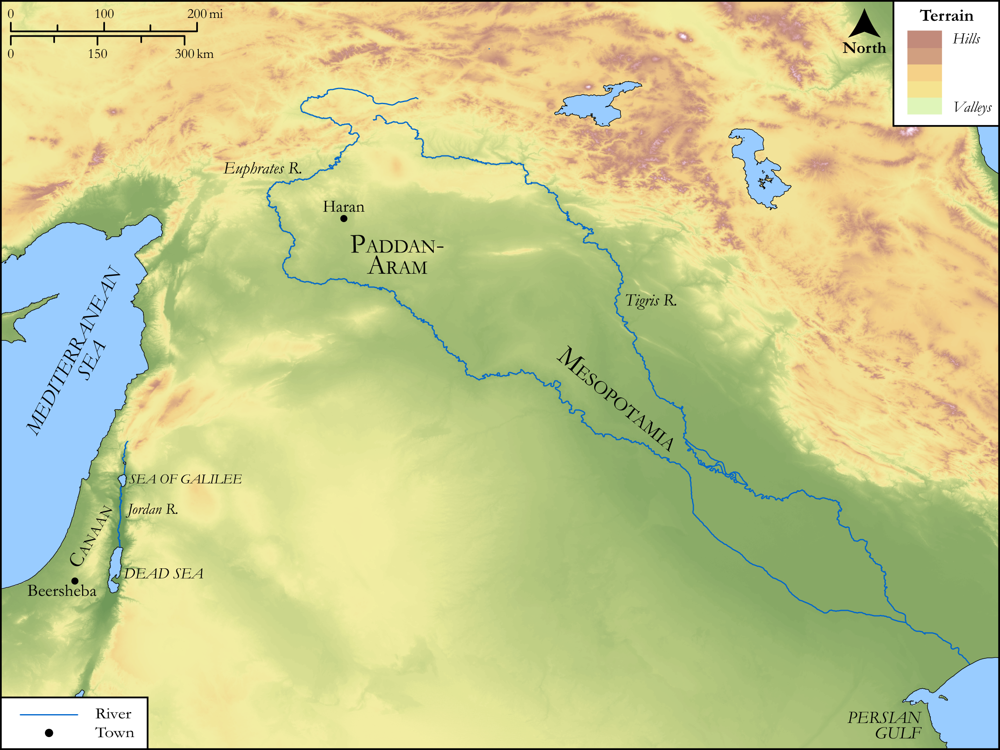

# Biblica Open Bible Maps

## License Information

Biblica Open Bible Maps, © 2023–2025 Biblica, Inc. This work is licensed under Creative Commons Attribution-ShareAlike 4.0 International (https://creativecommons.org/licenses/by-sa/4.0/). More Information: https://docs.google.com/document/d/1Pp44yZ0Zdnd59vJHTrt2rPYq0SppfX5rZbPBt6mz37U/edit?tab=t.0#heading=h.oev9aj1ksvk2

--------------------------------

## SRV Genesis: Gen. 22:20–23 (id: OT275)

### Image Content

[link](images/OT275.png)

Original: [SRV Genesis: Gen. 22:20\-23](https://drive.google.com/open?id=10maqKxMVjla_PDZJkFROyUrn_JPieofC&usp=drive_copy)

* **Associated Passages:** Genesis 22:1-24

* **Associated ACAI Concepts:** Abraham (ID: `person:Abraham`); LORD (ID: `deity:Lord`); Offering (ID: `keyterm:Offering`); Isaac (ID: `person:Isaac`); Sheep (ID: `fauna:Lamb`); Bethuel (ID: `person:Bethuel`); Bless (ID: `keyterm:Bless`); Milcah (ID: `person:Milcah`); An Angel (ID: `deity:Angel`); Nahor (ID: `person:Nahor.2`); Knife (ID: `realia:Knife`); Donkey (ID: `fauna:Donkey`); Hazo (ID: `person:Hazo`); Tahash (ID: `person:Tahash`); Reumah (ID: `person:Reumah`); Chesed (ID: `person:Chesed`); Aram (ID: `person:Aram.2`); Tebah (ID: `person:Tebah`); Pildash (ID: `person:Pildash`); Jidlaph (ID: `person:Jidlaph`); Buz (ID: `person:Buz`); Kemuel (ID: `person:Kemuel`); Gaham (ID: `person:Gaham`); Maacah (ID: `person:Maacah`); Uz (ID: `person:Uz.2`); Swear (ID: `keyterm:Swear`); Rebekah (ID: `person:Rebekah`); Beersheba (ID: `place:Beersheba`); Love (ID: `keyterm:Love`); A Person (ID: `person:GenericPerson`); Fear (ID: `keyterm:Fear`); Dispossess (ID: `keyterm:Dispossess`); Mount Moriah (ID: `place:MoriahMount`); Stone Altar (ID: `realia:StoneAltar`); Temple Altar (ID: `realia:TempleAltar`); To Saddle (ID: `realia:ToSaddle`); Tabernacle Altar (ID: `realia:TabernacleAltar`); Altar (ID: `realia:Altar`)
