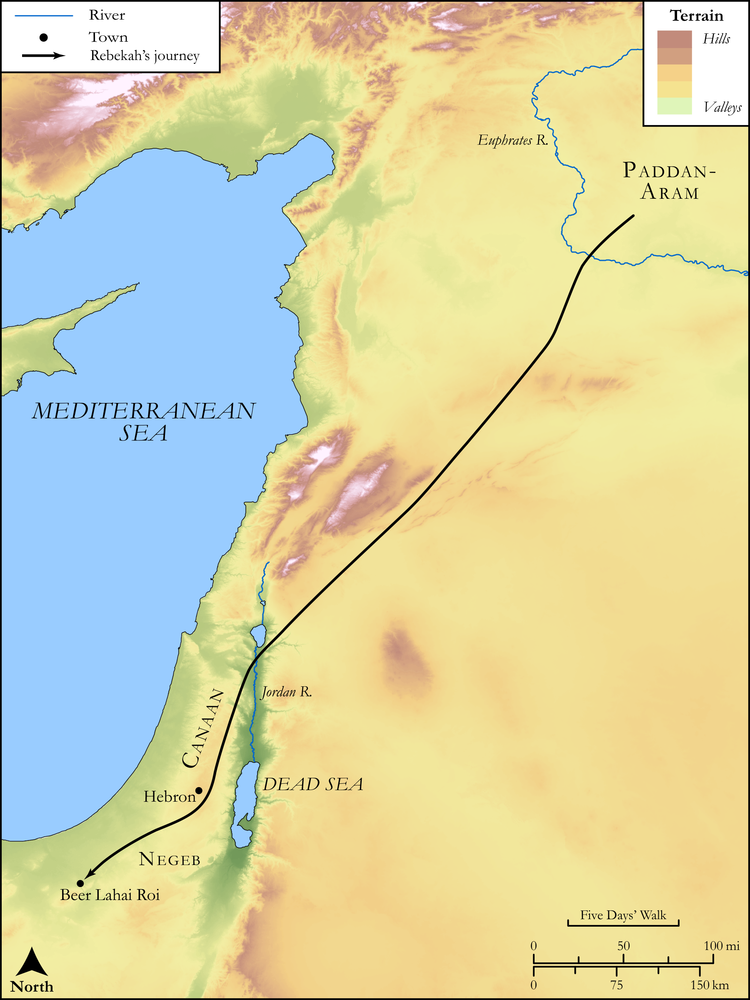

# Biblica Open Bible Maps

## License Information

Biblica Open Bible Maps, © 2023–2025 Biblica, Inc. This work is licensed under Creative Commons Attribution-ShareAlike 4.0 International (https://creativecommons.org/licenses/by-sa/4.0/). More Information: https://docs.google.com/document/d/1Pp44yZ0Zdnd59vJHTrt2rPYq0SppfX5rZbPBt6mz37U/edit?tab=t.0#heading=h.oev9aj1ksvk2

--------------------------------

## SRV Genesis: Gen. 24:62–66 (id: OT277)

### Image Content

[link](images/OT277.png)

Original: [SRV Genesis: Gen. 24:62\-66](https://drive.google.com/open?id=1XWWatGvXyUoXaZqLxTJmwVFg7nscAc59&usp=drive_copy)

* **Associated Passages:** Genesis 24:1-67

* **Associated ACAI Concepts:** LORD (ID: `deity:Lord`); Rebekah (ID: `person:Rebekah`); Abraham (ID: `person:Abraham`); Isaac (ID: `person:Isaac`); Camel (ID: `fauna:Camel`); Bless (ID: `keyterm:Bless`); Clay Jar (ID: `realia:ClayJar`); Nahor (ID: `person:Nahor.2`); Bethuel (ID: `person:Bethuel`); Swear (ID: `keyterm:Swear`); Kindness (ID: `keyterm:Kindness`); Milcah (ID: `person:Milcah`); Truth (ID: `keyterm:Truth`); House (ID: `realia:House`); Laban (ID: `person:Laban`); Oath (ID: `keyterm:Oath`); Canaan (ID: `place:Canaan`); A Servant (ID: `person:GenericServant`); Sarah (ID: `person:Sarah`); An Angel (ID: `deity:Angel`); Canaanites (ID: `group:Canaan`); Be Blameless (ID: `keyterm:Blameless`); Earring (ID: `realia:Earring`); Beer-lahai-roi (ID: `place:Beer-lahai-roi`); Negev (ID: `place:Negeb`); Mother of Rebekah (ID: `person:MotherOfRebekah`); Exempt (ID: `keyterm:Exempt`); Love (ID: `keyterm:Love`); Mesopotamia (ID: `place:Mesopotamia`); Dispossess (ID: `keyterm:Dispossess`)
