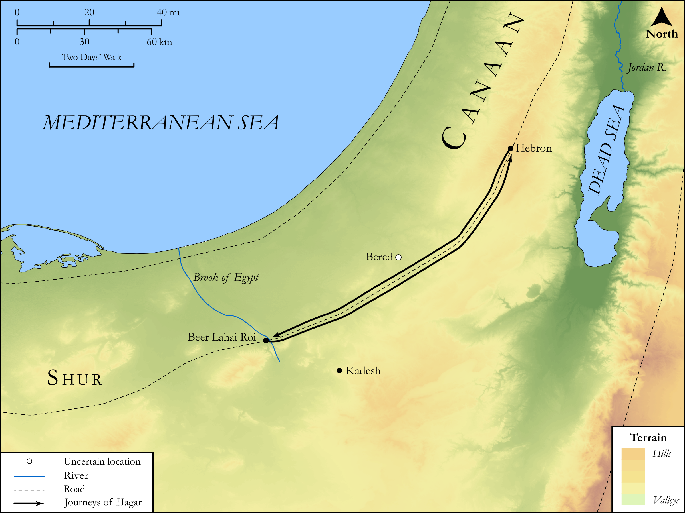

# Biblica Open Bible Maps

## License Information

Biblica Open Bible Maps, © 2023–2025 Biblica, Inc. This work is licensed under Creative Commons Attribution-ShareAlike 4.0 International (https://creativecommons.org/licenses/by-sa/4.0/). More Information: https://docs.google.com/document/d/1Pp44yZ0Zdnd59vJHTrt2rPYq0SppfX5rZbPBt6mz37U/edit?tab=t.0#heading=h.oev9aj1ksvk2

--------------------------------

## SRV Genesis: Gen. 25:1–10 (id: OT278)

### Image Content

[link](images/OT278.png)

Original: [SRV Genesis: Gen. 25:1\-10](https://drive.google.com/open?id=11zET5sV2xhfId69NV5pSwshlGkuAmA4S&usp=drive_copy)

* **Associated Passages:** Genesis 25:1-34

* **Associated ACAI Concepts:** Esau (ID: `person:Esau`); Abraham (ID: `person:Abraham`); Isaac (ID: `person:Isaac`); Israel (ID: `person:Israel`); Ishmael (ID: `person:Ishmael`); LORD (ID: `deity:Lord`); Rebekah (ID: `person:Rebekah`); Keturah (ID: `person:Keturah`); Midian (ID: `person:Midian`); Jokshan (ID: `person:Jokshan`); Egypt (ID: `place:Egypt`); Sarah (ID: `person:Sarah`); Heth (ID: `person:Heth`); Medan (ID: `person:Medan`); Stew (ID: `realia:Stew`); Ishbak (ID: `person:Ishbak`); Ephron (ID: `person:Ephron.2`); Kedemah (ID: `person:Kedemah`); Massa (ID: `person:Massa`); Leummites (ID: `group:Leummim`); Adbeel (ID: `person:Adbeel`); Machpelah (ID: `place:Machpelah`); Jetur (ID: `person:Jetur`); Paddan-aram (ID: `place:Paddan-aram`); Hadad (ID: `person:Hadad.4`); Tema (ID: `person:Tema`); Epher (ID: `person:Epher`); Havilah (ID: `place:Havilah.2`); Zimran (ID: `person:Zimran`); Mibsam (ID: `person:Mibsam`); Abida (ID: `person:Abida`); Ephah (ID: `person:Ephah`); Mishma (ID: `person:Mishma`); Beer-lahai-roi (ID: `place:Beer-lahai-roi`); Hanoch (ID: `person:Hanoch`); Nebaioth (ID: `person:Nebaioth`); Dumah (ID: `person:Dumah`); Sheba (ID: `person:Sheba.3`); Dedan (ID: `person:Dedan.2`); Kedar (ID: `person:Kedar`); Naphish (ID: `person:Naphish`); Asshurim (ID: `group:Asshurim`); Eldaah (ID: `person:Eldaah`); Zohar (ID: `person:Zohar`); Letushim (ID: `group:Letushim`); Shuah (ID: `person:Shuah`); Swear (ID: `keyterm:Swear`); Laban (ID: `person:Laban`); Bless (ID: `keyterm:Bless`); Love (ID: `keyterm:Love`); Egyptians (ID: `group:Egypt`); Arameans (ID: `group:Aramean`); Assyria (ID: `place:Assyria`); Hittites (ID: `group:Hittite`); Mamre (ID: `place:Mamre`); Force to Serve (ID: `keyterm:EnticedToServe`); Hagar (ID: `person:Hagar`); Shur (ID: `place:Shur`); Bethuel (ID: `person:Bethuel`); Lentil (ID: `flora:Lentil`); Clothing (ID: `realia:Clothing`); Tent (ID: `realia:Tent`)
