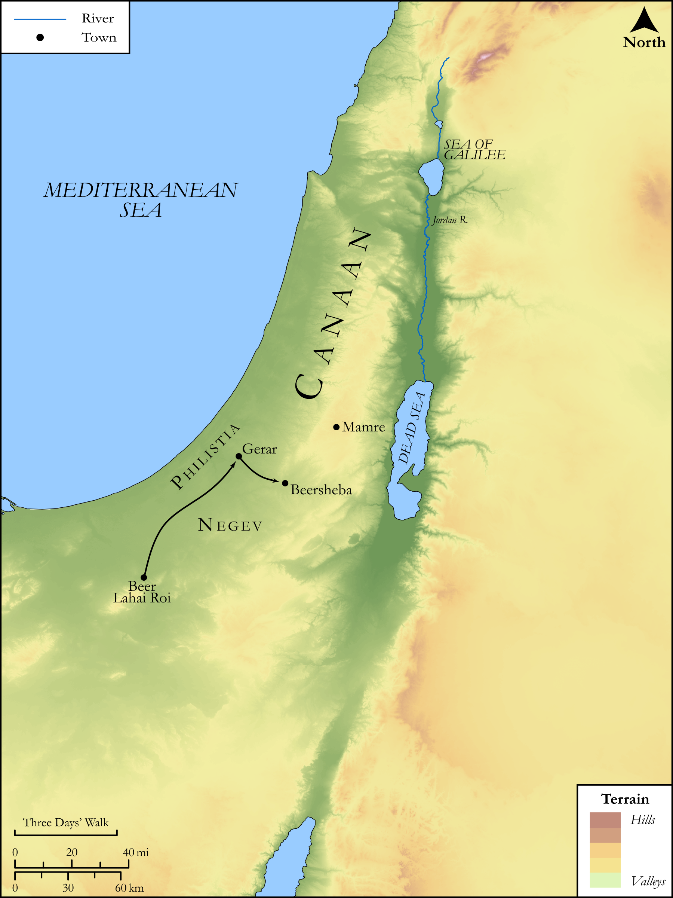

# Biblica Open Bible Maps

## License Information

Biblica Open Bible Maps, © 2023–2025 Biblica, Inc. This work is licensed under Creative Commons Attribution-ShareAlike 4.0 International (https://creativecommons.org/licenses/by-sa/4.0/). More Information: https://docs.google.com/document/d/1Pp44yZ0Zdnd59vJHTrt2rPYq0SppfX5rZbPBt6mz37U/edit?tab=t.0#heading=h.oev9aj1ksvk2

--------------------------------

## SRV Genesis: Gen. 26:1–32 (id: OT281)

### Image Content

[link](images/OT281.png)

Original: [SRV Genesis: Gen. 26:1\-32](https://drive.google.com/open?id=1UGZYOsib6uZ0yNfe47_JziMkavvDgET1&usp=drive_copy)

* **Associated Passages:** Genesis 26:1-35

* **Associated ACAI Concepts:** Isaac (ID: `person:Isaac`); LORD (ID: `deity:Lord`); Abimelech (ID: `person:Abimelech`); Abraham (ID: `person:Abraham`); Gerar (ID: `place:Gerar`); Bless (ID: `keyterm:Bless`); Philistines (ID: `group:Philistine`); Philistia (ID: `place:Philistine`); Rebekah (ID: `person:Rebekah`); Swear (ID: `keyterm:Swear`); Peace (ID: `keyterm:IntactState`); Oath (ID: `keyterm:Oath`); Fear (ID: `keyterm:Fear`); Beersheba (ID: `place:Beersheba`); Rehoboth (ID: `place:Rehoboth`); Beeri (ID: `person:Beeri`); Hittites (ID: `group:Hittite`); Ahuzzath (ID: `person:Ahuzzath`); Phicol (ID: `person:Phicol`); Esek (ID: `place:Esek`); Sitnah (ID: `place:Sitnah`); Elon (ID: `person:Elon`); Judith (ID: `person:Judith`); Flock (ID: `fauna:Flock`); Goat (ID: `fauna:Goat`); Covenant (ID: `keyterm:Covenant`); Adah (ID: `person:Adah.2`); Instruction (ID: `keyterm:Instruction`); Egypt (ID: `place:Egypt`); Esau (ID: `person:Esau`); Heth (ID: `person:Heth`); Be Zealous (ID: `keyterm:Zealous`); Window (ID: `realia:Window`); Sheep (ID: `fauna:Lamb`); Tent (ID: `realia:Tent`); Temple Altar (ID: `realia:TempleAltar`); Tabernacle Altar (ID: `realia:TabernacleAltar`); Altar (ID: `realia:Altar`); Cattle (ID: `fauna:Bull`); Stone Altar (ID: `realia:StoneAltar`)
