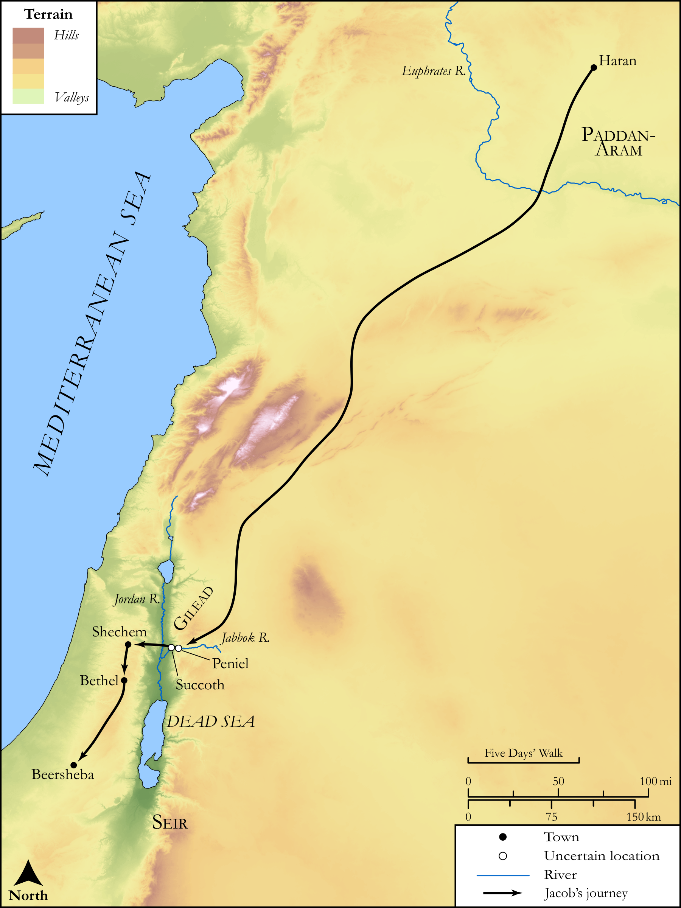

# Biblica Open Bible Maps

## License Information

Biblica Open Bible Maps, © 2023–2025 Biblica, Inc. This work is licensed under Creative Commons Attribution-ShareAlike 4.0 International (<a href="https://creativecommons.org/licenses/by-sa/4.0/">https://creativecommons.org/licenses/by-sa/4.0/</a>). More Information: <a href="https://docs.google.com/document/d/1Pp44yZ0Zdnd59vJHTrt2rPYq0SppfX5rZbPBt6mz37U/edit?tab=t.0#heading=h.oev9aj1ksvk2">https://docs.google.com/document/d/1Pp44yZ0Zdnd59vJHTrt2rPYq0SppfX5rZbPBt6mz37U/edit?tab=t.0#heading=h.oev9aj1ksvk2</a>

--------------------------------

## SRV Genesis: Gen. 31:1–21, Gen. 31:22–35, Gen. 31:36–55, Gen. 32:22–32, Gen. 33:1–20, Gen. 34:1–17, Gen. 34:18–31, Gen. 35:21–28 (id: OT282)

### Image Content

[link](images/OT282.png)

Original: [SRV Genesis: Gen. 31:1\-21, Gen. 31:22\-35, Gen. 31:36\-55, Gen. 32:22\-32, Gen. 33:1\-20, Gen. 34:1\-17, Gen. 34:18\-31, Gen. 35:21\-28](https://drive.google.com/open?id=1GILAo-PXE8dF3ioVxjkPaudhURQbQLM3&usp=drive_copy)

* **Associated Passages:** Genesis 31:1-54

* **Associated ACAI Concepts:** Israel (ID: `person:Israel`); Laban (ID: `person:Laban`); LORD (ID: `deity:Lord`); Rachel (ID: `person:Rachel`); Flock (ID: `fauna:Flock`); Goat (ID: `fauna:Goat`); Gilead (ID: `place:Gilead`); Teraphim (ID: `deity:Teraphim`); Jegar-sahadutha (ID: `place:Jegar-sahadutha`); Isaac (ID: `person:Isaac`); Leah (ID: `person:Leah`); Paddan-aram (ID: `place:Paddan-aram`); Household Idols (ID: `realia:HouseholdIdols`); Force to Serve (ID: `keyterm:EnticedToServe`); Abraham (ID: `person:Abraham`); Arameans (ID: `group:Aramean`); Tent (ID: `realia:Tent`); Swear (ID: `keyterm:Swear`); Vow (ID: `keyterm:Vow`); Bethel (ID: `place:Bethel`); Witness (ID: `keyterm:Witness`); Canaan (ID: `place:Canaan`); Smear (ID: `keyterm:Smear`); Covenant (ID: `keyterm:Covenant`); Glory (ID: `keyterm:Glory`); An Angel (ID: `deity:Angel`); Fear (ID: `keyterm:Fear`); Rebel (ID: `keyterm:Rebel`); To Sin (ID: `keyterm:Sin`); To Cause to Possess (ID: `keyterm:Possess`)
