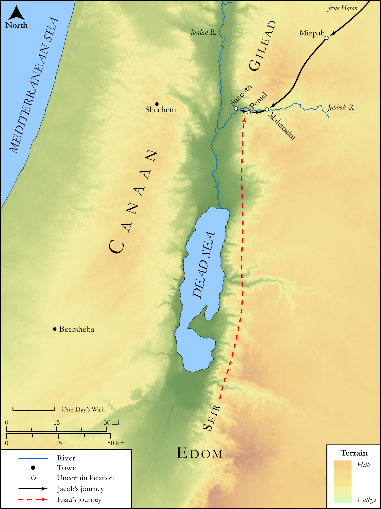

# Biblica Open Bible Maps

## License Information

Biblica Open Bible Maps, © 2023–2025 Biblica, Inc. This work is licensed under Creative Commons Attribution-ShareAlike 4.0 International (<a href="https://creativecommons.org/licenses/by-sa/4.0/">https://creativecommons.org/licenses/by-sa/4.0/</a>). More Information: <a href="https://docs.google.com/document/d/1Pp44yZ0Zdnd59vJHTrt2rPYq0SppfX5rZbPBt6mz37U/edit?tab=t.0#heading=h.oev9aj1ksvk2">https://docs.google.com/document/d/1Pp44yZ0Zdnd59vJHTrt2rPYq0SppfX5rZbPBt6mz37U/edit?tab=t.0#heading=h.oev9aj1ksvk2</a>

--------------------------------

## SRV Genesis: Gen. 32:1–20 (id: OT283)

### Image Content

[link](images/OT283.png)

Original: [SRV Genesis: Gen. 32:1\-20](https://drive.google.com/open?id=1CM4BNRKmhoa6PKFiLP6wXSJwO0OdxHmX&usp=drive_copy)

* **Associated Passages:** Genesis 32:1-33

* **Associated ACAI Concepts:** Israel (ID: `person:Israel`); Esau (ID: `person:Esau`); LORD (ID: `deity:Lord`); Flock (ID: `fauna:Flock`); Goat (ID: `fauna:Goat`); Offering (ID: `keyterm:Offering`); An Angel (ID: `deity:Angel`); Penuel (ID: `place:Penuel`); Cattle (ID: `fauna:Bull`); Bless (ID: `keyterm:Bless`); Mahanaim (ID: `place:Mahanaim`); Edom (ID: `place:Edom`); Jabbok (ID: `place:Jabbok`); Camel (ID: `fauna:Camel`); Donkey (ID: `fauna:Donkey`); Favor (ID: `keyterm:Favor`); Kindness (ID: `keyterm:Kindness`); Isaac (ID: `person:Isaac`); Jordan River (ID: `place:Jordan`); Fear (ID: `keyterm:Fear`); Appease (ID: `keyterm:Appease`); Truth (ID: `keyterm:Truth`); Seir (ID: `place:Seir`); Abraham (ID: `person:Abraham`); Laban (ID: `person:Laban`); Sheep (ID: `fauna:Lamb`); Staff (ID: `realia:Staff`); Rod (ID: `realia:Rod`)
