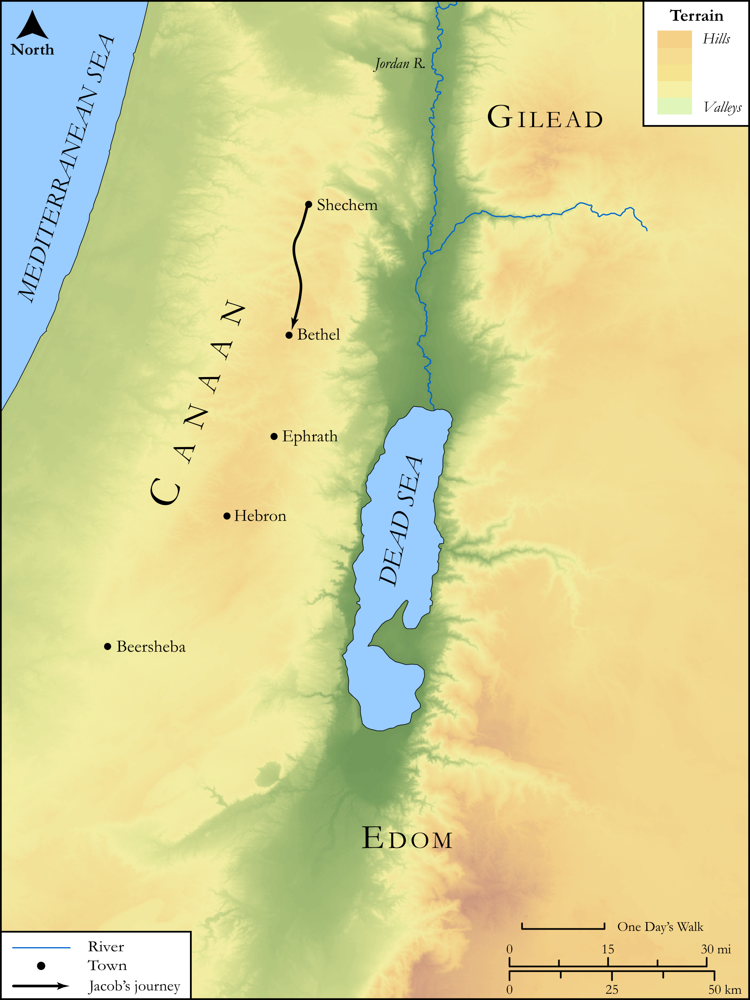

# Biblica Open Bible Maps

## License Information

Biblica Open Bible Maps, © 2023–2025 Biblica, Inc. This work is licensed under Creative Commons Attribution-ShareAlike 4.0 International (https://creativecommons.org/licenses/by-sa/4.0/). More Information: https://docs.google.com/document/d/1Pp44yZ0Zdnd59vJHTrt2rPYq0SppfX5rZbPBt6mz37U/edit?tab=t.0#heading=h.oev9aj1ksvk2

--------------------------------

## SRV Genesis: Gen. 35:1–14 (id: OT284)

### Image Content

[link](images/OT284.png)

Original: [SRV Genesis: Gen. 35:1\-14](https://drive.google.com/open?id=1U1z8KxEWnQ5xYwd7_UD3YELP9Z67yOlq&usp=drive_copy)

* **Associated Passages:** Genesis 35:1-29

* **Associated ACAI Concepts:** Israel (ID: `person:Israel`); LORD (ID: `deity:Lord`); Bethel (ID: `place:Bethel`); Rachel (ID: `person:Rachel`); Isaac (ID: `person:Isaac`); Benjamin (ID: `person:Benjamin`); Bethlehem (ID: `place:Bethlehem`); Reuben (ID: `person:Reuben`); Stone Altar (ID: `realia:StoneAltar`); Temple Altar (ID: `realia:TempleAltar`); Tabernacle Altar (ID: `realia:TabernacleAltar`); Altar (ID: `realia:Altar`); Paddan-aram (ID: `place:Paddan-aram`); Abraham (ID: `person:Abraham`); Leah (ID: `person:Leah`); Bilhah (ID: `person:Bilhah`); Esau (ID: `person:Esau`); Allon-bachuth (ID: `place:Allon-bacuth`); Tower of Eder (ID: `place:TowerOfEder`); Judah (ID: `person:Judah.4`); Mamre (ID: `place:Mamre`); Deborah (ID: `person:Deborah`); A Midwife (ID: `person:GenericMidwife`); Canaan (ID: `place:Canaan`); Hebron (ID: `place:Hebron`); Naphtali (ID: `person:Naphtali`); Zebulun (ID: `person:Zebulun`); Rebekah (ID: `person:Rebekah`); Issachar (ID: `person:Issachar`); Dan (ID: `person:Dan`); Offering (ID: `keyterm:Offering`); Shechem (ID: `place:Shechem`); Bless (ID: `keyterm:Bless`); Pure (ID: `keyterm:Pure`); Simeon (ID: `person:Simeon.5`); Zilpah (ID: `person:Zilpah`); Joseph (ID: `person:Joseph.10`); Gad (ID: `person:Gad`); Fear (ID: `keyterm:Fear`); Asher (ID: `person:Asher`); Levi (ID: `person:Levi.3`); Oak (ID: `flora:Oak`); Terebinth (ID: `flora:Terebinth`); Anointing Oil (ID: `realia:AnointingOil`); Olive Oil (ID: `realia:OliveOil`); Earring (ID: `realia:Earring`); Wine (ID: `realia:Wine`); Tent (ID: `realia:Tent`)
