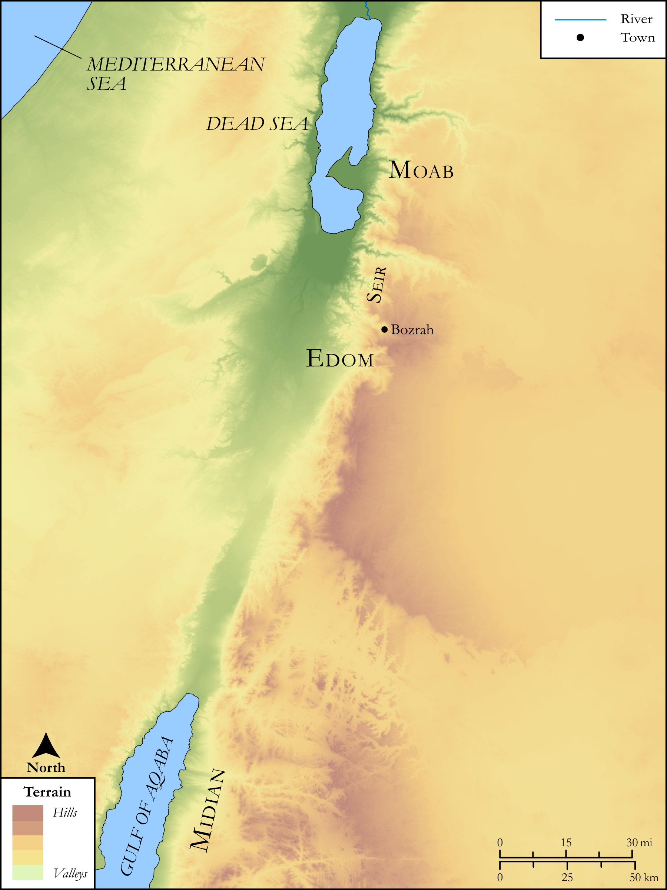

# Biblica Open Bible Maps

## License Information

Biblica Open Bible Maps, © 2023–2025 Biblica, Inc. This work is licensed under Creative Commons Attribution-ShareAlike 4.0 International (<a href="https://creativecommons.org/licenses/by-sa/4.0/">https://creativecommons.org/licenses/by-sa/4.0/</a>). More Information: <a href="https://docs.google.com/document/d/1Pp44yZ0Zdnd59vJHTrt2rPYq0SppfX5rZbPBt6mz37U/edit?tab=t.0#heading=h.oev9aj1ksvk2">https://docs.google.com/document/d/1Pp44yZ0Zdnd59vJHTrt2rPYq0SppfX5rZbPBt6mz37U/edit?tab=t.0#heading=h.oev9aj1ksvk2</a>

--------------------------------

## SRV Genesis: Gen. 36:31–42 (id: OT288)

### Image Content

[link](images/OT288.png)

Original: [SRV Genesis: Gen. 36:31\-42](https://drive.google.com/open?id=11tWbuytN9vixEZvJvYPB8uC-m-wGAywG&usp=drive_copy)

* **Associated Passages:** Genesis 36:1-43

* **Associated ACAI Concepts:** Esau (ID: `person:Esau`); Edom (ID: `place:Edom`); Eliphaz (ID: `person:Eliphaz`); Adah (ID: `person:Adah.2`); Mahalath (ID: `person:Mahalath`); Hori (ID: `person:Hori`); Reuel (ID: `person:Reuel.3`); Oholibamah (ID: `person:Oholibamah`); Zibeon (ID: `person:Zibeon.2`); Korah (ID: `person:Korah`); Jeush (ID: `person:Jeush`); Anah (ID: `person:Anah`); Jalam (ID: `person:Jalam`); Ezer (ID: `person:Ezer`); Shobal (ID: `person:Shobal`); Lotan (ID: `person:Lotan`); Dishon (ID: `person:Dishon`); Edomites (ID: `group:Edom`); Teman (ID: `person:Teman`); Dishan (ID: `person:Dishan`); Anah (ID: `person:Anah.2`); Canaan (ID: `place:Canaan`); Horites (ID: `group:Hori`); Seir (ID: `place:Seir`); Baal-hanan (ID: `person:Baal-hanan`); Achbor (ID: `person:Achbor`); Nahath (ID: `person:Nahath`); Kenaz (ID: `person:Kenaz`); Hadad (ID: `person:Hadad`); Jobab (ID: `person:Jobab.2`); Amalek (ID: `person:Amalek`); Seir (ID: `person:Seir`); Zerah (ID: `person:Zerah`); Gatam (ID: `person:Gatam`); Bela (ID: `person:Bela.2`); Samlah (ID: `person:Samlah`); Husham (ID: `person:Husham`); Omar (ID: `person:Omar`); Mizzah (ID: `person:Mizzah`); Zibeon (ID: `person:Zibeon`); Zepho (ID: `person:Zepho`); Shammah (ID: `person:Shammah.2`); Shaul (ID: `person:Shaul`); Israel (ID: `person:Israel`); Bilhan (ID: `person:Bilhan`); Akan (ID: `person:Akan`); Timna (ID: `person:Timna.2`); Elon (ID: `person:Elon`); Onam (ID: `person:Onam`); Zerah (ID: `person:Zerah.2`); Dinhabah (ID: `place:Dinhabah`); Hadad (ID: `person:Hadad.2`); Ebal (ID: `person:Ebal`); Zaavan (ID: `person:Zaavan`); Mehetabel (ID: `person:Mehetabel`); Manahath (ID: `person:Manahath`); Shepho (ID: `person:Shepho`); Eshban (ID: `person:Eshban`); Aran (ID: `person:Aran`); Magdiel (ID: `person:Magdiel`); Matred (ID: `person:Matred`); Pau (ID: `place:Pau`); Mezahab (ID: `person:Mezahab`); Kenaz (ID: `person:Kenaz.2`); Masrekah (ID: `place:Masrekah`); Ithran (ID: `person:Ithran`); Alvah (ID: `person:Alvah`); Dishon (ID: `person:Dishon.2`); Hemdan (ID: `person:Hemdan`); Oholibamah (ID: `person:Oholibamah.2`); Anah (ID: `person:Anah.3`); Jetheth (ID: `person:Jetheth`); Elah (ID: `person:Elah`); Uz (ID: `person:Uz.3`); Korah (ID: `person:Korah.2`); Cheran (ID: `person:Cheran`); Bedad (ID: `person:Bedad`); Alvan (ID: `person:Alvan`); Aiah (ID: `person:Aiah`); Mibzar (ID: `person:Mibzar`); Iram (ID: `person:Iram`); Hemam (ID: `person:Hemam`); Oholibamah (ID: `person:Oholibamah.3`); Pinon (ID: `person:Pinon`); Avith (ID: `place:Avith`); Timna (ID: `person:Timna.3`); Timna (ID: `person:Timna`); Rehoboth (ID: `place:Rehoboth.2`); Beor (ID: `person:Beor`); Hittites (ID: `group:Hittite`); Heth (ID: `person:Heth`); Teman (ID: `place:Teman`); Hivites (ID: `group:Hivites`); Temanites (ID: `group:Teman`); Israelites (ID: `group:Israel`); Nebaioth (ID: `person:Nebaioth`); Ishmael (ID: `person:Ishmael`); Bozrah (ID: `place:Bozrah.2`); Midian (ID: `place:Midian`); Moab (ID: `place:Moab`); Euphrates River (ID: `place:Euphrates`); Donkey (ID: `fauna:Donkey`); Sheep (ID: `fauna:Lamb`); Cattle (ID: `fauna:Bull`)
