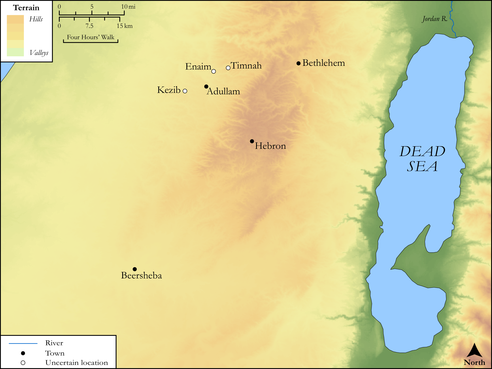

# Biblica Open Bible Maps

## License Information

Biblica Open Bible Maps, © 2023–2025 Biblica, Inc. This work is licensed under Creative Commons Attribution-ShareAlike 4.0 International (https://creativecommons.org/licenses/by-sa/4.0/). More Information: https://docs.google.com/document/d/1Pp44yZ0Zdnd59vJHTrt2rPYq0SppfX5rZbPBt6mz37U/edit?tab=t.0#heading=h.oev9aj1ksvk2

--------------------------------

## SRV Genesis: Gen. 38:1–29 (id: OT290)

### Image Content

[link](images/OT290.png)

Original: [SRV Genesis: Gen. 38:1\-29](https://drive.google.com/open?id=1ujxHJdPTrA8rzNIByzuXrW5iDtirnh24&usp=drive_copy)

* **Associated Passages:** Genesis 38:1-30

* **Associated ACAI Concepts:** Judah (ID: `person:Judah.4`); Shelah (ID: `person:Shelah`); Tamar (ID: `person:Tamar`); Goat (ID: `fauna:Goat`); Adullamites (ID: `group:Adullam`); Timnah (ID: `place:Timnah`); Er (ID: `person:Er.2`); Onan (ID: `person:Onan`); Flock (ID: `fauna:Flock`); Adullam (ID: `place:Adullam`); Enaim (ID: `place:Enaim`); Shua (ID: `person:Shua`); Hirah (ID: `person:Hirah`); Kid (ID: `fauna:Kid`); LORD (ID: `deity:Lord`); Thread (ID: `realia:Thread`); Perez (ID: `person:Perez`); Zerah (ID: `person:Zerah.3`); Rod (ID: `realia:Rod`); Measuring Reed (ID: `realia:MeasuringReed`); Canaan (ID: `place:Canaan`); Achzib (ID: `place:Achzib`); Canaanites (ID: `group:Canaan`); Be (Or Show Oneself) Just (ID: `keyterm:Just`); Play the Prostitute (ID: `keyterm:PlayTheProstitute`)
