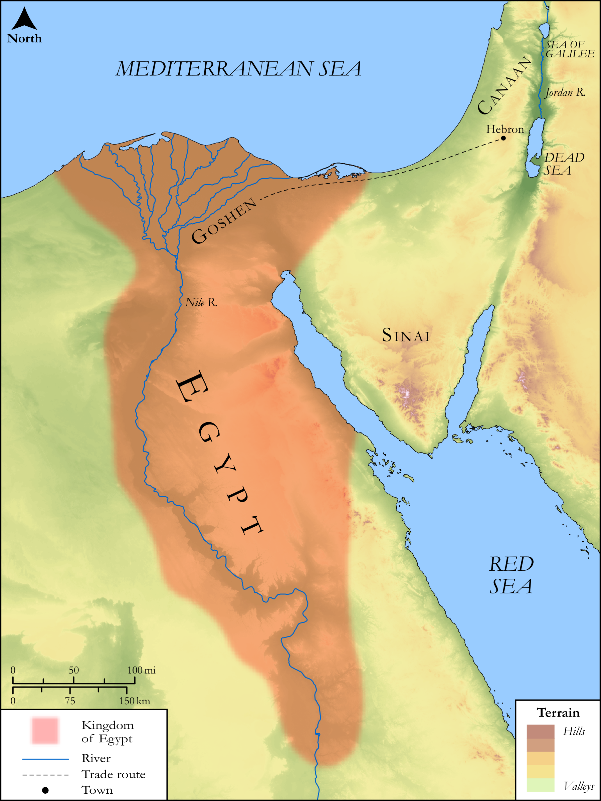

# Biblica Open Bible Maps

## License Information

Biblica Open Bible Maps, © 2023–2025 Biblica, Inc. This work is licensed under Creative Commons Attribution-ShareAlike 4.0 International (https://creativecommons.org/licenses/by-sa/4.0/). More Information: https://docs.google.com/document/d/1Pp44yZ0Zdnd59vJHTrt2rPYq0SppfX5rZbPBt6mz37U/edit?tab=t.0#heading=h.oev9aj1ksvk2

--------------------------------

## SRV Genesis: Gen. 41:1–36 (id: OT291)

### Image Content

[link](images/OT291.png)

Original: [SRV Genesis: Gen. 41:1\-36](https://drive.google.com/open?id=1b28bPG8gBmJcceNi_z39hyYlSbD5zmcB&usp=drive_copy)

* **Associated Passages:** Genesis 41:1-57

* **Associated ACAI Concepts:** Pharaoh (ID: `person:Pharaoh.4`); Joseph (ID: `person:Joseph.10`); Egypt (ID: `place:Egypt`); LORD (ID: `deity:Lord`); Nile River (ID: `place:Nile`); Cattle (ID: `fauna:Bull`); Potiphera (ID: `person:Potiphera`); Asenath (ID: `person:Asenath`); On (ID: `place:On`); Perceive (ID: `keyterm:Perceive`); Manasseh (ID: `person:Manasseh`); Ephraim (ID: `person:Ephraim`); Grass (ID: `flora:Grass`); Peace (ID: `keyterm:IntactState`); Hebrews (ID: `group:Hebrews`); To Sin (ID: `keyterm:Sin`); Egyptians (ID: `group:Egypt`); Appoint (ID: `keyterm:Appoint`); House (ID: `realia:House`); Prison (ID: `realia:Prison`); Linen (ID: `realia:Linen`); Chariot (ID: `realia:Chariot`)
