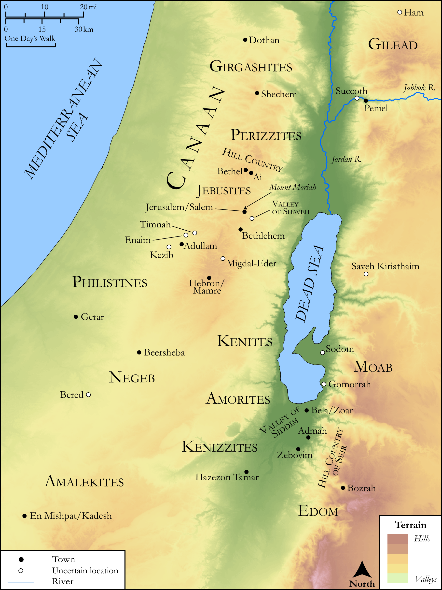

# Biblica Open Bible Maps

## License Information

Biblica Open Bible Maps, © 2023–2025 Biblica, Inc. This work is licensed under Creative Commons Attribution-ShareAlike 4.0 International (<a href="https://creativecommons.org/licenses/by-sa/4.0/">https://creativecommons.org/licenses/by-sa/4.0/</a>). More Information: <a href="https://docs.google.com/document/d/1Pp44yZ0Zdnd59vJHTrt2rPYq0SppfX5rZbPBt6mz37U/edit?tab=t.0#heading=h.oev9aj1ksvk2">https://docs.google.com/document/d/1Pp44yZ0Zdnd59vJHTrt2rPYq0SppfX5rZbPBt6mz37U/edit?tab=t.0#heading=h.oev9aj1ksvk2</a>

--------------------------------

## SRV Genesis: All Genesis Sites (Canaan) (id: OT294)

### Image Content

[link](images/OT294.png)

Original: [SRV Genesis: All Genesis Sites (Canaan)](https://drive.google.com/open?id=17UDCCmtWTzAI2A2LexHRmr9fDkAH51S3&usp=drive_copy)

* **Associated Passages:** Genesis 1:1-50:26

* **Associated ACAI Concepts:** LORD (ID: `deity:Lord`); Israel (ID: `person:Israel`); Abraham (ID: `person:Abraham`); Joseph (ID: `person:Joseph.10`); Egypt (ID: `place:Egypt`); Isaac (ID: `person:Isaac`); Pharaoh (ID: `person:Pharaoh.4`); Bless (ID: `keyterm:Bless`); Esau (ID: `person:Esau`); Canaan (ID: `place:Canaan`); Laban (ID: `person:Laban`); Sarah (ID: `person:Sarah`); Rachel (ID: `person:Rachel`); Noah (ID: `person:Noah`); Leah (ID: `person:Leah`); Lot (ID: `person:Lot`); Rebekah (ID: `person:Rebekah`); Judah (ID: `person:Judah.4`); Covenant (ID: `keyterm:Covenant`); Abimelech (ID: `person:Abimelech`); Fear (ID: `keyterm:Fear`); Sodom (ID: `place:Sodom`); Offering (ID: `keyterm:Offering`); Ishmael (ID: `person:Ishmael`); Heth (ID: `person:Heth`); Swear (ID: `keyterm:Swear`); Benjamin (ID: `person:Benjamin`); Adam (ID: `person:Adam`); Force to Serve (ID: `keyterm:EnticedToServe`); An Angel (ID: `deity:Angel`)
