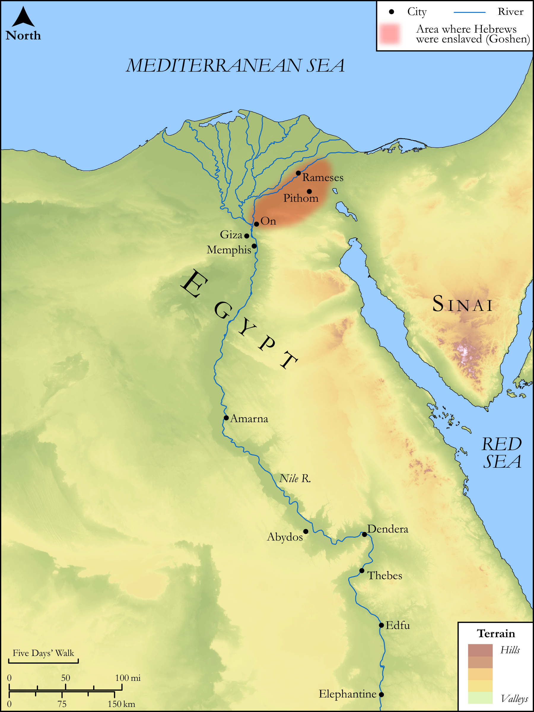

# Biblica Open Bible Maps

## License Information

Biblica Open Bible Maps, © 2023–2025 Biblica, Inc. This work is licensed under Creative Commons Attribution-ShareAlike 4.0 International (<a href="https://creativecommons.org/licenses/by-sa/4.0/">https://creativecommons.org/licenses/by-sa/4.0/</a>). More Information: <a href="https://docs.google.com/document/d/1Pp44yZ0Zdnd59vJHTrt2rPYq0SppfX5rZbPBt6mz37U/edit?tab=t.0#heading=h.oev9aj1ksvk2">https://docs.google.com/document/d/1Pp44yZ0Zdnd59vJHTrt2rPYq0SppfX5rZbPBt6mz37U/edit?tab=t.0#heading=h.oev9aj1ksvk2</a>

--------------------------------

## SRV Exodus: Exod. 1:8–14, Exod. 2:11–14 (id: OT301)

### Image Content

[link](images/OT301.png)

Original: [SRV Exodus: Exod. 1:8\-14, Exod. 2:11\-14](https://drive.google.com/open?id=1L1Z-6KBwFZP-pHyemKGc76JF7itTgz4i&usp=drive_copy)

* **Associated Passages:** Exodus 1:1-22

* **Associated ACAI Concepts:** Egypt (ID: `place:Egypt`); Israel (ID: `person:Israel`); Pharaoh (ID: `person:Pharaoh.5`); Hebrews (ID: `group:Hebrews`); LORD (ID: `deity:Lord`); Joseph (ID: `person:Joseph.10`); Force to Serve (ID: `keyterm:EnticedToServe`); Fear (ID: `keyterm:Fear`); Egyptians (ID: `group:Egypt`); Puah (ID: `person:Puah.3`); Work (ID: `keyterm:Work`); Pithom (ID: `place:Pithom`); Shiphrah (ID: `person:Shiphrah`); Nile River (ID: `place:Nile`); Gad (ID: `person:Gad`); Asher (ID: `person:Asher`); Dan (ID: `person:Dan`); Raamses (ID: `place:Raamses`); Simeon (ID: `person:Simeon.5`); Reuben (ID: `person:Reuben`); Naphtali (ID: `person:Naphtali`); Judah (ID: `person:Judah.4`); Zebulun (ID: `person:Zebulun`); Benjamin (ID: `person:Benjamin`); Issachar (ID: `person:Issachar`); Levi (ID: `person:Levi.3`); Birthstool (ID: `realia:Birthstool`); Brick (ID: `realia:Brick`)
