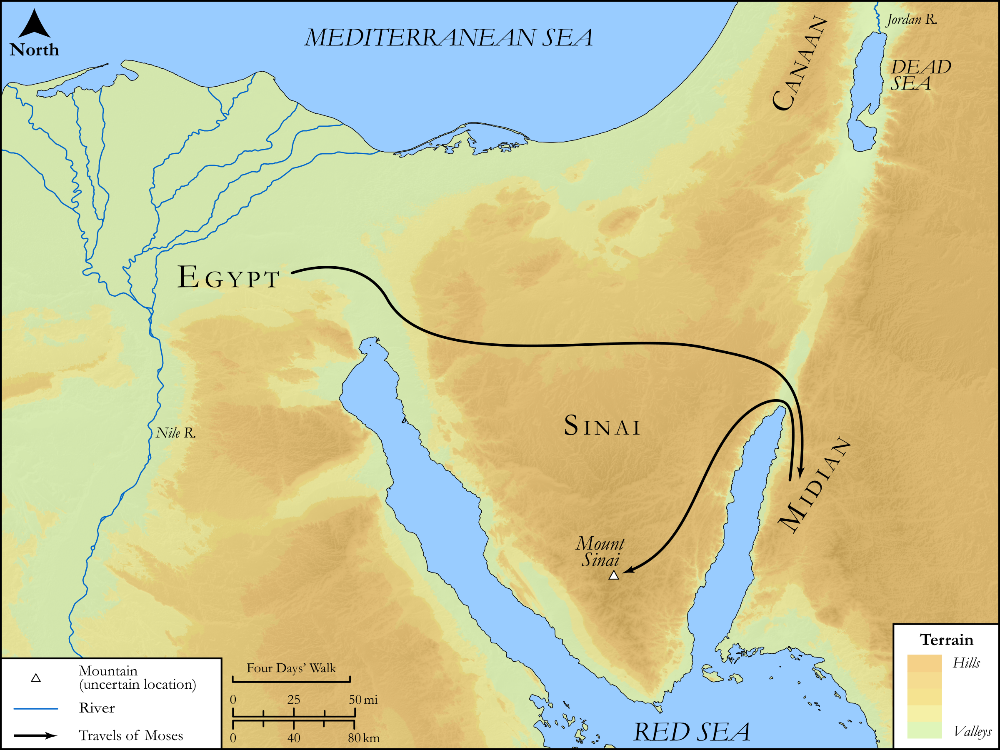

# Biblica Open Bible Maps

## License Information

Biblica Open Bible Maps, © 2023–2025 Biblica, Inc. This work is licensed under Creative Commons Attribution-ShareAlike 4.0 International (https://creativecommons.org/licenses/by-sa/4.0/). More Information: https://docs.google.com/document/d/1Pp44yZ0Zdnd59vJHTrt2rPYq0SppfX5rZbPBt6mz37U/edit?tab=t.0#heading=h.oev9aj1ksvk2

--------------------------------

## SRV Exodus: Exod. 2:16–25, Exod. 3:1–10 (id: OT303)

### Image Content

[link](images/OT303.png)

Original: [SRV Exodus: Exod. 2:16\-25, Exod. 3:1\-10](https://drive.google.com/open?id=15o8-JOvJzrMpdnsGYtrbun20VTc05KiB&usp=drive_copy)

* **Associated Passages:** Exodus 2:1-25

* **Associated ACAI Concepts:** Pharaoh (ID: `person:Pharaoh.5`); Moses (ID: `person:Moses`); Egypt (ID: `place:Egypt`); Hebrews (ID: `group:Hebrews`); Egyptians (ID: `group:Egypt`); Israel (ID: `person:Israel`); LORD (ID: `deity:Lord`); Flock (ID: `fauna:Flock`); Goat (ID: `fauna:Goat`); Nile River (ID: `place:Nile`); Midian (ID: `place:Midian`); Cattails (ID: `flora:Cattails`); Gershom (ID: `person:Gershom`); Zipporah (ID: `person:Zipporah`); Sheep (ID: `fauna:Lamb`); Ship (ID: `realia:Ship`); Abraham (ID: `person:Abraham`); Isaac (ID: `person:Isaac`); Jethro (ID: `person:Jethro`); Work (ID: `keyterm:Work`); Tribe of Levi (ID: `group:Levi`); Fear (ID: `keyterm:Fear`); Covenant (ID: `keyterm:Covenant`); Levi (ID: `person:Levi.3`); Papyrus (ID: `flora:Papyrus`)
