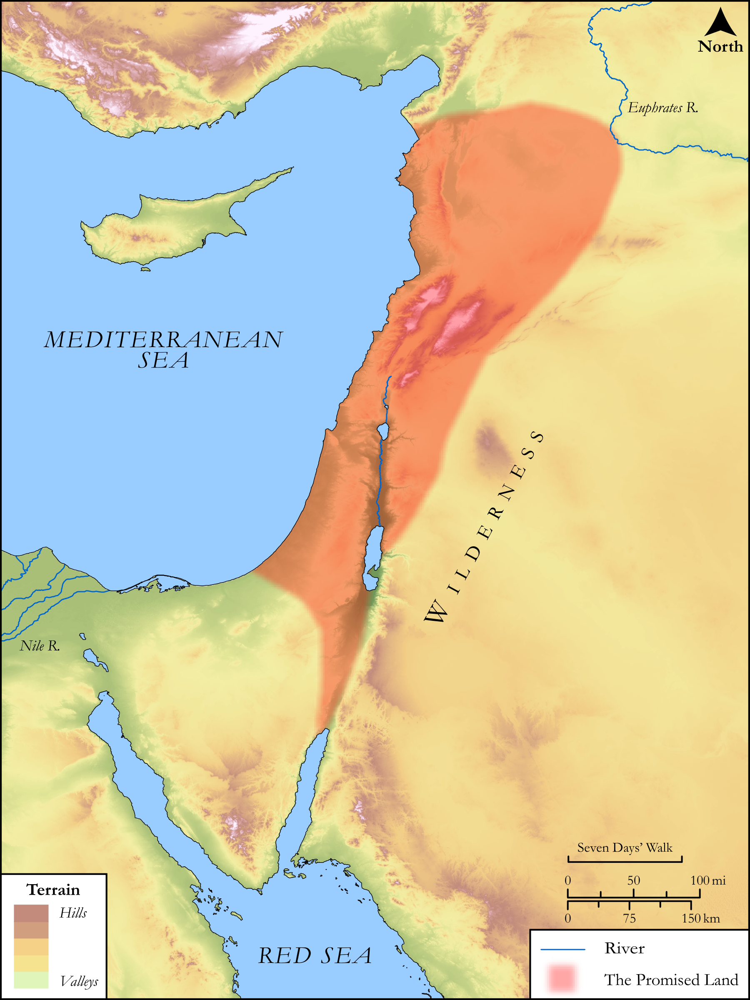

# Biblica Open Bible Maps

## License Information

Biblica Open Bible Maps, © 2023–2025 Biblica, Inc. This work is licensed under Creative Commons Attribution-ShareAlike 4.0 International (https://creativecommons.org/licenses/by-sa/4.0/). More Information: https://docs.google.com/document/d/1Pp44yZ0Zdnd59vJHTrt2rPYq0SppfX5rZbPBt6mz37U/edit?tab=t.0#heading=h.oev9aj1ksvk2

--------------------------------

## SRV Exodus: Exod. 3:1–10, Exod. 23:20–32 (id: OT304)

### Image Content

[link](images/OT304.png)

Original: [SRV Exodus: Exod. 3:1\-10, Exod. 23:20\-32](https://drive.google.com/open?id=13hWljync3FLLzJwUIMFYb5eUyIuoOubl&usp=drive_copy)

* **Associated Passages:** Exodus 3:1-22

* **Associated ACAI Concepts:** Egypt (ID: `place:Egypt`); LORD (ID: `deity:Lord`); Israel (ID: `person:Israel`); Moses (ID: `person:Moses`); Egyptians (ID: `group:Egypt`); Abraham (ID: `person:Abraham`); Isaac (ID: `person:Isaac`); Bush (ID: `flora:Bush`); Perizzites (ID: `group:Perizzites`); Land Flowing of Milk and Honey (ID: `keyterm:LandFlowingOfMilkAndHoney`); Heth (ID: `person:Heth`); Canaan (ID: `place:Canaan`); Hivites (ID: `group:Hivites`); Jebusites (ID: `group:Jebusites`); Hittites (ID: `group:Hittite`); Canaanites (ID: `group:Canaan`); Pharaoh (ID: `person:Pharaoh.6`); Amorites (ID: `group:Amorites`); Mount Sinai (ID: `place:SinaiMount`); Jethro (ID: `person:Jethro`); Midian (ID: `place:Midian`); An Angel (ID: `deity:Angel`); Appoint (ID: `keyterm:Appoint`); Favor (ID: `keyterm:Favor`); Hebrews (ID: `group:Hebrews`); Fear (ID: `keyterm:Fear`); Force to Serve (ID: `keyterm:EnticedToServe`); Holy (ID: `keyterm:Holy`); Sheep (ID: `fauna:Lamb`); Cloak (ID: `realia:Cloak`); Flock (ID: `fauna:Flock`); Money (ID: `realia:Money`); Goat (ID: `fauna:Goat`); House (ID: `realia:House`)
