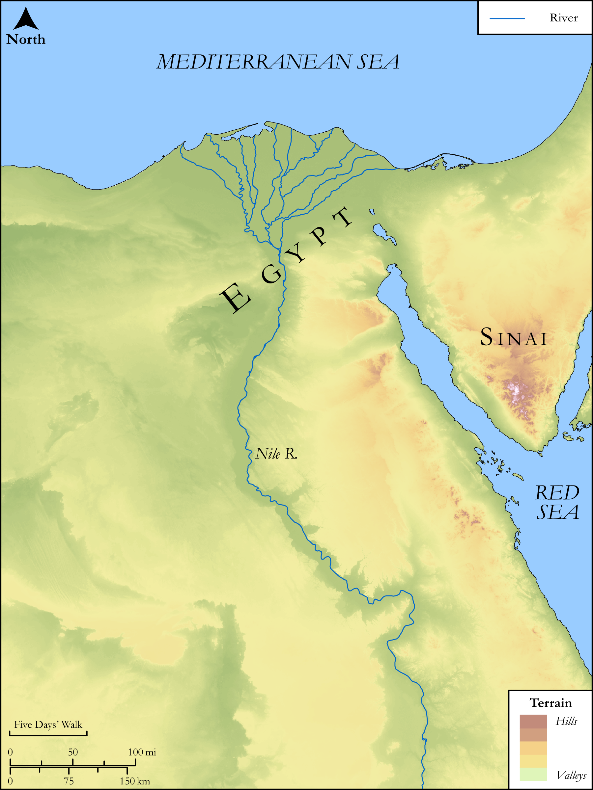

# Biblica Open Bible Maps

## License Information

Biblica Open Bible Maps, © 2023–2025 Biblica, Inc. This work is licensed under Creative Commons Attribution-ShareAlike 4.0 International (https://creativecommons.org/licenses/by-sa/4.0/). More Information: https://docs.google.com/document/d/1Pp44yZ0Zdnd59vJHTrt2rPYq0SppfX5rZbPBt6mz37U/edit?tab=t.0#heading=h.oev9aj1ksvk2

--------------------------------

## SRV Exodus: Exod. 4:1–17, Exod. 7:14–25, Exod. 8:20–31 (id: OT306)

### Image Content

[link](images/OT306.png)

Original: [SRV Exodus: Exod. 4:1\-17, Exod. 7:14\-25, Exod. 8:20\-31](https://drive.google.com/open?id=1ig6Cirg01KLEya0PoLK_X7dkwGGWSK40&usp=drive_copy)

* **Associated Passages:** Exodus 4:1-31

* **Associated ACAI Concepts:** LORD (ID: `deity:Lord`); Moses (ID: `person:Moses`); Believe In (ID: `keyterm:BelieveIn`); Aaron (ID: `person:Aaron`); Israel (ID: `person:Israel`); Egypt (ID: `place:Egypt`); Rod (ID: `realia:Rod`); Pharaoh (ID: `person:Pharaoh.6`); Zipporah (ID: `person:Zipporah`); Infectious Skin Disease (ID: `keyterm:InfectiousSkinDisease`); Force to Serve (ID: `keyterm:EnticedToServe`); Abraham (ID: `person:Abraham`); Peace (ID: `keyterm:IntactState`); Foreskin (ID: `keyterm:Foreskin`); Isaac (ID: `person:Isaac`); Jethro (ID: `person:Jethro`); Symbol (ID: `keyterm:Example`); Midian (ID: `place:Midian`); Nile River (ID: `place:Nile`); Tribe of Levi (ID: `group:Levi`); Circumcision (ID: `keyterm:Circumcision`); Appoint (ID: `keyterm:Appoint`); Levi (ID: `person:Levi.3`); Knife (ID: `realia:Knife`); Donkey (ID: `fauna:Donkey`); Snake (ID: `fauna:Snake`)
