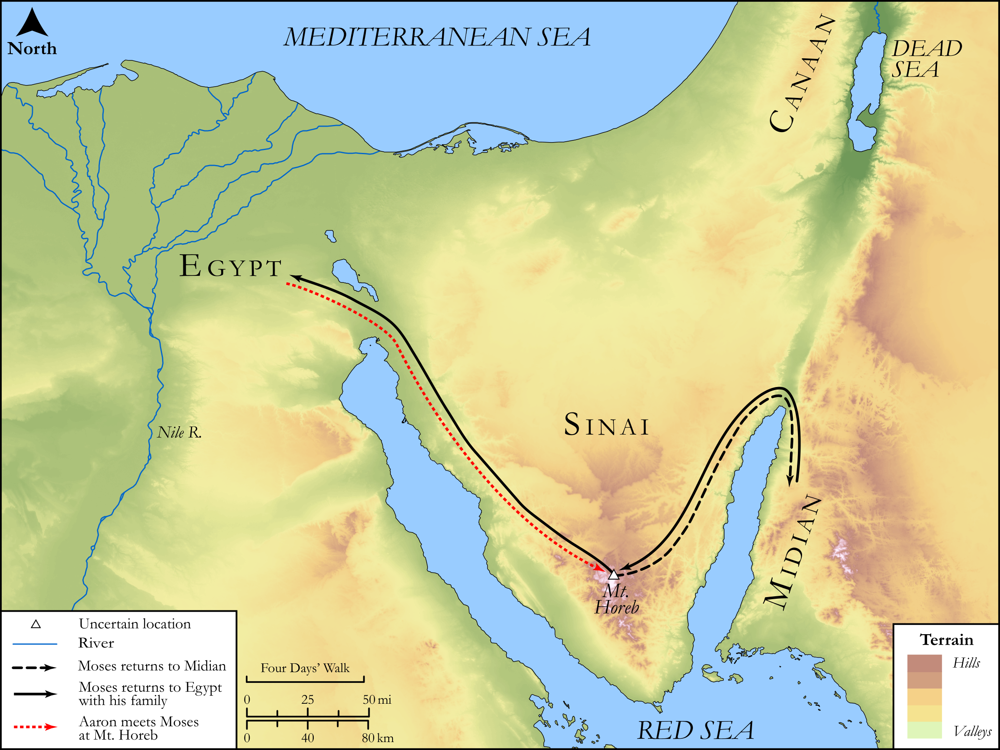

# Biblica Open Bible Maps

## License Information

Biblica Open Bible Maps, © 2023–2025 Biblica, Inc. This work is licensed under Creative Commons Attribution-ShareAlike 4.0 International (https://creativecommons.org/licenses/by-sa/4.0/). More Information: https://docs.google.com/document/d/1Pp44yZ0Zdnd59vJHTrt2rPYq0SppfX5rZbPBt6mz37U/edit?tab=t.0#heading=h.oev9aj1ksvk2

--------------------------------

## SRV Exodus: Exod. 4:18–31, Exod. 17:1–6 (id: OT307)

### Image Content

[link](images/OT307.png)

Original: [SRV Exodus: Exod. 4:18\-31, Exod. 17:1\-6](https://drive.google.com/open?id=1rPmHOEB8ir6cF6ChtamGoE6GdLWXcuGU&usp=drive_copy)

* **Associated Passages:** Exodus 4:1-31

* **Associated ACAI Concepts:** LORD (ID: `deity:Lord`); Moses (ID: `person:Moses`); Believe In (ID: `keyterm:BelieveIn`); Aaron (ID: `person:Aaron`); Egypt (ID: `place:Egypt`); Israel (ID: `person:Israel`); Rod (ID: `realia:Rod`); Pharaoh (ID: `person:Pharaoh.6`); Zipporah (ID: `person:Zipporah`); Levi (ID: `person:Levi.3`); Abraham (ID: `person:Abraham`); Appoint (ID: `keyterm:Appoint`); Foreskin (ID: `keyterm:Foreskin`); Peace (ID: `keyterm:IntactState`); Infectious Skin Disease (ID: `keyterm:InfectiousSkinDisease`); Jethro (ID: `person:Jethro`); Isaac (ID: `person:Isaac`); Force to Serve (ID: `keyterm:EnticedToServe`); Circumcision (ID: `keyterm:Circumcision`); Tribe of Levi (ID: `group:Levi`); Midian (ID: `place:Midian`); Symbol (ID: `keyterm:Example`); Nile River (ID: `place:Nile`); Knife (ID: `realia:Knife`); Snake (ID: `fauna:Snake`); Donkey (ID: `fauna:Donkey`)
