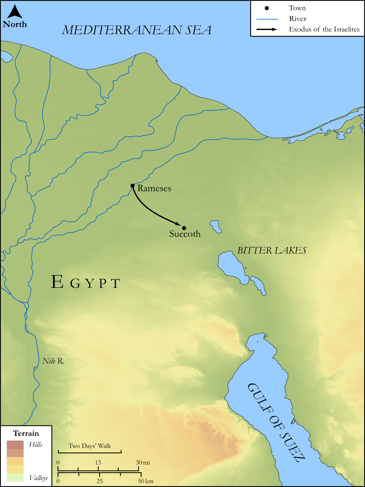

# Biblica Open Bible Maps

## License Information

Biblica Open Bible Maps, © 2023–2025 Biblica, Inc. This work is licensed under Creative Commons Attribution-ShareAlike 4.0 International (<a href="https://creativecommons.org/licenses/by-sa/4.0/">https://creativecommons.org/licenses/by-sa/4.0/</a>). More Information: <a href="https://docs.google.com/document/d/1Pp44yZ0Zdnd59vJHTrt2rPYq0SppfX5rZbPBt6mz37U/edit?tab=t.0#heading=h.oev9aj1ksvk2">https://docs.google.com/document/d/1Pp44yZ0Zdnd59vJHTrt2rPYq0SppfX5rZbPBt6mz37U/edit?tab=t.0#heading=h.oev9aj1ksvk2</a>

--------------------------------

## SRV Exodus: Exod. 12:29–41 (id: OT309)

### Image Content

[link](images/OT309.png)

Original: [SRV Exodus: Exod. 12:29\-41](https://drive.google.com/open?id=1P1iab0tQwK7HxBBTsais0hhTeq5sG3sr&usp=drive_copy)

* **Associated Passages:** Exodus 12:1-51

* **Associated ACAI Concepts:** LORD (ID: `deity:Lord`); Egypt (ID: `place:Egypt`); Israel (ID: `person:Israel`); Moses (ID: `person:Moses`); Passover (ID: `keyterm:Passover`); Aaron (ID: `person:Aaron`); House (ID: `realia:House`); Unleavened Bread (ID: `realia:UnleavenedBread`); Flock (ID: `fauna:Flock`); Goat (ID: `fauna:Goat`); Cattle (ID: `fauna:Bull`); Doorpost (ID: `realia:Doorpost`); Circumcision (ID: `keyterm:Circumcision`); Work (ID: `keyterm:Work`); Pharaoh (ID: `person:Pharaoh.6`); Sheep (ID: `fauna:Lamb`); Uncircumcised Person (ID: `keyterm:UncircumcisedPerson`); Succoth (ID: `place:Succoth.2`); Favor (ID: `keyterm:Favor`); Force to Serve (ID: `keyterm:EnticedToServe`); Bless (ID: `keyterm:Bless`); Holy (ID: `keyterm:Holy`); Complete (ID: `keyterm:Complete`); Decree (ID: `keyterm:Decree`); Rameses (ID: `place:Rameses`); Slaughtering (ID: `keyterm:Slaughtering`); Instruction (ID: `keyterm:Instruction`); Money (ID: `realia:Money`); Cloak (ID: `realia:Cloak`); Hyssop (ID: `flora:Hyssop`)
