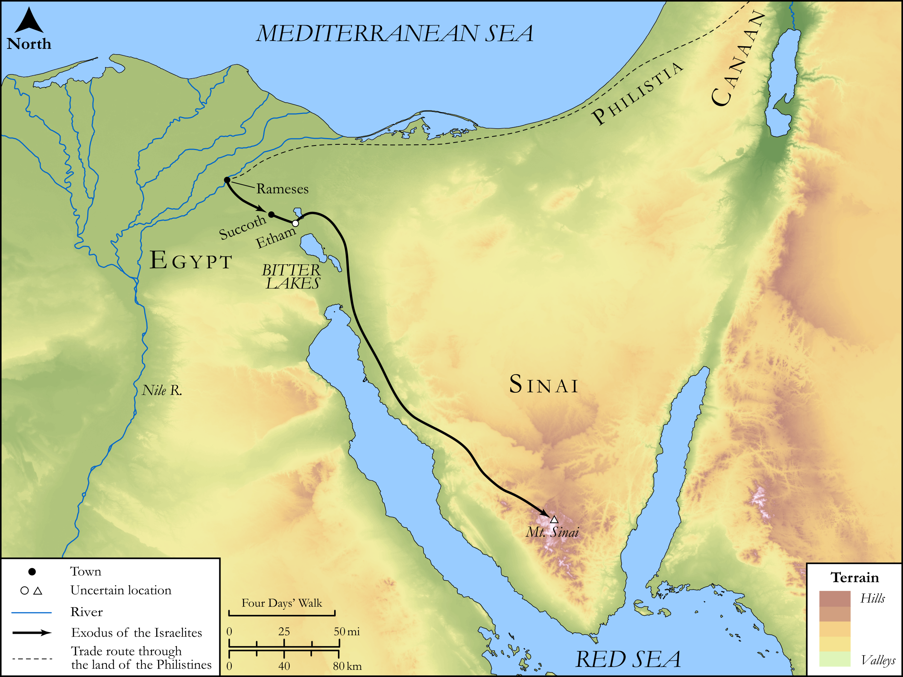

# Biblica Open Bible Maps

## License Information

Biblica Open Bible Maps, © 2023–2025 Biblica, Inc. This work is licensed under Creative Commons Attribution-ShareAlike 4.0 International (https://creativecommons.org/licenses/by-sa/4.0/). More Information: https://docs.google.com/document/d/1Pp44yZ0Zdnd59vJHTrt2rPYq0SppfX5rZbPBt6mz37U/edit?tab=t.0#heading=h.oev9aj1ksvk2

--------------------------------

## SRV Exodus: Exod. 13:17–21 (id: OT311)

### Image Content

[link](images/OT311.png)

Original: [SRV Exodus: Exod. 13:17\-21](https://drive.google.com/open?id=19CEKJnyDp9yrpq_KIIw8hto4FJGbJpBY&usp=drive_copy)

* **Associated Passages:** Exodus 13:1-22

* **Associated ACAI Concepts:** LORD (ID: `deity:Lord`); Egypt (ID: `place:Egypt`); Swear (ID: `keyterm:Swear`); Moses (ID: `person:Moses`); Israel (ID: `person:Israel`); Cattle (ID: `fauna:Bull`); Canaan (ID: `place:Canaan`); Redeem (ID: `keyterm:Redeem`); Canaanites (ID: `group:Canaan`); Pharaoh (ID: `person:Pharaoh.6`); Unleavened Bread (ID: `realia:UnleavenedBread`); Red Sea (ID: `place:RedSea`); Succoth (ID: `place:Succoth.2`); Etham (ID: `place:Etham`); Philistines (ID: `group:Philistine`); Hivites (ID: `group:Hivites`); Appoint (ID: `keyterm:Appoint`); Joseph (ID: `person:Joseph.10`); Jebusites (ID: `group:Jebusites`); Work (ID: `keyterm:Work`); Land Flowing of Milk and Honey (ID: `keyterm:LandFlowingOfMilkAndHoney`); Hittites (ID: `group:Hittite`); Instruction (ID: `keyterm:Instruction`); Force to Serve (ID: `keyterm:EnticedToServe`); Philistia (ID: `place:Philistine`); Amorites (ID: `group:Amorites`); Holy (ID: `keyterm:Holy`); Heth (ID: `person:Heth`); Sheep (ID: `fauna:Lamb`); Donkey (ID: `fauna:Donkey`); Cattails (ID: `flora:Cattails`)
