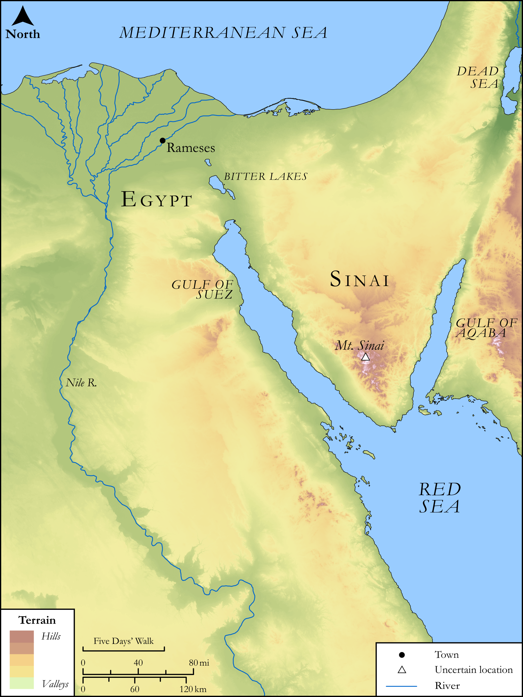

# Biblica Open Bible Maps

## License Information

Biblica Open Bible Maps, © 2023–2025 Biblica, Inc. This work is licensed under Creative Commons Attribution-ShareAlike 4.0 International (https://creativecommons.org/licenses/by-sa/4.0/). More Information: https://docs.google.com/document/d/1Pp44yZ0Zdnd59vJHTrt2rPYq0SppfX5rZbPBt6mz37U/edit?tab=t.0#heading=h.oev9aj1ksvk2

--------------------------------

## SRV Exodus: Exod. 14:15–31, Exod. 25:1–8 (id: OT313)

### Image Content

[link](images/OT313.png)

Original: [SRV Exodus: Exod. 14:15\-31, Exod. 25:1\-8](https://drive.google.com/open?id=192RQiuXEt8kcXdJa07jDpNOQ6WXuD2Ug&usp=drive_copy)

* **Associated Passages:** Exodus 14:1-31

* **Associated ACAI Concepts:** Egypt (ID: `place:Egypt`); LORD (ID: `deity:Lord`); Israel (ID: `person:Israel`); Pharaoh (ID: `person:Pharaoh.6`); Egyptians (ID: `group:Egypt`); Moses (ID: `person:Moses`); Chariot (ID: `realia:Chariot`); Fear (ID: `keyterm:Fear`); Bring Honor and Glory on Oneself (ID: `keyterm:BringHonorAndGloryOnOneself`); Baal-zephon (ID: `place:Baal-zephon`); Pi-hahiroth (ID: `place:Pi-hahiroth`); Force to Serve (ID: `keyterm:EnticedToServe`); Migdol (ID: `place:Migdol`); Believe In (ID: `keyterm:BelieveIn`); Horse (ID: `fauna:Horse`); An Angel (ID: `deity:Angel`); Salvation (ID: `keyterm:Salvation`); Wagon (ID: `realia:Wagon`); Rod (ID: `realia:Rod`)
