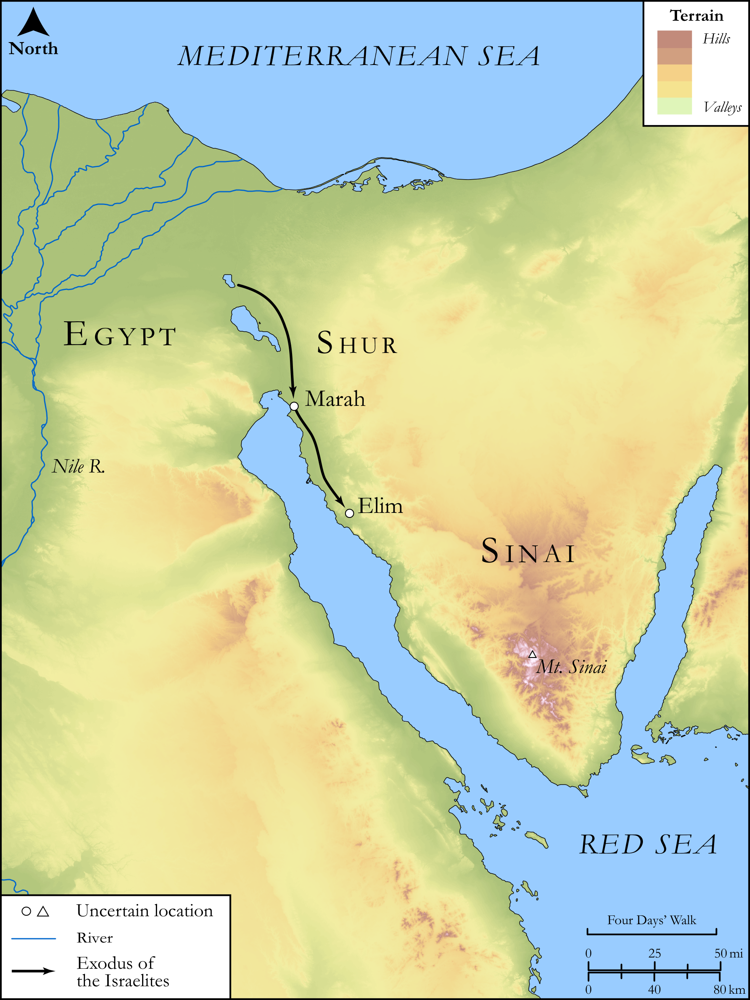

# Biblica Open Bible Maps

## License Information

Biblica Open Bible Maps, © 2023–2025 Biblica, Inc. This work is licensed under Creative Commons Attribution-ShareAlike 4.0 International (<a href="https://creativecommons.org/licenses/by-sa/4.0/">https://creativecommons.org/licenses/by-sa/4.0/</a>). More Information: <a href="https://docs.google.com/document/d/1Pp44yZ0Zdnd59vJHTrt2rPYq0SppfX5rZbPBt6mz37U/edit?tab=t.0#heading=h.oev9aj1ksvk2">https://docs.google.com/document/d/1Pp44yZ0Zdnd59vJHTrt2rPYq0SppfX5rZbPBt6mz37U/edit?tab=t.0#heading=h.oev9aj1ksvk2</a>

--------------------------------

## SRV Exodus: Exod. 15:19–26 (id: OT314)

### Image Content

[link](images/OT314.png)

Original: [SRV Exodus: Exod. 15:19\-26](https://drive.google.com/open?id=1EZ8X9zNEqANJINBVOfNM4pMo2ioQh2sH&usp=drive_copy)

* **Associated Passages:** Exodus 15:1-27

* **Associated ACAI Concepts:** LORD (ID: `deity:Lord`); Moses (ID: `person:Moses`); Israel (ID: `person:Israel`); Red Sea (ID: `place:RedSea`); Miriam (ID: `person:Miriam`); Decree (ID: `keyterm:Decree`); Horse (ID: `fauna:Horse`); Holy (ID: `keyterm:Holy`); Pharaoh (ID: `person:Pharaoh.6`); Elim (ID: `place:Elim`); Philistia (ID: `place:Philistine`); Marah (ID: `place:Marah`); Shur (ID: `place:Shur`); Leader (ID: `keyterm:Leader`); Chariot (ID: `realia:Chariot`); Cattails (ID: `flora:Cattails`); Kindness (ID: `keyterm:Kindness`); Dispossess (ID: `keyterm:Dispossess`); Canaan (ID: `place:Canaan`); Edom (ID: `place:Edom`); Terror (ID: `keyterm:Terror`); Egypt (ID: `place:Egypt`); Fear (ID: `keyterm:Fear`); Aaron (ID: `person:Aaron`); Moab (ID: `place:Moab`); Salvation (ID: `keyterm:Salvation`); Mighty (ID: `keyterm:Mighty`); To Cause to Possess (ID: `keyterm:Possess`); Redeem (ID: `keyterm:Redeem`); Strength (ID: `keyterm:Strength`); Drum (ID: `realia:Drum`); Date Palm (ID: `flora:DatePalm`); Sword (ID: `realia:Sword`)
