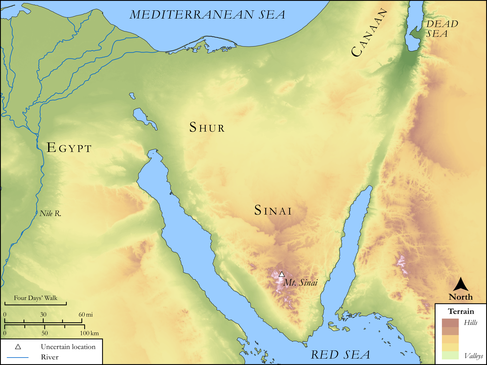

# Biblica Open Bible Maps

## License Information

Biblica Open Bible Maps, © 2023–2025 Biblica, Inc. This work is licensed under Creative Commons Attribution-ShareAlike 4.0 International (https://creativecommons.org/licenses/by-sa/4.0/). More Information: https://docs.google.com/document/d/1Pp44yZ0Zdnd59vJHTrt2rPYq0SppfX5rZbPBt6mz37U/edit?tab=t.0#heading=h.oev9aj1ksvk2

--------------------------------

## SRV Exodus: Exod. 15:19–27, Exod. 16:1–12, Exod. 16:22–36, Exod. 33:1–11 (id: OT315)

### Image Content

[link](images/OT315.png)

Original: [SRV Exodus: Exod. 15:19\-27, Exod. 16:1\-12, Exod. 16:22\-36, Exod. 33:1\-11](https://drive.google.com/open?id=1Le82edGm0G2i6piqi87bd67ac-R-lCJY&usp=drive_copy)

* **Associated Passages:** Exodus 15:1-27

* **Associated ACAI Concepts:** LORD (ID: `deity:Lord`); Israel (ID: `person:Israel`); Moses (ID: `person:Moses`); Miriam (ID: `person:Miriam`); Red Sea (ID: `place:RedSea`); Decree (ID: `keyterm:Decree`); Horse (ID: `fauna:Horse`); Holy (ID: `keyterm:Holy`); Pharaoh (ID: `person:Pharaoh.6`); Shur (ID: `place:Shur`); Elim (ID: `place:Elim`); Philistia (ID: `place:Philistine`); Leader (ID: `keyterm:Leader`); Marah (ID: `place:Marah`); Cattails (ID: `flora:Cattails`); Chariot (ID: `realia:Chariot`); Canaan (ID: `place:Canaan`); Edom (ID: `place:Edom`); Mighty (ID: `keyterm:Mighty`); Strength (ID: `keyterm:Strength`); Terror (ID: `keyterm:Terror`); To Cause to Possess (ID: `keyterm:Possess`); Redeem (ID: `keyterm:Redeem`); Egypt (ID: `place:Egypt`); Salvation (ID: `keyterm:Salvation`); Kindness (ID: `keyterm:Kindness`); Aaron (ID: `person:Aaron`); Moab (ID: `place:Moab`); Fear (ID: `keyterm:Fear`); Dispossess (ID: `keyterm:Dispossess`); Date Palm (ID: `flora:DatePalm`); Drum (ID: `realia:Drum`); Sword (ID: `realia:Sword`)
