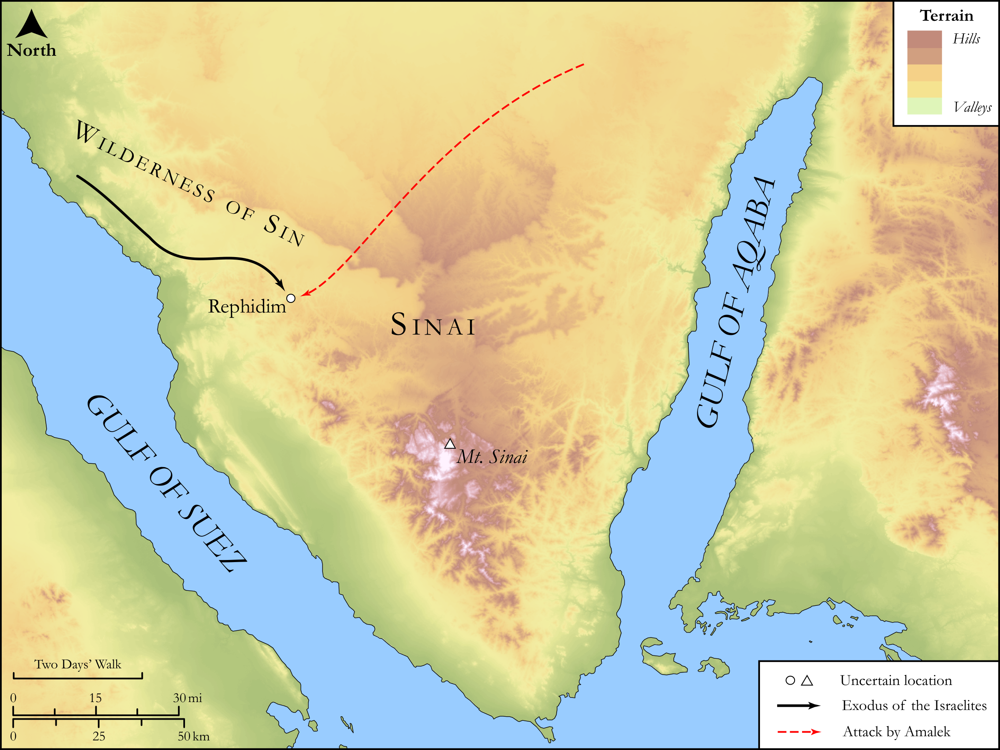

# Biblica Open Bible Maps

## License Information

Biblica Open Bible Maps, © 2023–2025 Biblica, Inc. This work is licensed under Creative Commons Attribution-ShareAlike 4.0 International (https://creativecommons.org/licenses/by-sa/4.0/). More Information: https://docs.google.com/document/d/1Pp44yZ0Zdnd59vJHTrt2rPYq0SppfX5rZbPBt6mz37U/edit?tab=t.0#heading=h.oev9aj1ksvk2

--------------------------------

## SRV Exodus: Exod. 17:1–7, Exod. 17:8–15 (id: OT316)

### Image Content

[link](images/OT316.png)

Original: [SRV Exodus: Exod. 17:1\-7, Exod. 17:8\-15](https://drive.google.com/open?id=1jgg8FwBxvH81APDeQBYuBDzt5NRO0KQY&usp=drive_copy)

* **Associated Passages:** Exodus 17:1-16

* **Associated ACAI Concepts:** Moses (ID: `person:Moses`); LORD (ID: `deity:Lord`); Amalek (ID: `place:Amalek`); Israel (ID: `person:Israel`); Joshua (ID: `person:Joshua.2`); Hur (ID: `person:Hur.2`); Rephidim (ID: `place:Rephidim`); Aaron (ID: `person:Aaron`); Rod (ID: `realia:Rod`); Wilderness of Sin (ID: `place:Sin`); Massah (ID: `place:Massah`); Mount Sinai (ID: `place:SinaiMount`); Egypt (ID: `place:Egypt`); Nile River (ID: `place:Nile`); Destroy (ID: `keyterm:Destroy`); Meribah (ID: `place:Meribah`); Throne (ID: `realia:Throne`); Sword (ID: `realia:Sword`); Scroll (ID: `realia:Scroll`); Temple Altar (ID: `realia:TempleAltar`); Tabernacle Altar (ID: `realia:TabernacleAltar`); Altar (ID: `realia:Altar`); Stone Altar (ID: `realia:StoneAltar`)
