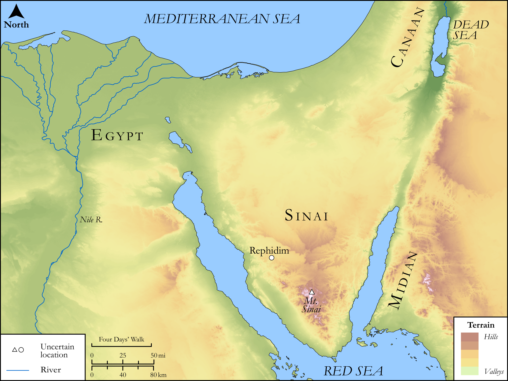

# Biblica Open Bible Maps

## License Information

Biblica Open Bible Maps, © 2023–2025 Biblica, Inc. This work is licensed under Creative Commons Attribution-ShareAlike 4.0 International (https://creativecommons.org/licenses/by-sa/4.0/). More Information: https://docs.google.com/document/d/1Pp44yZ0Zdnd59vJHTrt2rPYq0SppfX5rZbPBt6mz37U/edit?tab=t.0#heading=h.oev9aj1ksvk2

--------------------------------

## SRV Exodus: Exod. 18:1–12, Exod. 25:23–29 (id: OT317)

### Image Content

[link](images/OT317.png)

Original: [SRV Exodus: Exod. 18:1\-12, Exod. 25:23\-29](https://drive.google.com/open?id=19fwXWemCdy02gP09L03o6jja62zLgBxk&usp=drive_copy)

* **Associated Passages:** Exodus 18:1-27

* **Associated ACAI Concepts:** Moses (ID: `person:Moses`); LORD (ID: `deity:Lord`); Jethro (ID: `person:Jethro`); Israel (ID: `person:Israel`); Egypt (ID: `place:Egypt`); Pharaoh (ID: `person:Pharaoh.6`); Peace (ID: `keyterm:IntactState`); Instruction (ID: `keyterm:Instruction`); Decree (ID: `keyterm:Decree`); Eliezer (ID: `person:Eliezer.3`); Zipporah (ID: `person:Zipporah`); Gershom (ID: `person:Gershom`); Bless (ID: `keyterm:Bless`); Truth (ID: `keyterm:Truth`); The Way (ID: `keyterm:TheWay`); Offering (ID: `keyterm:Offering`); Fear (ID: `keyterm:Fear`); Midian (ID: `place:Midian`); Slaughtering (ID: `keyterm:Slaughtering`); Aaron (ID: `person:Aaron`); Tent (ID: `realia:Tent`)
