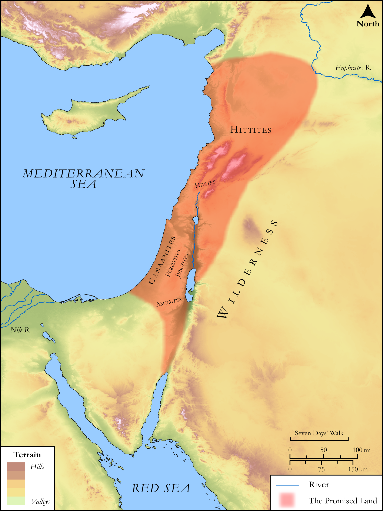

# Biblica Open Bible Maps

## License Information

Biblica Open Bible Maps, © 2023–2025 Biblica, Inc. This work is licensed under Creative Commons Attribution-ShareAlike 4.0 International (<a href="https://creativecommons.org/licenses/by-sa/4.0/">https://creativecommons.org/licenses/by-sa/4.0/</a>). More Information: <a href="https://docs.google.com/document/d/1Pp44yZ0Zdnd59vJHTrt2rPYq0SppfX5rZbPBt6mz37U/edit?tab=t.0#heading=h.oev9aj1ksvk2">https://docs.google.com/document/d/1Pp44yZ0Zdnd59vJHTrt2rPYq0SppfX5rZbPBt6mz37U/edit?tab=t.0#heading=h.oev9aj1ksvk2</a>

--------------------------------

## SRV Exodus: Exod. 23:20–32 (id: OT318)

### Image Content

[link](images/OT318.png)

Original: [SRV Exodus: Exod. 23:20\-32](https://drive.google.com/open?id=1NIPUDbajOUgNU7n4om9kXFbpSb9yZfS_&usp=drive_copy)

* **Associated Passages:** Exodus 23:1-33

* **Associated ACAI Concepts:** LORD (ID: `deity:Lord`); Force to Serve (ID: `keyterm:EnticedToServe`); Donkey (ID: `fauna:Donkey`); Hivites (ID: `group:Hivites`); Hittites (ID: `group:Hittite`); Canaan (ID: `place:Canaan`); An Angel (ID: `deity:Angel`); Egypt (ID: `place:Egypt`); Heth (ID: `person:Heth`); Canaanites (ID: `group:Canaan`); Terror (ID: `keyterm:Terror`); Mediterranean Sea (ID: `place:GreatSea`); Cattle (ID: `fauna:Bull`); Amorites (ID: `group:Amorites`); Red Sea (ID: `place:RedSea`); Bless (ID: `keyterm:Bless`); Be (Or Show Oneself) Just (ID: `keyterm:Just`); Covenant (ID: `keyterm:Covenant`); Rebel (ID: `keyterm:Rebel`); Philistia (ID: `place:Philistine`); Philistines (ID: `group:Philistine`); Exempt (ID: `keyterm:Exempt`); Perizzites (ID: `group:Perizzites`); To Sin (ID: `keyterm:Sin`); Euphrates River (ID: `place:Euphrates`); Forgive (ID: `keyterm:Forgive`); Slaughtering (ID: `keyterm:Slaughtering`); Jebusites (ID: `group:Jebusites`); Kid (ID: `fauna:Kid`); Sacred Pillar (ID: `realia:SacredPillar`); Hornet (ID: `fauna:Hornet`); Vine (ID: `flora:Vine`); Unleavened Bread (ID: `realia:UnleavenedBread`); Trap (ID: `realia:Trap`); Goat (ID: `fauna:Goat`); Olive Tree (ID: `flora:OliveTree`); House (ID: `realia:House`); Cattails (ID: `flora:Cattails`)
