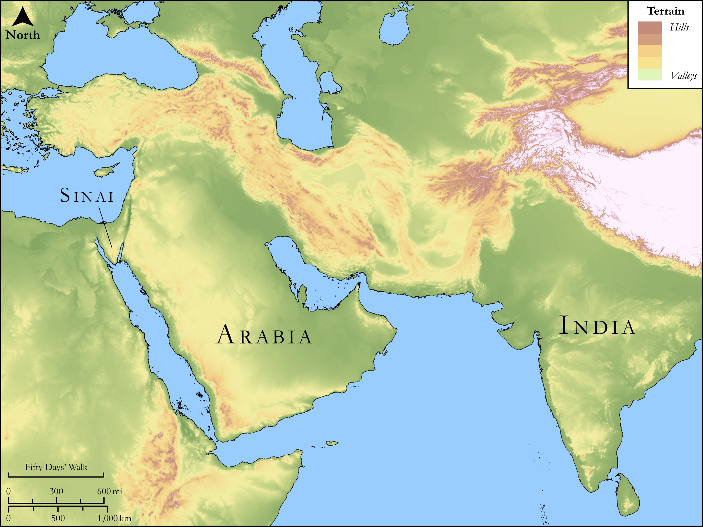

# Biblica Open Bible Maps

## License Information

Biblica Open Bible Maps, © 2023–2025 Biblica, Inc. This work is licensed under Creative Commons Attribution-ShareAlike 4.0 International (https://creativecommons.org/licenses/by-sa/4.0/). More Information: https://docs.google.com/document/d/1Pp44yZ0Zdnd59vJHTrt2rPYq0SppfX5rZbPBt6mz37U/edit?tab=t.0#heading=h.oev9aj1ksvk2

--------------------------------

## SRV Exodus: Exod. 30:22–33 (id: OT319)

### Image Content

[link](images/OT319.png)

Original: [SRV Exodus: Exod. 30:22\-33](https://drive.google.com/open?id=1AJ9QQFeTQZvRfulzp2oJ1sWfQ58eK9q5&usp=drive_copy)

* **Associated Passages:** Exodus 30:1-38

* **Associated ACAI Concepts:** LORD (ID: `deity:Lord`); Holy (ID: `keyterm:Holy`); Offering (ID: `keyterm:Offering`); Aaron (ID: `person:Aaron`); Temple Altar (ID: `realia:TempleAltar`); Tabernacle Altar (ID: `realia:TabernacleAltar`); Stone Altar (ID: `realia:StoneAltar`); Tent of Meeting (ID: `realia:TentOfMeeting`); Altar (ID: `realia:Altar`); Moses (ID: `person:Moses`); Israel (ID: `person:Israel`); Appease (ID: `keyterm:Appease`); Testimony (ID: `keyterm:Witness.2`); Shekel (ID: `realia:Shekel`); Anointing Oil (ID: `realia:AnointingOil`); Atonement (ID: `keyterm:Atonement`); Olive Oil (ID: `realia:OliveOil`); Ark of the Covenant (ID: `realia:ArkOfTheCovenant`); Horns of Altar (ID: `realia:HornsOfAltar`); Pure (ID: `keyterm:Pure`); Smear (ID: `keyterm:Smear`); Covenant Box (ID: `keyterm:CovenantBox`); Lamp (ID: `realia:Lamp`); Acacia (ID: `flora:Acacia`); Priesthood (ID: `keyterm:Priesthood`); Decree (ID: `keyterm:Decree`); To Sin (ID: `keyterm:Sin`); Fennel (ID: `flora:Fennel`); Gerah (ID: `realia:Gerah`); Onycha (ID: `fauna:Onycha`); Liquidambar (ID: `flora:Liquidambar`); Cassia (ID: `flora:Cassia`); Frankincense (ID: `flora:Frankincense`); Cinnamon (ID: `flora:Cinnamon`); Myrrh (ID: `flora:Myrrh`); Calamus (ID: `flora:Calamus`); Olive Tree (ID: `flora:OliveTree`); Curtain (ID: `realia:Curtain`); Hin (ID: `realia:Hin`); Wine (ID: `realia:Wine`); Cover Lid (ID: `realia:CoverLid`); Money (ID: `realia:Money`); Balsam Tree (ID: `flora:BalsamTree`); Cubit (ID: `realia:Cubit`); Lampstand (ID: `realia:Lampstand.2`)
