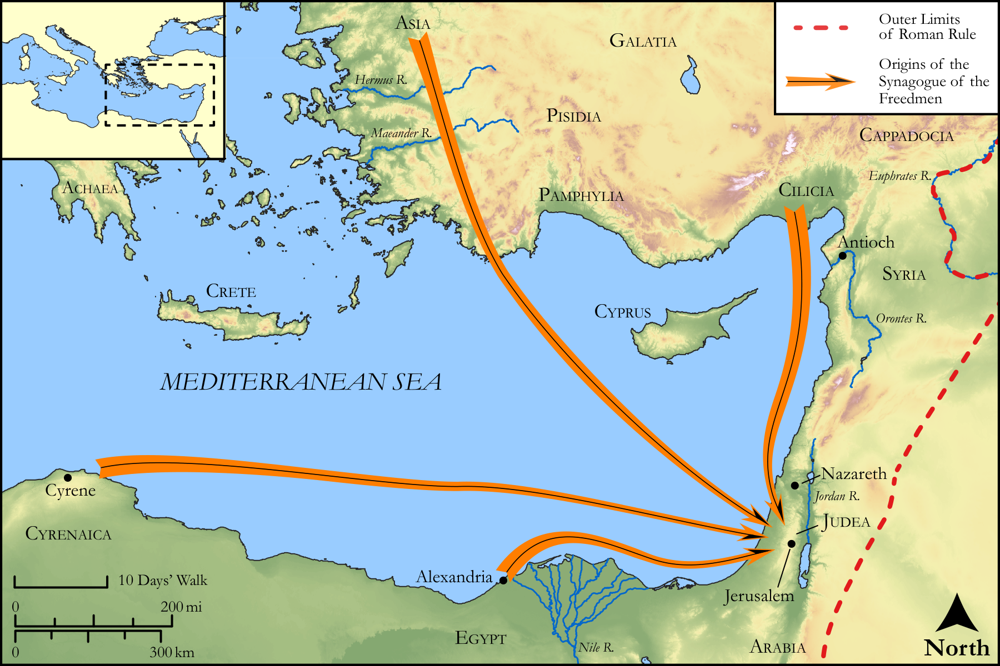

# Biblica Open Bible Maps

## License Information

Biblica Open Bible Maps, © 2023–2025 Biblica, Inc. This work is licensed under Creative Commons Attribution-ShareAlike 4.0 International (<a href="https://creativecommons.org/licenses/by-sa/4.0/">https://creativecommons.org/licenses/by-sa/4.0/</a>). More Information: <a href="https://docs.google.com/document/d/1Pp44yZ0Zdnd59vJHTrt2rPYq0SppfX5rZbPBt6mz37U/edit?tab=t.0#heading=h.oev9aj1ksvk2">https://docs.google.com/document/d/1Pp44yZ0Zdnd59vJHTrt2rPYq0SppfX5rZbPBt6mz37U/edit?tab=t.0#heading=h.oev9aj1ksvk2</a>

--------------------------------

## Paul and the Early Church: Stephen's Opponents (id: NT032)

### Image Content

[link](images/NT032.png)

Original: [Paul and the Early Church: Stephen's Opponents](https://drive.google.com/open?id=1wkj0nqBg-cNxlC5nHEBXKQ76QPlVyUPg&usp=drive_copy)

* **Associated Passages:** Acts 6:1-15

* **Associated ACAI Concepts:** Stephen (ID: `person:Stephen`); Serve (ID: `keyterm:Serve`); LORD (ID: `deity:Lord`); Be a Disciple (ID: `keyterm:Disciple`); Holy Spirit (ID: `deity:HolySpirit`); Believe (ID: `keyterm:Believe`); Pray (ID: `keyterm:Pray`); Spirit (ID: `keyterm:Spirit.2`); Word (ID: `keyterm:Word`); Moses (ID: `person:Moses`); Philip (ID: `person:Philip.4`); Parmenas (ID: `person:Parmenas`); Alexandria (ID: `place:Alexandria`); Alexandrians (ID: `group:Alexandria`); Nicanor (ID: `person:Nicanor`); Prochorus (ID: `person:Prochorus`); Freedmen (ID: `group:Freedmen`); Nicolaus (ID: `person:Nicolaus`); Timon (ID: `person:Timon`); Antiochians (ID: `group:Antioch`); Hellenists (ID: `group:Hellenist`); Jerusalem (ID: `place:Jerusalem`); Blasphemous (ID: `keyterm:Blasphemous`); A Group of Disciples (ID: `group:GenericDisciples`); Favor (ID: `keyterm:Favor`); Nazareth (ID: `place:Nazareth`); Cyrene (ID: `place:Cyrene`); Portent (ID: `keyterm:Portent`); Asia (ID: `place:Asia`); Hebrews (ID: `group:Hebrews`); Cilicia (ID: `place:Cilicia`); Witness (ID: `keyterm:Witness`); Symbol (ID: `keyterm:Example`); Jesus (ID: `person:Jesus.2`); Bear Witness (ID: `keyterm:BearWitness`); Ability (ID: `keyterm:Ability`); Law (ID: `keyterm:Law`); Greece (ID: `place:Greece`); Holy (ID: `keyterm:Holy`); An Angel (ID: `deity:Angel`); Chosen (ID: `keyterm:Chosen`); Antioch (ID: `place:Antioch`); Tabernacle (ID: `realia:Tabernacle`)
