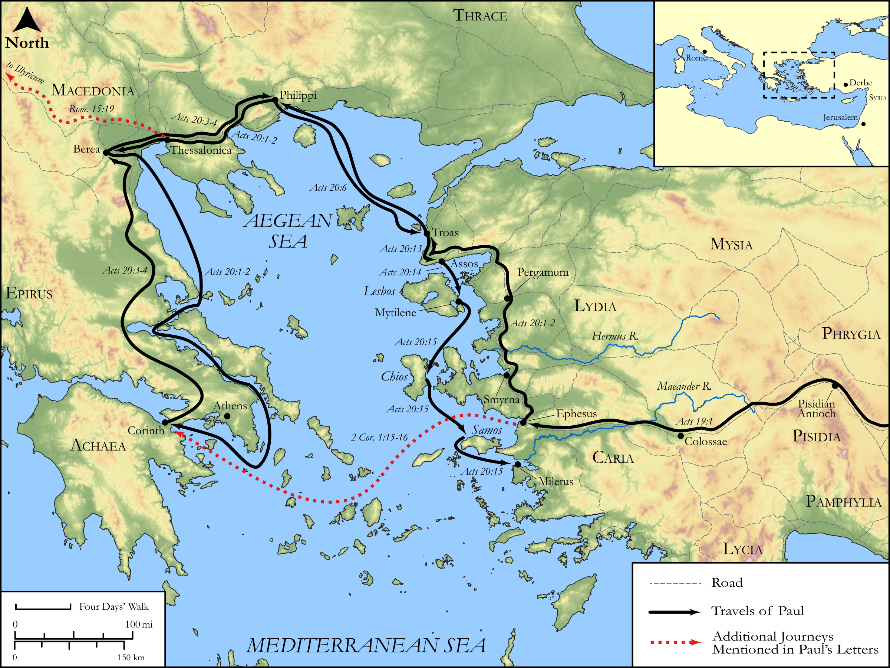

# Biblica Open Bible Maps

## License Information

Biblica Open Bible Maps, © 2023–2025 Biblica, Inc. This work is licensed under Creative Commons Attribution-ShareAlike 4.0 International (<a href="https://creativecommons.org/licenses/by-sa/4.0/">https://creativecommons.org/licenses/by-sa/4.0/</a>). More Information: <a href="https://docs.google.com/document/d/1Pp44yZ0Zdnd59vJHTrt2rPYq0SppfX5rZbPBt6mz37U/edit?tab=t.0#heading=h.oev9aj1ksvk2">https://docs.google.com/document/d/1Pp44yZ0Zdnd59vJHTrt2rPYq0SppfX5rZbPBt6mz37U/edit?tab=t.0#heading=h.oev9aj1ksvk2</a>

--------------------------------

## Paul and the Early Church: Paul's Third Missionary Journey (Part 1) (id: NT045)

### Image Content

[link](images/NT045.png)

Original: [Paul and the Early Church: Paul's Third Missionary Journey (Part 1\)](https://drive.google.com/open?id=1iQSHCHnWMOaMNUjex90pKZaB6hhjks8S&usp=drive_copy)

* **Associated Passages:** Acts 19:1-20:38

* **Associated ACAI Concepts:** Paul (ID: `person:Paul`); LORD (ID: `deity:Lord`); Jews (ID: `group:Jews`); Ephesus (ID: `place:Ephesus`); Jesus (ID: `person:Jesus.2`); Asia (ID: `place:Asia`); Macedonia (ID: `place:Macedonia`); Artemis (ID: `deity:Artemis`); Name (ID: `keyterm:Name`); Holy Spirit (ID: `deity:HolySpirit`); Be a Disciple (ID: `keyterm:Disciple`); Declare (ID: `keyterm:Declare`); Believe (ID: `keyterm:Believe`); Ask for (ID: `keyterm:AskFor`); Ephesians (ID: `group:Ephesus`); Javan (ID: `person:Javan`); Baptism (ID: `keyterm:Baptism`); Greeks (ID: `group:Greek`); Encourage (ID: `keyterm:Encourage`); Jerusalem (ID: `place:Jerusalem`); Serve (ID: `keyterm:Serve`); Life (ID: `keyterm:Life`); Miletus (ID: `place:Miletus`); Demetrius (ID: `person:Demetrius`); Assos (ID: `place:Assos`); Troas (ID: `place:Troas`); Aristarchus (ID: `person:Aristarchus`); Authority (ID: `keyterm:Authority.2`); The Way (ID: `keyterm:TheWay`); Repent (ID: `keyterm:Repent`)
