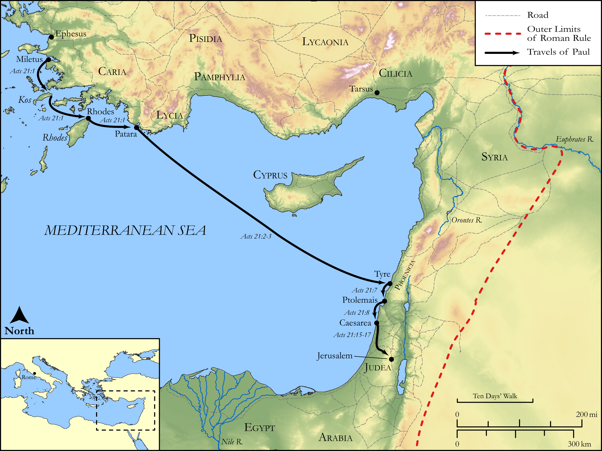

# Biblica Open Bible Maps

## License Information

Biblica Open Bible Maps, © 2023–2025 Biblica, Inc. This work is licensed under Creative Commons Attribution-ShareAlike 4.0 International (<a href="https://creativecommons.org/licenses/by-sa/4.0/">https://creativecommons.org/licenses/by-sa/4.0/</a>). More Information: <a href="https://docs.google.com/document/d/1Pp44yZ0Zdnd59vJHTrt2rPYq0SppfX5rZbPBt6mz37U/edit?tab=t.0#heading=h.oev9aj1ksvk2">https://docs.google.com/document/d/1Pp44yZ0Zdnd59vJHTrt2rPYq0SppfX5rZbPBt6mz37U/edit?tab=t.0#heading=h.oev9aj1ksvk2</a>

--------------------------------

## Paul and the Early Church: Paul's Third Missionary Journey (Part 2) (id: NT046)

### Image Content

[link](images/NT046.png)

Original: [Paul and the Early Church: Paul's Third Missionary Journey (Part 2\)](https://drive.google.com/open?id=13qqVxHNjLTuzt4r23BFyffk9LgXjKBZY&usp=drive_copy)

* **Associated Passages:** Acts 21:1-40

* **Associated ACAI Concepts:** Paul (ID: `person:Paul`); Jerusalem (ID: `place:Jerusalem`); Jews (ID: `group:Jews`); Temple (ID: `realia:Temple`); Gentiles (ID: `group:Gentile`); LORD (ID: `deity:Lord`); Law (ID: `keyterm:Law`); Caesarea (ID: `place:Caesarea`); Ship (ID: `realia:Ship`); Believe (ID: `keyterm:Believe`); Tyre (ID: `place:Tyre`); Pure (ID: `keyterm:Pure`); Name (ID: `keyterm:Name`); Be a Disciple (ID: `keyterm:Disciple`); Holy Spirit (ID: `deity:HolySpirit`); Cyprus (ID: `place:Cyprus`); Step (ID: `realia:Step`); Cos (ID: `place:Cos`); Rhodes (ID: `place:Rhodes`); Trophimus (ID: `person:Trophimus`); Philip (ID: `person:Philip.4`); Tarsus (ID: `place:Tarsus`); Tarsians (ID: `group:Tarsus`); Mnason (ID: `person:Mnason`); Cypriots (ID: `group:Cyprus`); Patara (ID: `place:Patara`); Phoenicia (ID: `place:Phoenicia`); Cilicia (ID: `place:Cilicia`); Agabus (ID: `person:Agabus`); Acco (ID: `place:Acco`); Judea (ID: `place:Judea`); Ephesians (ID: `group:Ephesus`); Live (ID: `keyterm:Live.3`); Egypt (ID: `place:Egypt`); Heart (ID: `keyterm:Heart`); Pray (ID: `keyterm:Pray`); Israelites (ID: `group:Israel`); Israel (ID: `person:Israel`); Defilement (ID: `keyterm:Defilement`); Offering (ID: `keyterm:Offering`); Military Member (ID: `person:MilitaryMember`); James (ID: `person:James.3`); Something Definite (ID: `keyterm:SomethingDefinite`); Javan (ID: `person:Javan`); Decided (ID: `keyterm:Decided`); Asia (ID: `place:Asia`); Vow (ID: `keyterm:Vow`); Greeks (ID: `group:Greek`); Ephesus (ID: `place:Ephesus`); Serve (ID: `keyterm:Serve`); Jesus (ID: `person:Jesus.2`); Moses (ID: `person:Moses`); Egyptians (ID: `group:Egypt`); Speak as a Prophet (ID: `keyterm:Speak`); Glory (ID: `keyterm:Glory`); Blood (ID: `keyterm:Blood`); Be Lawful (ID: `keyterm:Lawful`); Ask for (ID: `keyterm:AskFor`); Holy (ID: `keyterm:Holy`); Fornication (ID: `keyterm:Fornication`); Persuade (ID: `keyterm:Persuade`); Belt (ID: `realia:Belt`); Chain (ID: `realia:Chain`); Tabernacle (ID: `realia:Tabernacle`); House (ID: `realia:House`); Bag (ID: `realia:Bag`); Door (ID: `realia:Door`)
