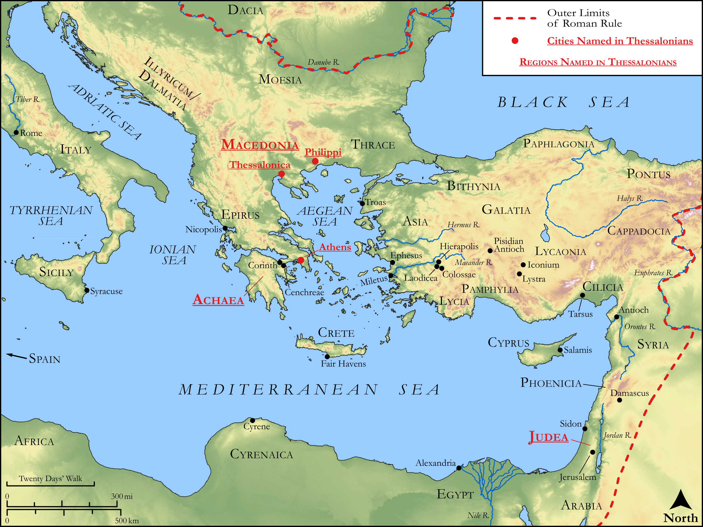

# Biblica Open Bible Maps

## License Information

Biblica Open Bible Maps, © 2023–2025 Biblica, Inc. This work is licensed under Creative Commons Attribution-ShareAlike 4.0 International (<a href="https://creativecommons.org/licenses/by-sa/4.0/">https://creativecommons.org/licenses/by-sa/4.0/</a>). More Information: <a href="https://docs.google.com/document/d/1Pp44yZ0Zdnd59vJHTrt2rPYq0SppfX5rZbPBt6mz37U/edit?tab=t.0#heading=h.oev9aj1ksvk2">https://docs.google.com/document/d/1Pp44yZ0Zdnd59vJHTrt2rPYq0SppfX5rZbPBt6mz37U/edit?tab=t.0#heading=h.oev9aj1ksvk2</a>

--------------------------------

## Paul and the Early Church: Thessalonians (id: NT056)

### Image Content

[link](images/NT056.png)

Original: [Paul and the Early Church: Thessalonians](https://drive.google.com/open?id=1LMttazjAZ1kntURzk8666x2xEONYUyGV&usp=drive_copy)

* **Associated Passages:** 1 Thessalonians 1:1-5:28; 2 Thessalonians 1:1-3:18

* **Associated ACAI Concepts:** Jesus (ID: `person:Jesus.2`); LORD (ID: `deity:Lord`); Believe (ID: `keyterm:Believe`); Ask for (ID: `keyterm:AskFor`); Love (ID: `keyterm:Love`); Good News (ID: `keyterm:GoodNews`); Favor (ID: `keyterm:Favor`); Glory (ID: `keyterm:Glory`); Heart (ID: `keyterm:Heart`); Encourage (ID: `keyterm:Encourage`); Hope (ID: `keyterm:Hope`); Consecration (ID: `keyterm:Consecration.2`); Pray (ID: `keyterm:Pray`); Salvation (ID: `keyterm:Salvation`); Holy Spirit (ID: `deity:HolySpirit`); Ability (ID: `keyterm:Ability`); Good (ID: `keyterm:Good`); Live (ID: `keyterm:Live.3`); Make Peace (ID: `keyterm:Peace`); Life (ID: `keyterm:Life`); Cause of Joy (ID: `keyterm:CauseOfJoy`); Holy (ID: `keyterm:Holy`); Paul (ID: `person:Paul`); Timothy (ID: `person:Timothy`); Church (ID: `keyterm:Church`); Lawless (ID: `keyterm:Lawless`); Be Blameless (ID: `keyterm:Blameless`); Macedonia (ID: `place:Macedonia`); Spirit (ID: `keyterm:Spirit.2`); Sky (ID: `keyterm:Heaven`)
