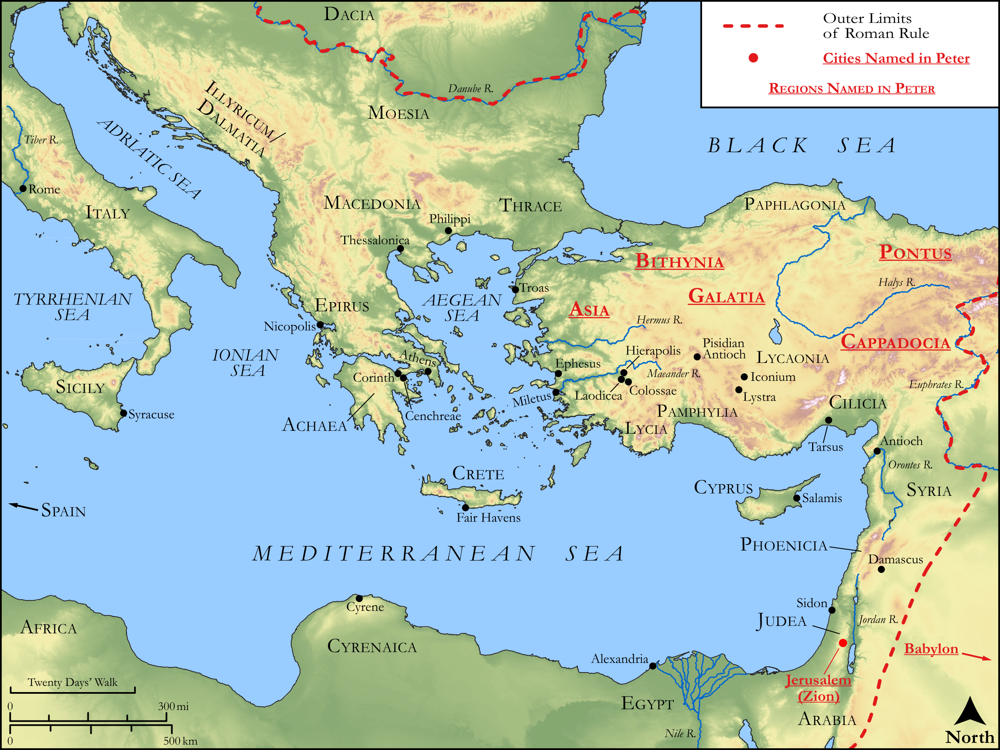

# Biblica Open Bible Maps

## License Information

Biblica Open Bible Maps, © 2023–2025 Biblica, Inc. This work is licensed under Creative Commons Attribution-ShareAlike 4.0 International (<a href="https://creativecommons.org/licenses/by-sa/4.0/">https://creativecommons.org/licenses/by-sa/4.0/</a>). More Information: <a href="https://docs.google.com/document/d/1Pp44yZ0Zdnd59vJHTrt2rPYq0SppfX5rZbPBt6mz37U/edit?tab=t.0#heading=h.oev9aj1ksvk2">https://docs.google.com/document/d/1Pp44yZ0Zdnd59vJHTrt2rPYq0SppfX5rZbPBt6mz37U/edit?tab=t.0#heading=h.oev9aj1ksvk2</a>

--------------------------------

## Paul and the Early Church: Peter (id: NT059)

### Image Content

[link](images/NT059.png)

Original: [Paul and the Early Church: Peter](https://drive.google.com/open?id=1rdSEz-oI5AKGfj4XXqJOO88jh0YkkKQ8&usp=drive_copy)

* **Associated Passages:** 1 Peter 1:1-5:14; 2 Peter 1:1-3:18

* **Associated ACAI Concepts:** LORD (ID: `deity:Lord`); Jesus (ID: `person:Jesus.2`); Glory (ID: `keyterm:Glory`); Ability (ID: `keyterm:Ability`); Favor (ID: `keyterm:Favor`); Be (Or Show Oneself) Just (ID: `keyterm:Just`); Body (ID: `keyterm:Body.3`); Holy (ID: `keyterm:Holy`); Believe (ID: `keyterm:Believe`); Life (ID: `keyterm:Life`); Sky (ID: `keyterm:Heaven`); Beloved (ID: `keyterm:Beloved`); To Sin (ID: `keyterm:Sin`); Salvation (ID: `keyterm:Salvation`); Love (ID: `keyterm:Love`); Fear (ID: `keyterm:Fear`); Good (ID: `keyterm:Good`); Always (ID: `keyterm:Always`); Judgment (ID: `keyterm:Judgment`); Hope (ID: `keyterm:Hope`); Do Good (ID: `keyterm:DoGood`); Chosen (ID: `keyterm:Chosen`); Promise (ID: `keyterm:Promise`); Savior (ID: `keyterm:Savior`); Heart (ID: `keyterm:Heart`); Holy Spirit (ID: `deity:HolySpirit`); Make Peace (ID: `keyterm:Peace`); An Angel (ID: `deity:Angel`); Blaspheme (ID: `keyterm:Blaspheme`); Decided (ID: `keyterm:Decided`)
