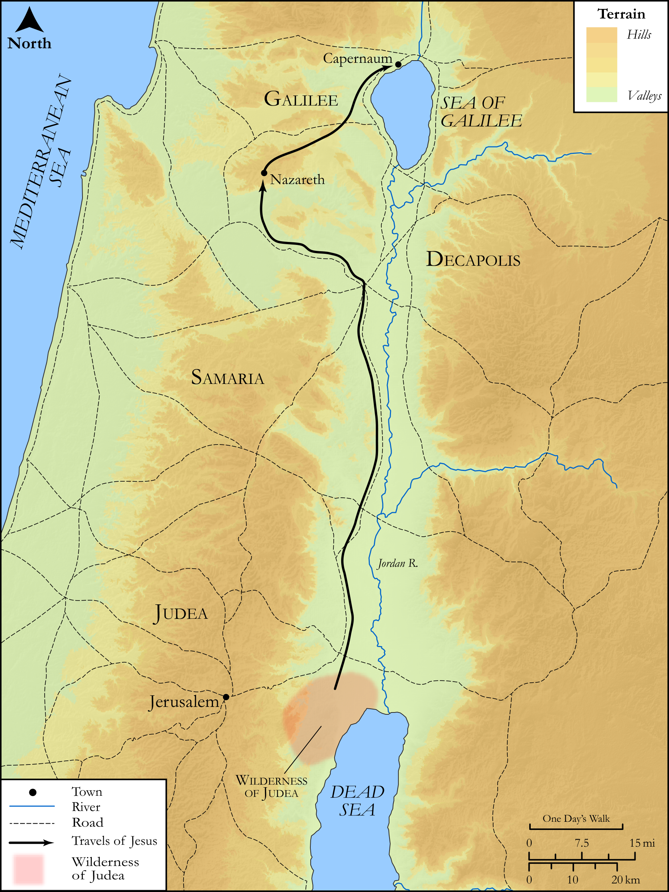

# Biblica Open Bible Maps

## License Information

Biblica Open Bible Maps, © 2023–2025 Biblica, Inc. This work is licensed under Creative Commons Attribution-ShareAlike 4.0 International (<a href="https://creativecommons.org/licenses/by-sa/4.0/">https://creativecommons.org/licenses/by-sa/4.0/</a>). More Information: <a href="https://docs.google.com/document/d/1Pp44yZ0Zdnd59vJHTrt2rPYq0SppfX5rZbPBt6mz37U/edit?tab=t.0#heading=h.oev9aj1ksvk2">https://docs.google.com/document/d/1Pp44yZ0Zdnd59vJHTrt2rPYq0SppfX5rZbPBt6mz37U/edit?tab=t.0#heading=h.oev9aj1ksvk2</a>

--------------------------------

## SRV Matthew: Matt. 4:12–24 (id: NT102)

### Image Content

[link](images/NT102.png)

Original: [SRV Matthew: Matt. 4:12\-24](https://drive.google.com/open?id=1vBbbIHzE3StZH2IZ8C6hpmTuxCgodgQK&usp=drive_copy)

* **Associated Passages:** Matthew 4:1-25

* **Associated ACAI Concepts:** Galilee (ID: `place:Galilee`); Serve (ID: `keyterm:Serve`); Jesus (ID: `person:Jesus.2`); LORD (ID: `deity:Lord`); Kingdom (ID: `keyterm:Kingdom`); Bow Down (ID: `keyterm:BowDown`); Proclaim (ID: `keyterm:Proclaim`); Put to the Test (ID: `keyterm:PutToTheTest`); Casting Net (ID: `realia:CastingNet`); Tribe of Zebulun (ID: `group:Zebulun`); Naphtali (ID: `person:Naphtali`); An Angel (ID: `deity:Angel`); Zebulun (ID: `person:Zebulun`); To Command (ID: `keyterm:Command`); Jordan River (ID: `place:Jordan`); Andrew (ID: `person:Andrew`); Fishnet (ID: `realia:Fishnet`); Repent (ID: `keyterm:Repent`); Decapolis (ID: `place:Decapolis`); Nazareth (ID: `place:Nazareth`); Word (ID: `keyterm:Word`); Zebedee (ID: `person:Zebedee`); Good News (ID: `keyterm:GoodNews`); John (ID: `person:John.2`); James (ID: `person:James`); Ship (ID: `realia:Ship`); Sea of Galilee (ID: `place:GalileeSea`); Judea (ID: `place:Judea`); Jerusalem (ID: `place:Jerusalem`); Priesthood (ID: `keyterm:Priesthood`); Be Demon Possessed (ID: `keyterm:DemonPossessed`); Satan (ID: `deity:Satan`); Abstain from Food (ID: `keyterm:Fast`); John (ID: `person:John`); Sky (ID: `keyterm:Heaven`); Gentiles (ID: `group:Gentile`); Peter (ID: `person:Peter`); Capernaum (ID: `place:Capernaum`); Isaiah (ID: `person:Isaiah`); Glory (ID: `keyterm:Glory`); Life (ID: `keyterm:Life`); Holy (ID: `keyterm:Holy`); To Cause to Happen (ID: `keyterm:Happen`); Holy Spirit (ID: `deity:HolySpirit`); Ability (ID: `keyterm:Ability`); Pinnacle (ID: `realia:Pinnacle`); Synagogue (ID: `realia:Synagogue`); Temple (ID: `realia:Temple`)
