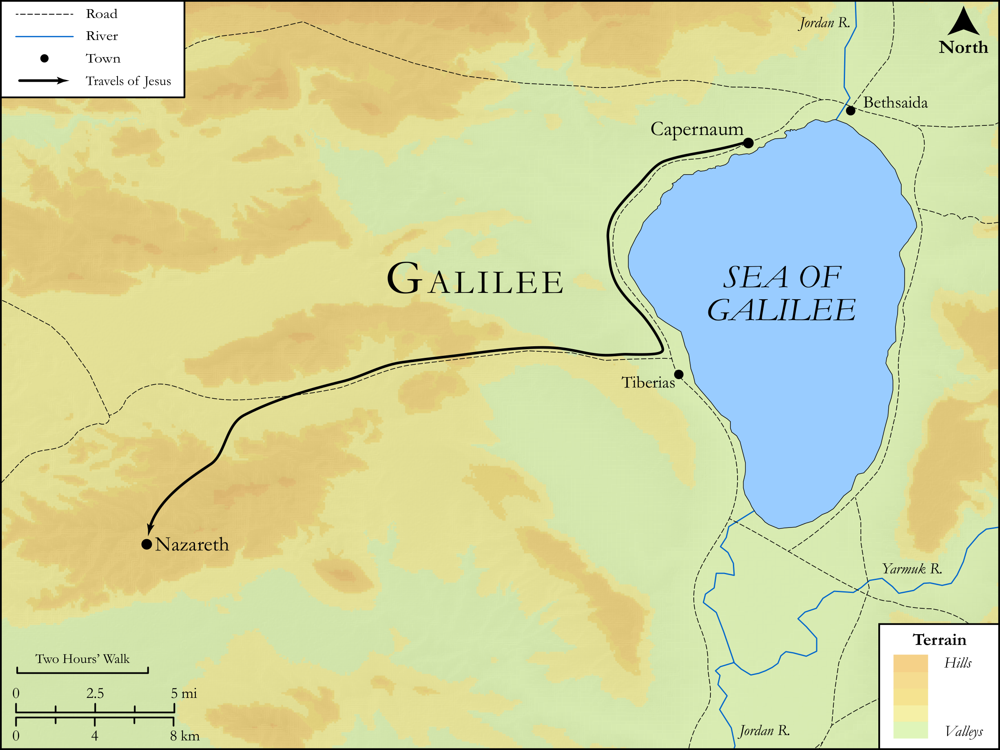

# Biblica Open Bible Maps

## License Information

Biblica Open Bible Maps, © 2023–2025 Biblica, Inc. This work is licensed under Creative Commons Attribution-ShareAlike 4.0 International (<a href="https://creativecommons.org/licenses/by-sa/4.0/">https://creativecommons.org/licenses/by-sa/4.0/</a>). More Information: <a href="https://docs.google.com/document/d/1Pp44yZ0Zdnd59vJHTrt2rPYq0SppfX5rZbPBt6mz37U/edit?tab=t.0#heading=h.oev9aj1ksvk2">https://docs.google.com/document/d/1Pp44yZ0Zdnd59vJHTrt2rPYq0SppfX5rZbPBt6mz37U/edit?tab=t.0#heading=h.oev9aj1ksvk2</a>

--------------------------------

## SRV Matthew: Matt. 13:54–58, Matt. 14:13–20 (id: NT109)

### Image Content

[link](images/NT109.png)

Original: [SRV Matthew: Matt. 13:54\-58, Matt. 14:13\-20](https://drive.google.com/open?id=1SzsJpx5ZFWTRn4Q0qyRoFdGaWyU6us8u&usp=drive_copy)

* **Associated Passages:** Matthew 13:1-58

* **Associated ACAI Concepts:** Kingdom (ID: `keyterm:Kingdom`); Parable (ID: `keyterm:Parable`); Sky (ID: `keyterm:Heaven`); Weed (ID: `flora:Weed`); Grain (ID: `flora:Grain`); Always (ID: `keyterm:Always`); Jesus (ID: `person:Jesus.2`); Ability (ID: `keyterm:Ability`); Be (Or Show Oneself) Just (ID: `keyterm:Just`); Be a Disciple (ID: `keyterm:Disciple`); An Angel (ID: `deity:Angel`); Heart (ID: `keyterm:Heart`); Cause of Joy (ID: `keyterm:CauseOfJoy`); Wheat (ID: `flora:Wheat`); Simon (ID: `person:Simon.3`); James (ID: `person:James.3`); Jude (ID: `person:Jude`); Disbelieve (ID: `keyterm:Disbelieve`); Brier (ID: `flora:Brier`); Mary (ID: `person:Mary`); Lawless (ID: `keyterm:Lawless`); A Group of Disciples (ID: `group:GenericDisciples`); LORD (ID: `deity:Lord`); Joseph (ID: `person:Joseph.4`); Surely! (ID: `keyterm:Surely`); Isaiah (ID: `person:Isaiah`); To Cause to Happen (ID: `keyterm:Happen`); Happy (ID: `keyterm:Happy`); Stumbling Block (ID: `keyterm:StumblingBlock`); Kiln (ID: `realia:Kiln`)
