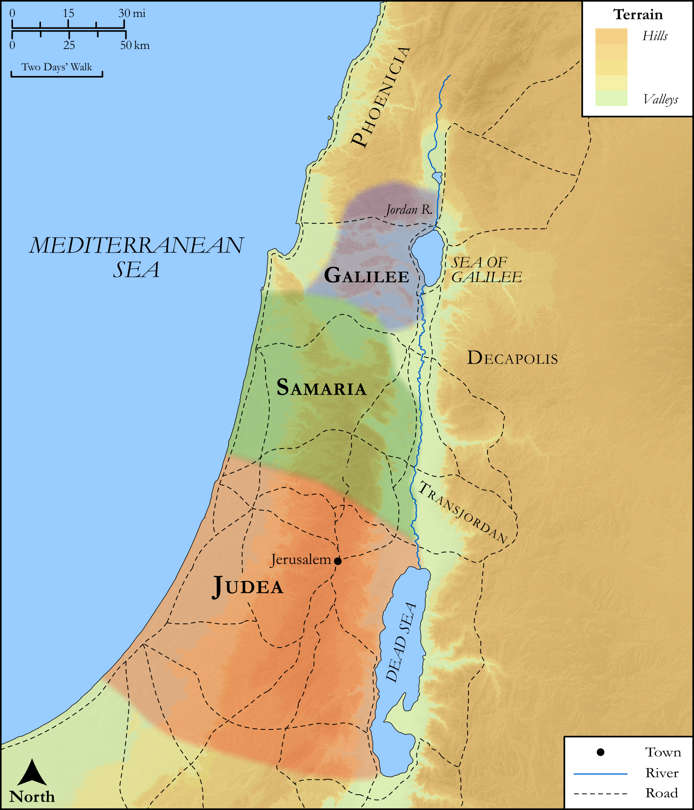

# Biblica Open Bible Maps

## License Information

Biblica Open Bible Maps, © 2023–2025 Biblica, Inc. This work is licensed under Creative Commons Attribution-ShareAlike 4.0 International (<a href="https://creativecommons.org/licenses/by-sa/4.0/">https://creativecommons.org/licenses/by-sa/4.0/</a>). More Information: <a href="https://docs.google.com/document/d/1Pp44yZ0Zdnd59vJHTrt2rPYq0SppfX5rZbPBt6mz37U/edit?tab=t.0#heading=h.oev9aj1ksvk2">https://docs.google.com/document/d/1Pp44yZ0Zdnd59vJHTrt2rPYq0SppfX5rZbPBt6mz37U/edit?tab=t.0#heading=h.oev9aj1ksvk2</a>

--------------------------------

## SRV Matthew: Matt. 19:1–12 (id: NT117)

### Image Content

[link](images/NT117.png)

Original: [SRV Matthew: Matt. 19:1\-12](https://drive.google.com/open?id=1udpl-UHsYBLdZIlcDNBnwzSeFHbXY71t&usp=drive_copy)

* **Associated Passages:** Matthew 19:1-30

* **Associated ACAI Concepts:** Jesus (ID: `person:Jesus.2`); Sky (ID: `keyterm:Heaven`); Kingdom (ID: `keyterm:Kingdom`); Be a Disciple (ID: `keyterm:Disciple`); LORD (ID: `deity:Lord`); Life (ID: `keyterm:Life`); Body (ID: `keyterm:Body.3`); Always (ID: `keyterm:Always`); Good (ID: `keyterm:Good`); Moses (ID: `person:Moses`); Surely! (ID: `keyterm:Surely`); Rich Young Ruler (ID: `person:RichYoungRuler`); Fornication (ID: `keyterm:Fornication`); To Command (ID: `keyterm:Command`); Judea (ID: `place:Judea`); Pray (ID: `keyterm:Pray`); Commandment (ID: `keyterm:Commandment`); Israel (ID: `person:Israel`); A Group of Disciples (ID: `group:GenericDisciples`); Salvation (ID: `keyterm:Salvation`); Decided (ID: `keyterm:Decided`); Love (ID: `keyterm:Love`); New World (ID: `keyterm:NewWorld`); Serve (ID: `keyterm:Serve`); Peter (ID: `person:Peter`); Name (ID: `keyterm:Name`); Hardheartedness (ID: `keyterm:Hardheartedness`); Glory (ID: `keyterm:Glory`); Ask for (ID: `keyterm:AskFor`); Be Lawful (ID: `keyterm:Lawful`); Galilee (ID: `place:Galilee`); Pharisees (ID: `group:Pharisee`); Jordan River (ID: `place:Jordan`); Needle (ID: `realia:Needle`); Camel (ID: `fauna:Camel`); Throne (ID: `realia:Throne`); House (ID: `realia:House`); Scroll (ID: `realia:Scroll`)
