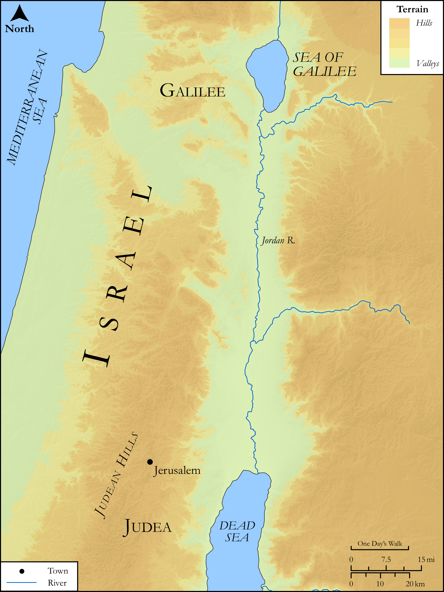

# Biblica Open Bible Maps

## License Information

Biblica Open Bible Maps, © 2023–2025 Biblica, Inc. This work is licensed under Creative Commons Attribution-ShareAlike 4.0 International (<a href="https://creativecommons.org/licenses/by-sa/4.0/">https://creativecommons.org/licenses/by-sa/4.0/</a>). More Information: <a href="https://docs.google.com/document/d/1Pp44yZ0Zdnd59vJHTrt2rPYq0SppfX5rZbPBt6mz37U/edit?tab=t.0#heading=h.oev9aj1ksvk2">https://docs.google.com/document/d/1Pp44yZ0Zdnd59vJHTrt2rPYq0SppfX5rZbPBt6mz37U/edit?tab=t.0#heading=h.oev9aj1ksvk2</a>

--------------------------------

## SRV Matthew: Matt. 24:15–27 (id: NT121)

### Image Content

[link](images/NT121.png)

Original: [SRV Matthew: Matt. 24:15\-27](https://drive.google.com/open?id=1hJkYAJYDxumMXxQjIC_SHmYH5xAhMSSn&usp=drive_copy)

* **Associated Passages:** Matthew 24:1-51

* **Associated ACAI Concepts:** Sky (ID: `keyterm:Heaven`); Jesus (ID: `person:Jesus.2`); Chosen (ID: `keyterm:Chosen`); Symbol (ID: `keyterm:Example`); Surely! (ID: `keyterm:Surely`); Ability (ID: `keyterm:Ability`); Noah (ID: `person:Noah`); Believe (ID: `keyterm:Believe`); Salvation (ID: `keyterm:Salvation`); Kingdom (ID: `keyterm:Kingdom`); Name (ID: `keyterm:Name`); Be a Disciple (ID: `keyterm:Disciple`); An Angel (ID: `deity:Angel`); Daniel (ID: `person:Daniel.3`); Faithfulness (ID: `keyterm:Faithfulness`); Disaster (ID: `keyterm:Disaster`); Judea (ID: `place:Judea`); Heart (ID: `keyterm:Heart`); Body (ID: `keyterm:Body.3`); Pray (ID: `keyterm:Pray`); Lawless (ID: `keyterm:Lawless`); Parable (ID: `keyterm:Parable`); Sabbath (ID: `keyterm:Sabbath`); LORD (ID: `deity:Lord`); Portent (ID: `keyterm:Portent`); Always (ID: `keyterm:Always`); Abomination of Desolation (ID: `keyterm:AbominationOfDesolation`); Love (ID: `keyterm:Love`); Good News (ID: `keyterm:GoodNews`); Proclaim (ID: `keyterm:Proclaim`)
