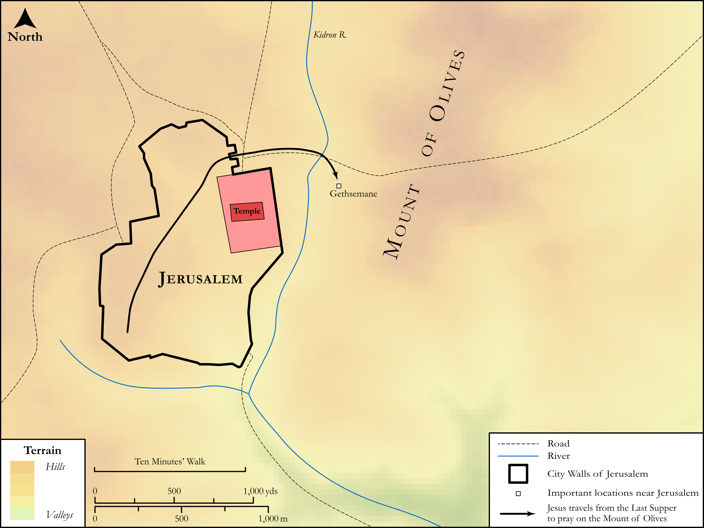

# Biblica Open Bible Maps

## License Information

Biblica Open Bible Maps, © 2023–2025 Biblica, Inc. This work is licensed under Creative Commons Attribution-ShareAlike 4.0 International (<a href="https://creativecommons.org/licenses/by-sa/4.0/">https://creativecommons.org/licenses/by-sa/4.0/</a>). More Information: <a href="https://docs.google.com/document/d/1Pp44yZ0Zdnd59vJHTrt2rPYq0SppfX5rZbPBt6mz37U/edit?tab=t.0#heading=h.oev9aj1ksvk2">https://docs.google.com/document/d/1Pp44yZ0Zdnd59vJHTrt2rPYq0SppfX5rZbPBt6mz37U/edit?tab=t.0#heading=h.oev9aj1ksvk2</a>

--------------------------------

## SRV Matthew: Matt. 26:36–45 (id: NT123)

### Image Content

[link](images/NT123.png)

Original: [SRV Matthew: Matt. 26:36\-45](https://drive.google.com/open?id=1PiB3MHhiiSGi4Q5qBKEHXdDhEEKl8C3q&usp=drive_copy)

* **Associated Passages:** Matthew 26:1-75

* **Associated ACAI Concepts:** Jesus (ID: `person:Jesus.2`); Be a Disciple (ID: `keyterm:Disciple`); Peter (ID: `person:Peter`); LORD (ID: `deity:Lord`); Pray (ID: `keyterm:Pray`); Passover (ID: `keyterm:Passover`); Body (ID: `keyterm:Body.3`); Judas (ID: `person:Judas.2`); Surely! (ID: `keyterm:Surely`); To Cause to Happen (ID: `keyterm:Happen`); Caiaphas (ID: `person:Caiaphas`); Written (ID: `keyterm:Scripture`); Galilee (ID: `place:Galilee`); Ability (ID: `keyterm:Ability`); Courtyard (ID: `realia:Courtyard`); Rooster (ID: `fauna:Rooster`); Simon (ID: `person:Simon.4`); Bethany (ID: `place:Bethany`); Spirit (ID: `keyterm:Spirit.2`); Gethsemane (ID: `place:Gethsemane`); Blood (ID: `keyterm:Blood`); Disaster (ID: `keyterm:Disaster`); A Servant (ID: `person:GenericServant`); A Group of People (ID: `group:GenericGroup`); Blaspheme (ID: `keyterm:Blaspheme`); Nazareth (ID: `place:Nazareth`); True (ID: `keyterm:True`); Word (ID: `keyterm:Word`); Sky (ID: `keyterm:Heaven`); Zebedee (ID: `person:Zebedee`)
