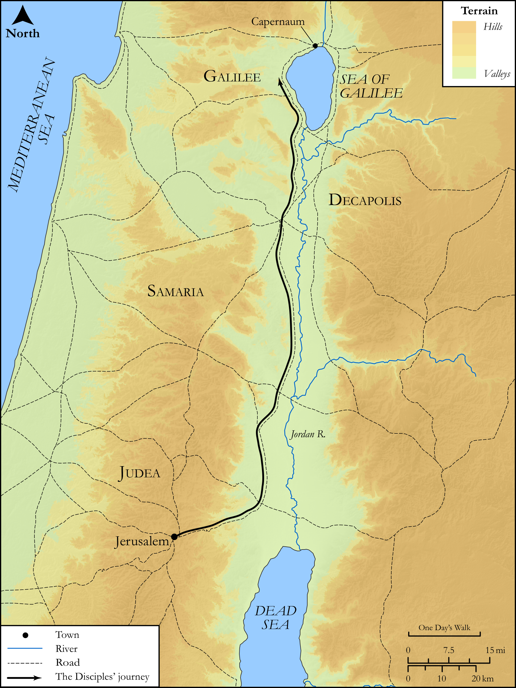

# Biblica Open Bible Maps

## License Information

Biblica Open Bible Maps, © 2023–2025 Biblica, Inc. This work is licensed under Creative Commons Attribution-ShareAlike 4.0 International (<a href="https://creativecommons.org/licenses/by-sa/4.0/">https://creativecommons.org/licenses/by-sa/4.0/</a>). More Information: <a href="https://docs.google.com/document/d/1Pp44yZ0Zdnd59vJHTrt2rPYq0SppfX5rZbPBt6mz37U/edit?tab=t.0#heading=h.oev9aj1ksvk2">https://docs.google.com/document/d/1Pp44yZ0Zdnd59vJHTrt2rPYq0SppfX5rZbPBt6mz37U/edit?tab=t.0#heading=h.oev9aj1ksvk2</a>

--------------------------------

## SRV Matthew: Matt. 28:16–19 (id: NT128)

### Image Content

[link](images/NT128.png)

Original: [SRV Matthew: Matt. 28:16\-19](https://drive.google.com/open?id=13TLSecPhzUsTSDKNkzX2KDao5e2Gg5Oz&usp=drive_copy)

* **Associated Passages:** Matthew 28:1-20

* **Associated ACAI Concepts:** Be a Disciple (ID: `keyterm:Disciple`); Jesus (ID: `person:Jesus.2`); Fear (ID: `keyterm:Fear`); Galilee (ID: `place:Galilee`); Resurrection (ID: `keyterm:Resurrection`); Bow Down (ID: `keyterm:BowDown`); LORD (ID: `deity:Lord`); Sky (ID: `keyterm:Heaven`); An Angel (ID: `deity:Angel`); Grave (ID: `realia:Grave`); Angels (ID: `group:Angels`); Week (ID: `keyterm:Week`); Authority (ID: `keyterm:Authority.2`); Sabbath (ID: `keyterm:Sabbath`); Mary (ID: `person:Mary.2`); To Command (ID: `keyterm:Command`); Always (ID: `keyterm:Always`); Mary Magdalene (ID: `person:Marymagdalene`); Cause of Joy (ID: `keyterm:CauseOfJoy`); Baptism (ID: `keyterm:Baptism`); Name (ID: `keyterm:Name`); Holy Spirit (ID: `deity:HolySpirit`); Jews (ID: `group:Jews`); Persuade (ID: `keyterm:Persuade`); Ability (ID: `keyterm:Ability`); Cross (ID: `realia:Cross`); Clothing (ID: `realia:Clothing`)
