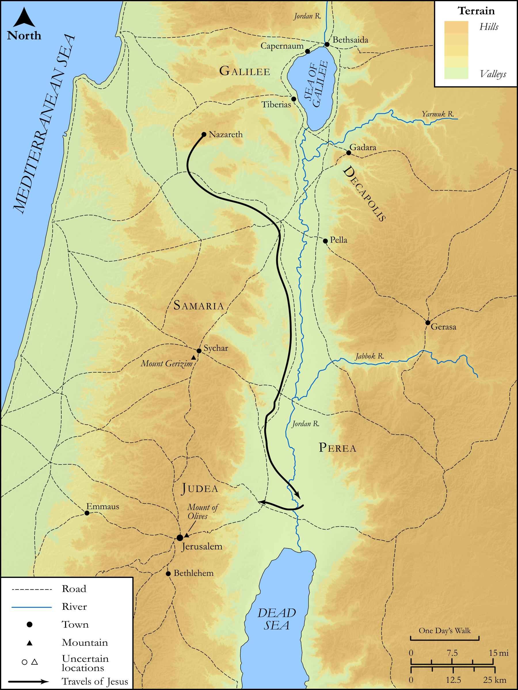

# Biblica Open Bible Maps

## License Information

Biblica Open Bible Maps, © 2023–2025 Biblica, Inc. This work is licensed under Creative Commons Attribution-ShareAlike 4.0 International (<a href="https://creativecommons.org/licenses/by-sa/4.0/">https://creativecommons.org/licenses/by-sa/4.0/</a>). More Information: <a href="https://docs.google.com/document/d/1Pp44yZ0Zdnd59vJHTrt2rPYq0SppfX5rZbPBt6mz37U/edit?tab=t.0#heading=h.oev9aj1ksvk2">https://docs.google.com/document/d/1Pp44yZ0Zdnd59vJHTrt2rPYq0SppfX5rZbPBt6mz37U/edit?tab=t.0#heading=h.oev9aj1ksvk2</a>

--------------------------------

## SRV Mark: Mark 1:1–13 (id: NT150)

### Image Content

[link](images/NT150.png)

Original: [SRV Mark: Mark 1:1\-13](https://drive.google.com/open?id=1VyBZEF91gAzty70JY98mjsUVw5l0qYop&usp=drive_copy)

* **Associated Passages:** Mark 1:1-45

* **Associated ACAI Concepts:** Proclaim (ID: `keyterm:Proclaim`); Jesus (ID: `person:Jesus.2`); Galilee (ID: `place:Galilee`); John (ID: `person:John`); LORD (ID: `deity:Lord`); Baptism (ID: `keyterm:Baptism`); Peter (ID: `person:Peter`); To Cleanse (ID: `keyterm:Cleanse.2`); Good News (ID: `keyterm:GoodNews`); Synagogue (ID: `realia:Synagogue`); Serve (ID: `keyterm:Serve`); Holy Spirit (ID: `deity:HolySpirit`); Jordan River (ID: `place:Jordan`); Zebedee (ID: `person:Zebedee`); James (ID: `person:James`); Repent (ID: `keyterm:Repent`); Demons (ID: `deity:Demons`); Nazareth (ID: `place:Nazareth`); Andrew (ID: `person:Andrew`); Sky (ID: `keyterm:Heaven`); John (ID: `person:John.2`); Authority (ID: `keyterm:Authority.2`); To Sin (ID: `keyterm:Sin`); An Angel (ID: `deity:Angel`); Ability (ID: `keyterm:Ability`); Capernaum (ID: `place:Capernaum`); Sea of Galilee (ID: `place:GalileeSea`); Hired Worker (ID: `keyterm:HiredWorker`); Judea (ID: `place:Judea`); Jerusalem (ID: `place:Jerusalem`); Believe (ID: `keyterm:Believe`); Be Demon Possessed (ID: `keyterm:DemonPossessed`); Pray (ID: `keyterm:Pray`); Satan (ID: `deity:Satan`); Sabbath (ID: `keyterm:Sabbath`); Infectious Skin Disease (ID: `keyterm:InfectiousSkinDisease`); Straightness (ID: `keyterm:Straightness`); To Command (ID: `keyterm:Command`); Offering (ID: `keyterm:Offering`); Beloved (ID: `keyterm:Beloved`); Put to the Test (ID: `keyterm:PutToTheTest`); Fishnet (ID: `realia:Fishnet`); Moses (ID: `person:Moses`); Isaiah (ID: `person:Isaiah`); Kingdom (ID: `keyterm:Kingdom`); Forgive (ID: `keyterm:Forgive`); Casting Net (ID: `realia:CastingNet`); Bear Witness (ID: `keyterm:BearWitness`); Ask for (ID: `keyterm:AskFor`); Ship (ID: `realia:Ship`); Holy (ID: `keyterm:Holy`); Strap (ID: `realia:Strap`); Bee (ID: `fauna:Bee`); Sandal (ID: `realia:Sandal`); Dove (ID: `fauna:Dove`); House (ID: `realia:House`); Bag (ID: `realia:Bag`); Leather (ID: `realia:Leather`); Locust (ID: `fauna:Locust`); Camel (ID: `fauna:Camel`); Belt (ID: `realia:Belt`)
