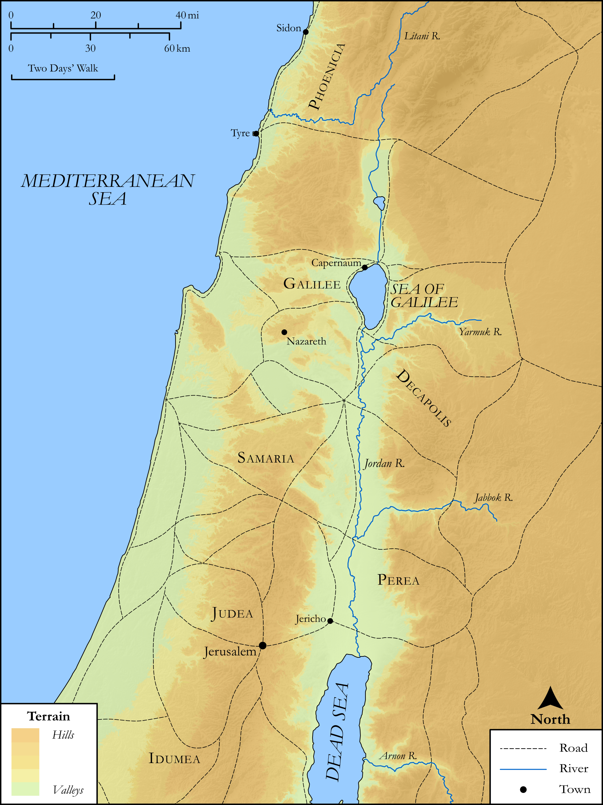

# Biblica Open Bible Maps

## License Information

Biblica Open Bible Maps, © 2023–2025 Biblica, Inc. This work is licensed under Creative Commons Attribution-ShareAlike 4.0 International (<a href="https://creativecommons.org/licenses/by-sa/4.0/">https://creativecommons.org/licenses/by-sa/4.0/</a>). More Information: <a href="https://docs.google.com/document/d/1Pp44yZ0Zdnd59vJHTrt2rPYq0SppfX5rZbPBt6mz37U/edit?tab=t.0#heading=h.oev9aj1ksvk2">https://docs.google.com/document/d/1Pp44yZ0Zdnd59vJHTrt2rPYq0SppfX5rZbPBt6mz37U/edit?tab=t.0#heading=h.oev9aj1ksvk2</a>

--------------------------------

## SRV Mark: Mark 3:7–11 (id: NT155)

### Image Content

[link](images/NT155.png)

Original: [SRV Mark: Mark 3:7\-11](https://drive.google.com/open?id=1NiRx4t7BRWfRXQkEsUlMuUaKLH28_QRP&usp=drive_copy)

* **Associated Passages:** Mark 3:1-35

* **Associated ACAI Concepts:** Satan (ID: `deity:Satan`); Blaspheme (ID: `keyterm:Blaspheme`); Jerusalem (ID: `place:Jerusalem`); Sabbath (ID: `keyterm:Sabbath`); Demons (ID: `deity:Demons`); Serve (ID: `keyterm:Serve`); To Sin (ID: `keyterm:Sin`); Name (ID: `keyterm:Name`); Forgive (ID: `keyterm:Forgive`); Be a Disciple (ID: `keyterm:Disciple`); Bartholomew (ID: `person:Bartholomew`); Zealots (ID: `group:Zealot`); Alphaeus (ID: `person:Alphaeus`); John (ID: `person:John.2`); James (ID: `person:James`); Be Lawful (ID: `keyterm:Lawful`); James (ID: `person:James.2`); Herodians (ID: `group:Herodian`); Idumea (ID: `place:Idumea`); House (ID: `realia:House`); Judea (ID: `place:Judea`); Heart (ID: `keyterm:Heart`); Parable (ID: `keyterm:Parable`); LORD (ID: `deity:Lord`); Religious Officials (ID: `group:ReligiousOfficials`); Tyre (ID: `place:Tyre`); Sidon (ID: `place:Sidon`); Andrew (ID: `person:Andrew`); Always (ID: `keyterm:Always`); Judas (ID: `person:Judas.2`); Salvation (ID: `keyterm:Salvation`); Simon (ID: `person:Simon.2`); Zebedee (ID: `person:Zebedee`); Proclaim (ID: `keyterm:Proclaim`); Authority (ID: `keyterm:Authority.2`); Jesus (ID: `person:Jesus.2`); Peter (ID: `person:Peter`); Surely! (ID: `keyterm:Surely`); Kingdom (ID: `keyterm:Kingdom`); Judas (ID: `person:Judas`); Life (ID: `keyterm:Life`); Thomas (ID: `person:Thomas`); Matthew (ID: `person:Matthew`); Philip (ID: `person:Philip`); Pharisees (ID: `group:Pharisee`); Galilee (ID: `place:Galilee`); Holy Spirit (ID: `deity:HolySpirit`); To Command (ID: `keyterm:Command`); Ability (ID: `keyterm:Ability`); Jordan River (ID: `place:Jordan`); Temple (ID: `realia:Temple`); Synagogue (ID: `realia:Synagogue`); Ship (ID: `realia:Ship`)
