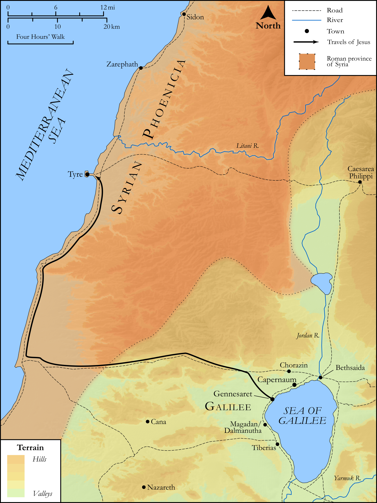

# Biblica Open Bible Maps

## License Information

Biblica Open Bible Maps, © 2023–2025 Biblica, Inc. This work is licensed under Creative Commons Attribution-ShareAlike 4.0 International (<a href="https://creativecommons.org/licenses/by-sa/4.0/">https://creativecommons.org/licenses/by-sa/4.0/</a>). More Information: <a href="https://docs.google.com/document/d/1Pp44yZ0Zdnd59vJHTrt2rPYq0SppfX5rZbPBt6mz37U/edit?tab=t.0#heading=h.oev9aj1ksvk2">https://docs.google.com/document/d/1Pp44yZ0Zdnd59vJHTrt2rPYq0SppfX5rZbPBt6mz37U/edit?tab=t.0#heading=h.oev9aj1ksvk2</a>

--------------------------------

## SRV Mark: Mark 7:24–29 (id: NT162)

### Image Content

[link](images/NT162.png)

Original: [SRV Mark: Mark 7:24\-29](https://drive.google.com/open?id=1X3Fdj7RAsJbPNdPGSSSwSnA8tIdSN98t&usp=drive_copy)

* **Associated Passages:** Mark 7:1-37

* **Associated ACAI Concepts:** Defilement (ID: `keyterm:Defilement`); Teaching (ID: `keyterm:Teaching`); Pharisees (ID: `group:Pharisee`); Heart (ID: `keyterm:Heart`); LORD (ID: `deity:Lord`); Demons (ID: `deity:Demons`); Be a Disciple (ID: `keyterm:Disciple`); Tyre (ID: `place:Tyre`); House (ID: `realia:House`); Commandment (ID: `keyterm:Commandment`); Ask for (ID: `keyterm:AskFor`); Temple Treasury (ID: `place:Corban`); Decapolis (ID: `place:Decapolis`); Sidon (ID: `place:Sidon`); Greeks (ID: `group:Greek`); Phoenicia (ID: `place:Phoenicia`); Syrophoenicians (ID: `group:Phoenicia`); Temple (ID: `realia:Temple`); Bed (ID: `realia:Bed`); Dog (ID: `fauna:Dog`); Jerusalem (ID: `place:Jerusalem`); Live (ID: `keyterm:Live.3`); Parable (ID: `keyterm:Parable`); Worship (ID: `keyterm:Worship`); Blaspheme (ID: `keyterm:Blaspheme`); Religious Officials (ID: `group:ReligiousOfficials`); Offering (ID: `keyterm:Offering`); Javan (ID: `person:Javan`); Sky (ID: `keyterm:Heaven`); Honest (ID: `keyterm:Honest`); Proclaim (ID: `keyterm:Proclaim`); Baptism (ID: `keyterm:Baptism`); Moses (ID: `person:Moses`); Isaiah (ID: `person:Isaiah`); Speak as a Prophet (ID: `keyterm:Speak`); Sea of Galilee (ID: `place:GalileeSea`); Fornication (ID: `keyterm:Fornication`); Jews (ID: `group:Jews`); To Cleanse (ID: `keyterm:Cleanse.2`); Cooking Pot (ID: `realia:CookingPot`)
