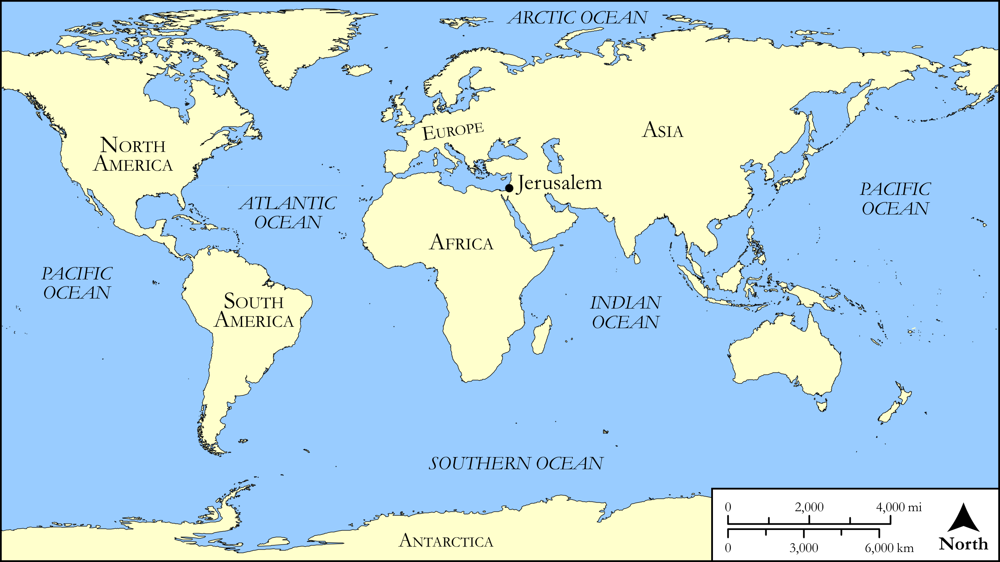

# Biblica Open Bible Maps

## License Information

Biblica Open Bible Maps, © 2023–2025 Biblica, Inc. This work is licensed under Creative Commons Attribution-ShareAlike 4.0 International (<a href="https://creativecommons.org/licenses/by-sa/4.0/">https://creativecommons.org/licenses/by-sa/4.0/</a>). More Information: <a href="https://docs.google.com/document/d/1Pp44yZ0Zdnd59vJHTrt2rPYq0SppfX5rZbPBt6mz37U/edit?tab=t.0#heading=h.oev9aj1ksvk2">https://docs.google.com/document/d/1Pp44yZ0Zdnd59vJHTrt2rPYq0SppfX5rZbPBt6mz37U/edit?tab=t.0#heading=h.oev9aj1ksvk2</a>

--------------------------------

## SRV Mark: Mark 13:24–30 (id: NT171)

### Image Content

[link](images/NT171.png)

Original: [SRV Mark: Mark 13:24\-30](https://drive.google.com/open?id=1fs2IoIt1G_13TuDghZECrnFPOuY7p_8-&usp=drive_copy)

* **Associated Passages:** Mark 13:1-37

* **Associated ACAI Concepts:** Sky (ID: `keyterm:Heaven`); LORD (ID: `deity:Lord`); Jesus (ID: `person:Jesus.2`); Chosen (ID: `keyterm:Chosen`); House (ID: `realia:House`); Salvation (ID: `keyterm:Salvation`); Symbol (ID: `keyterm:Example`); Name (ID: `keyterm:Name`); Ability (ID: `keyterm:Ability`); An Angel (ID: `deity:Angel`); Temple (ID: `realia:Temple`); Disaster (ID: `keyterm:Disaster`); Judea (ID: `place:Judea`); Believe (ID: `keyterm:Believe`); Body (ID: `keyterm:Body.3`); Pray (ID: `keyterm:Pray`); Parable (ID: `keyterm:Parable`); A Group of Disciples (ID: `group:GenericDisciples`); Portent (ID: `keyterm:Portent`); Andrew (ID: `person:Andrew`); Abomination of Desolation (ID: `keyterm:AbominationOfDesolation`); Good News (ID: `keyterm:GoodNews`); Proclaim (ID: `keyterm:Proclaim`); John (ID: `person:John.2`); Authority (ID: `keyterm:Authority.2`); Peter (ID: `person:Peter`); Surely! (ID: `keyterm:Surely`); Kingdom (ID: `keyterm:Kingdom`); James (ID: `person:James`); Bear Witness (ID: `keyterm:BearWitness`); Glory (ID: `keyterm:Glory`); Be a Disciple (ID: `keyterm:Disciple`); Holy Spirit (ID: `deity:HolySpirit`); To Command (ID: `keyterm:Command`); Fig (ID: `flora:Fig`); Synagogue (ID: `realia:Synagogue`); Housetop (ID: `realia:Housetop`); Olive Tree (ID: `flora:OliveTree`); Door (ID: `realia:Door`); Cloak (ID: `realia:Cloak`)
