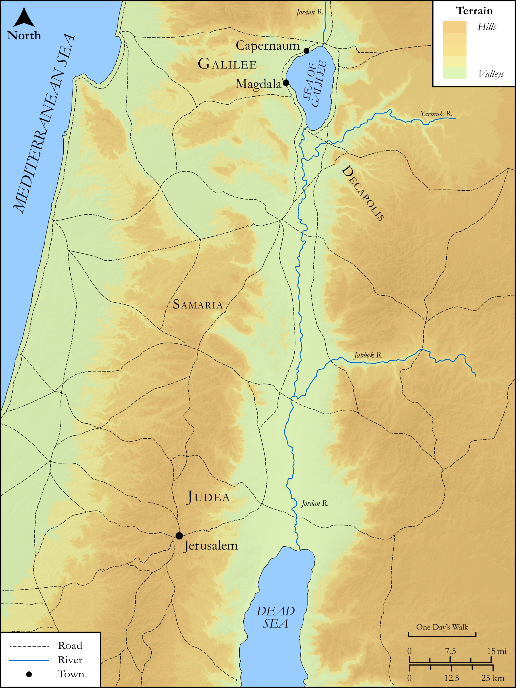

# Biblica Open Bible Maps

## License Information

Biblica Open Bible Maps, © 2023–2025 Biblica, Inc. This work is licensed under Creative Commons Attribution-ShareAlike 4.0 International (<a href="https://creativecommons.org/licenses/by-sa/4.0/">https://creativecommons.org/licenses/by-sa/4.0/</a>). More Information: <a href="https://docs.google.com/document/d/1Pp44yZ0Zdnd59vJHTrt2rPYq0SppfX5rZbPBt6mz37U/edit?tab=t.0#heading=h.oev9aj1ksvk2">https://docs.google.com/document/d/1Pp44yZ0Zdnd59vJHTrt2rPYq0SppfX5rZbPBt6mz37U/edit?tab=t.0#heading=h.oev9aj1ksvk2</a>

--------------------------------

## SRV Mark: Mark 15:40–46 (id: NT174)

### Image Content

[link](images/NT174.png)

Original: [SRV Mark: Mark 15:40\-46](https://drive.google.com/open?id=1taeF34_6P1_ECoFJv45eYEuFMlAw8n6o&usp=drive_copy)

* **Associated Passages:** Mark 15:1-47

* **Associated ACAI Concepts:** Pilate (ID: `person:Pilate`); Jesus (ID: `person:Jesus.2`); Jews (ID: `group:Jews`); Cross (ID: `realia:Cross`); Barabbas (ID: `person:Barabbas`); A Group of People (ID: `group:GenericGroup`); Mary (ID: `person:Mary.2`); Joseph (ID: `person:Joseph.6`); Elijah (ID: `person:Elijah`); LORD (ID: `deity:Lord`); Mary Magdalene (ID: `person:Marymagdalene`); Salvation (ID: `keyterm:Salvation`); James (ID: `person:James.4`); Simon (ID: `person:Simon.5`); Alexander (ID: `person:Alexander`); Joseph (ID: `person:Joseph.5`); Cyrene (ID: `place:Cyrene`); Golgotha (ID: `place:Golgotha`); Rufus (ID: `person:Rufus`); Centurion at Crucifixion (ID: `person:Centurion.3`); Arimathea (ID: `place:Arimathea`); Salome (ID: `person:Salome`); Joseph (ID: `person:Joseph.3`); Purple Cloth (ID: `realia:PurpleCloth`); Jerusalem (ID: `place:Jerusalem`); Believe (ID: `keyterm:Believe`); Body (ID: `keyterm:Body.3`); Bow Down (ID: `keyterm:BowDown`); Israel (ID: `person:Israel`); Blaspheme (ID: `keyterm:Blaspheme`); Religious Officials (ID: `group:ReligiousOfficials`); True (ID: `keyterm:True`); Serve (ID: `keyterm:Serve`); Priests (ID: `group:GenericPriests`); Kingdom (ID: `keyterm:Kingdom`); Day Before the Sabbath (ID: `keyterm:DayBeforeTheSabbath`); Elders (ID: `group:GenericElders`); Galilee (ID: `place:Galilee`); Reed (ID: `flora:Reed`); Temple (ID: `realia:Temple`); Clothing (ID: `realia:Clothing`); Palace (ID: `realia:Palace`); Myrrhed Wine (ID: `realia:MyrrhedWine`); Myrrh (ID: `flora:Myrrh`); Lot (ID: `realia:Lot`); Curtain (ID: `realia:Curtain`); Grave (ID: `realia:Grave`); Courtyard (ID: `realia:Courtyard`); Boxthorn (ID: `flora:Boxthorn`); Brier (ID: `flora:Brier`); Sour Wine (ID: `realia:SourWine`); Crown (ID: `realia:Crown`); Crown (ID: `realia:Crown.2`); Linen (ID: `realia:Linen`); Acacia (ID: `flora:Acacia`)
