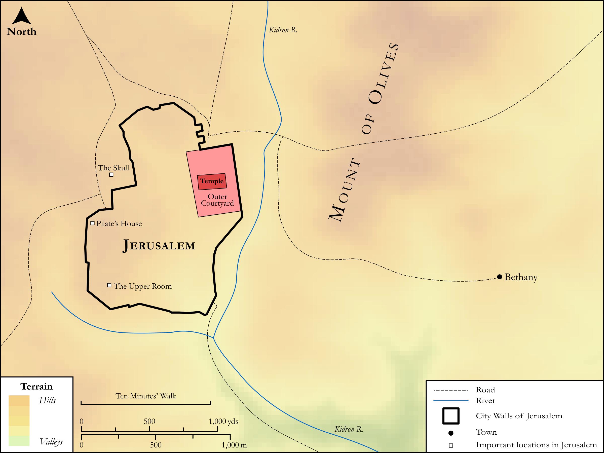

# Biblica Open Bible Maps

## License Information

Biblica Open Bible Maps, © 2023–2025 Biblica, Inc. This work is licensed under Creative Commons Attribution-ShareAlike 4.0 International (<a href="https://creativecommons.org/licenses/by-sa/4.0/">https://creativecommons.org/licenses/by-sa/4.0/</a>). More Information: <a href="https://docs.google.com/document/d/1Pp44yZ0Zdnd59vJHTrt2rPYq0SppfX5rZbPBt6mz37U/edit?tab=t.0#heading=h.oev9aj1ksvk2">https://docs.google.com/document/d/1Pp44yZ0Zdnd59vJHTrt2rPYq0SppfX5rZbPBt6mz37U/edit?tab=t.0#heading=h.oev9aj1ksvk2</a>

--------------------------------

## SRV Mark: All Mark Sites (Jerusalem) (id: NT176)

### Image Content

[link](images/NT176.png)

Original: [SRV Mark: All Mark Sites (Jerusalem)](https://drive.google.com/open?id=1M0WzcRSpONCLunI6v3oLvhxAOvYiXvwK&usp=drive_copy)

* **Associated Passages:** Mark 1:1-16:20

* **Associated ACAI Concepts:** Jesus (ID: `person:Jesus.2`); LORD (ID: `deity:Lord`); Be a Disciple (ID: `keyterm:Disciple`); Peter (ID: `person:Peter`); Ability (ID: `keyterm:Ability`); Believe (ID: `keyterm:Believe`); Kingdom (ID: `keyterm:Kingdom`); Sky (ID: `keyterm:Heaven`); John (ID: `person:John`); Proclaim (ID: `keyterm:Proclaim`); Surely! (ID: `keyterm:Surely`); Salvation (ID: `keyterm:Salvation`); Name (ID: `keyterm:Name`); Parable (ID: `keyterm:Parable`); To Command (ID: `keyterm:Command`); Fear (ID: `keyterm:Fear`); Life (ID: `keyterm:Life`); Ask for (ID: `keyterm:AskFor`); Pray (ID: `keyterm:Pray`); Galilee (ID: `place:Galilee`); Jerusalem (ID: `place:Jerusalem`); Demons (ID: `deity:Demons`); Baptism (ID: `keyterm:Baptism`); Heart (ID: `keyterm:Heart`); Authority (ID: `keyterm:Authority.2`); Pharisees (ID: `group:Pharisee`); John (ID: `person:John.2`); James (ID: `person:James`); Pilate (ID: `person:Pilate`); Elijah (ID: `person:Elijah`)
