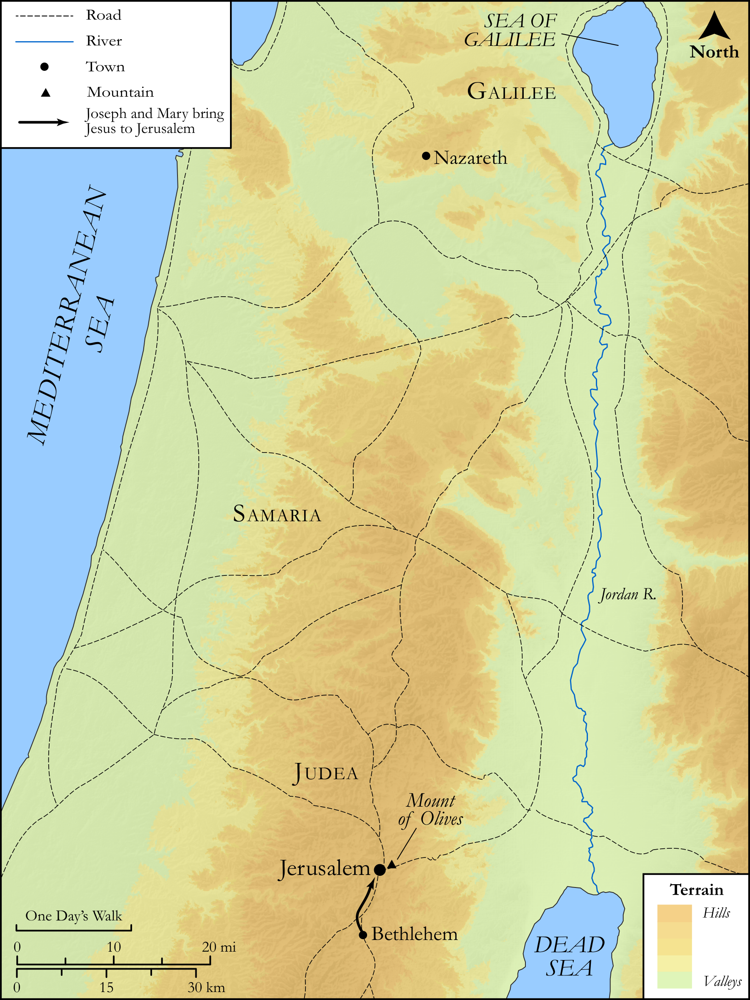

# Biblica Open Bible Maps

## License Information

Biblica Open Bible Maps, © 2023–2025 Biblica, Inc. This work is licensed under Creative Commons Attribution-ShareAlike 4.0 International (<a href="https://creativecommons.org/licenses/by-sa/4.0/">https://creativecommons.org/licenses/by-sa/4.0/</a>). More Information: <a href="https://docs.google.com/document/d/1Pp44yZ0Zdnd59vJHTrt2rPYq0SppfX5rZbPBt6mz37U/edit?tab=t.0#heading=h.oev9aj1ksvk2">https://docs.google.com/document/d/1Pp44yZ0Zdnd59vJHTrt2rPYq0SppfX5rZbPBt6mz37U/edit?tab=t.0#heading=h.oev9aj1ksvk2</a>

--------------------------------

## SRV Luke: Luke 2:22–39 (id: NT203)

### Image Content

[link](images/NT203.png)

Original: [SRV Luke: Luke 2:22\-39](https://drive.google.com/open?id=17U5rVTwSQJY7YofhpsxJk2A7Kz0tThJ2&usp=drive_copy)

* **Associated Passages:** Luke 2:1-52

* **Associated ACAI Concepts:** LORD (ID: `deity:Lord`); Jerusalem (ID: `place:Jerusalem`); Word (ID: `keyterm:Word`); Jesus (ID: `person:Jesus.2`); Law (ID: `keyterm:Law`); An Angel (ID: `deity:Angel`); Mary (ID: `person:Mary`); Glory (ID: `keyterm:Glory`); Nazareth (ID: `place:Nazareth`); Heart (ID: `keyterm:Heart`); Israel (ID: `person:Israel`); Register (ID: `keyterm:Register`); Holy Spirit (ID: `deity:HolySpirit`); Sheep (ID: `fauna:Lamb`); Flock (ID: `fauna:Flock`); Goat (ID: `fauna:Goat`); Simeon (ID: `person:Simeon.2`); Bethlehem (ID: `place:Bethlehem`); Manger (ID: `realia:Manger`); Favor (ID: `keyterm:Favor`); Joseph (ID: `person:Joseph.4`); David (ID: `person:David`); Symbol (ID: `keyterm:Example`); Fear (ID: `keyterm:Fear`); Bless (ID: `keyterm:Bless`); Name (ID: `keyterm:Name`); Make Peace (ID: `keyterm:Peace`); Holy (ID: `keyterm:Holy`); Galilee (ID: `place:Galilee`); Temple (ID: `realia:Temple`)
