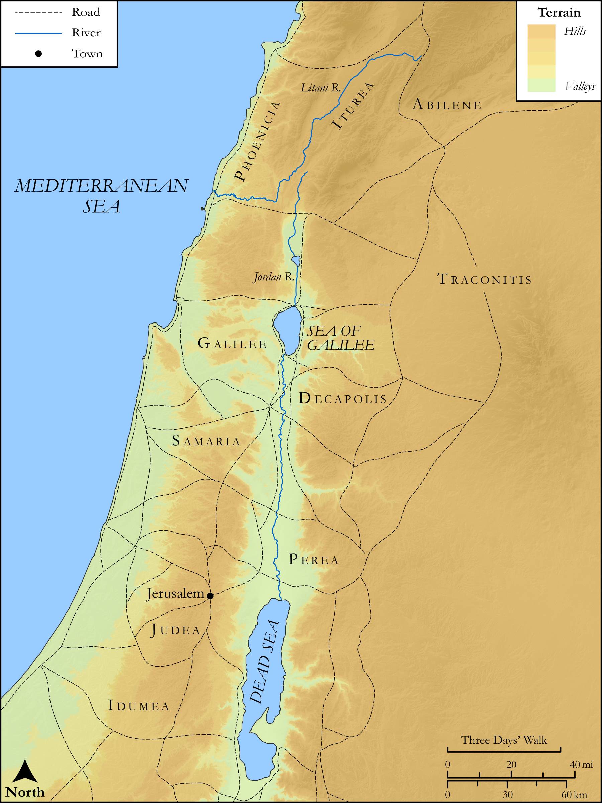

# Biblica Open Bible Maps

## License Information

Biblica Open Bible Maps, © 2023–2025 Biblica, Inc. This work is licensed under Creative Commons Attribution-ShareAlike 4.0 International (<a href="https://creativecommons.org/licenses/by-sa/4.0/">https://creativecommons.org/licenses/by-sa/4.0/</a>). More Information: <a href="https://docs.google.com/document/d/1Pp44yZ0Zdnd59vJHTrt2rPYq0SppfX5rZbPBt6mz37U/edit?tab=t.0#heading=h.oev9aj1ksvk2">https://docs.google.com/document/d/1Pp44yZ0Zdnd59vJHTrt2rPYq0SppfX5rZbPBt6mz37U/edit?tab=t.0#heading=h.oev9aj1ksvk2</a>

--------------------------------

## SRV Luke: Luke 3:1–13 (id: NT205)

### Image Content

[link](images/NT205.png)

Original: [SRV Luke: Luke 3:1\-13](https://drive.google.com/open?id=1PLMkF4mbD3u1s7S3Ys7BoEra6sAzNz50&usp=drive_copy)

* **Associated Passages:** Luke 3:1-38

* **Associated ACAI Concepts:** Baptism (ID: `keyterm:Baptism`); LORD (ID: `deity:Lord`); John (ID: `person:John`); Jesus (ID: `person:Jesus.2`); Herod Antipas (ID: `person:Herod.2`); Repent (ID: `keyterm:Repent`); Abraham (ID: `person:Abraham`); Straightness (ID: `keyterm:Straightness`); Sky (ID: `keyterm:Heaven`); Holy Spirit (ID: `deity:HolySpirit`); Shelah (ID: `person:Shelah.2`); Ituraea (ID: `place:Ituraea`); Mattathias (ID: `person:Mattathias.2`); Er (ID: `person:Er`); Melchi (ID: `person:Melchi`); Semein (ID: `person:Semein`); Melea (ID: `person:Melea`); Matthat (ID: `person:Matthat.2`); Eliakim (ID: `person:Eliakim.2`); Joseph (ID: `person:Joseph.4`); Adam (ID: `person:Adam`); Trachonitis (ID: `place:Trachonitis`); Jannai (ID: `person:Jannai`); Maath (ID: `person:Maath`); Heli (ID: `person:Heli`); Shem (ID: `person:Shem`); Joda (ID: `person:Joda`); Matthat (ID: `person:Matthat`); Shealtiel (ID: `person:Shealtiel`); Nahum (ID: `person:Nahum`); Herodias (ID: `person:Herodias`); Serug (ID: `person:Serug`); Lamech (ID: `person:Lamech.2`); Simeon (ID: `person:Simeon.3`); Jared (ID: `person:Jared`); Philip (ID: `person:Philip.3`); Abilene (ID: `place:Abilene`); Cainan (ID: `person:Cainan`); Levi (ID: `person:Levi.2`); Zerubbabel (ID: `person:Zerubbabel`); Hezron (ID: `person:Hezron.2`); Salmon (ID: `person:Salmon`); Cosam (ID: `person:Cosam`); Addi (ID: `person:Addi`); Kenan (ID: `person:Kenan`); Joanan (ID: `person:Joanan`); Melchi (ID: `person:Melchi.2`); Terah (ID: `person:Terah`); Boaz (ID: `person:Boaz`); Joshua (ID: `person:Joshua`); Mahalalel (ID: `person:Mahalalel`); Mattatha (ID: `person:Mattatha`); Josech (ID: `person:Josech`); Augustus (ID: `person:Augustus`); Tiberius (ID: `person:Tiberius`); Mattathias (ID: `person:Mattathias`); Jordan River (ID: `place:Jordan`); Reu (ID: `person:Reu`); Joseph (ID: `person:Joseph.8`); Peleg (ID: `person:Peleg`); Lysanias (ID: `person:Lysanias`); Menna (ID: `person:Menna`); Nathan (ID: `person:Nathan`); Joseph (ID: `person:Joseph.7`); Rhesa (ID: `person:Rhesa`); Jorim (ID: `person:Jorim`); Amos (ID: `person:Amos.2`); Enosh (ID: `person:Enosh`); Esli (ID: `person:Esli`); Neri (ID: `person:Neri`); Judah (ID: `person:Judah.3`); Nahor (ID: `person:Nahor`); Eber (ID: `person:Eber`); Annas (ID: `person:Annas`); Jonam (ID: `person:Jonam`); Naggai (ID: `person:Naggai`); Eliezer (ID: `person:Eliezer`); Levi (ID: `person:Levi`); Elmadam (ID: `person:Elmadam`); Methuselah (ID: `person:Methuselah`); Seth (ID: `person:Seth`); Arpachshad (ID: `person:Arpachshad`); Enoch (ID: `person:Enoch.2`); Beloved (ID: `keyterm:Beloved`); Tax Collector (ID: `keyterm:TaxCollector`); Isaac (ID: `person:Isaac`); To Sin (ID: `keyterm:Sin`); Forgive (ID: `keyterm:Forgive`); Pilate (ID: `person:Pilate`); Judea (ID: `place:Judea`); Pray (ID: `keyterm:Pray`); Israel (ID: `person:Israel`); Clean Out (ID: `keyterm:CleanOut`); Salvation (ID: `keyterm:Salvation`); Word (ID: `keyterm:Word`); Jesse (ID: `person:Jesse`); Proclaim (ID: `keyterm:Proclaim`); Ram (ID: `person:Ram`); Zechariah (ID: `person:Zechariah`); Galilee (ID: `place:Galilee`); Caiaphas (ID: `person:Caiaphas`); Heart (ID: `keyterm:Heart`); Noah (ID: `person:Noah`); Judah (ID: `person:Judah.4`); Amminadab (ID: `person:Amminadab`); Isaiah (ID: `person:Isaiah`); Perez (ID: `person:Perez`); Body (ID: `keyterm:Body.3`); David (ID: `person:David`); Nahshon (ID: `person:Nahshon`); Ask for (ID: `keyterm:AskFor`); Obed (ID: `person:Obed`); Strap (ID: `realia:Strap`); Barn (ID: `realia:Barn`); Wheat (ID: `flora:Wheat`); Grain (ID: `flora:Grain`); Dove (ID: `fauna:Dove`); Tunic (ID: `realia:Tunic.2`); Scroll (ID: `realia:Scroll`); Threshing Floor (ID: `realia:ThreshingFloor`); Axe (ID: `realia:Axe`); Winnowing Fork (ID: `realia:WinnowingFork`); Sandal (ID: `realia:Sandal`); Prison (ID: `realia:Prison`); Snake (ID: `fauna:Snake`)
