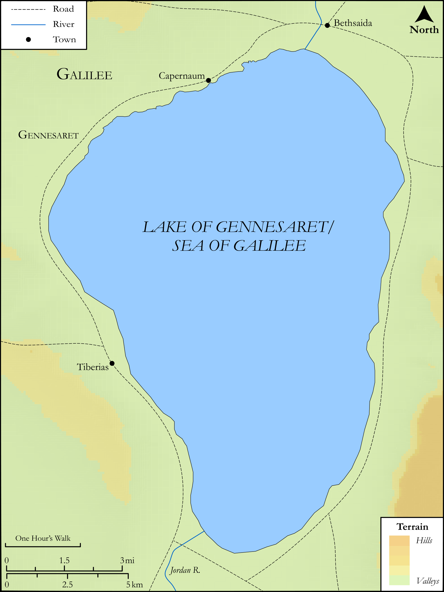

# Biblica Open Bible Maps

## License Information

Biblica Open Bible Maps, © 2023–2025 Biblica, Inc. This work is licensed under Creative Commons Attribution-ShareAlike 4.0 International (<a href="https://creativecommons.org/licenses/by-sa/4.0/">https://creativecommons.org/licenses/by-sa/4.0/</a>). More Information: <a href="https://docs.google.com/document/d/1Pp44yZ0Zdnd59vJHTrt2rPYq0SppfX5rZbPBt6mz37U/edit?tab=t.0#heading=h.oev9aj1ksvk2">https://docs.google.com/document/d/1Pp44yZ0Zdnd59vJHTrt2rPYq0SppfX5rZbPBt6mz37U/edit?tab=t.0#heading=h.oev9aj1ksvk2</a>

--------------------------------

## SRV Luke: Luke 5:1–11 (id: NT210)

### Image Content

[link](images/NT210.png)

Original: [SRV Luke: Luke 5:1\-11](https://drive.google.com/open?id=1b1vUisx1jW12yw6TfhCiHhDPCR4-oCnX&usp=drive_copy)

* **Associated Passages:** Luke 5:1-39

* **Associated ACAI Concepts:** Jesus (ID: `person:Jesus.2`); LORD (ID: `deity:Lord`); Peter (ID: `person:Peter`); To Sin (ID: `keyterm:Sin`); Forgive (ID: `keyterm:Forgive`); Pharisees (ID: `group:Pharisee`); Tax Collector (ID: `keyterm:TaxCollector`); Fishnet (ID: `realia:Fishnet`); Casting Net (ID: `realia:CastingNet`); Ship (ID: `realia:Ship`); Abstain from Food (ID: `keyterm:Fast`); To Cleanse (ID: `keyterm:Cleanse.2`); Bring In (ID: `keyterm:BringIn`); House (ID: `realia:House`); Bed (ID: `realia:Bed`); Pray (ID: `keyterm:Pray`); Fear (ID: `keyterm:Fear`); Glory (ID: `keyterm:Glory`); Be a Disciple (ID: `keyterm:Disciple`); Matthew (ID: `person:Matthew`); Ability (ID: `keyterm:Ability`); Infectious Skin Disease (ID: `keyterm:InfectiousSkinDisease`); Galilee (ID: `place:Galilee`); Fish (ID: `fauna:Fish`); Skin-Bottle (ID: `realia:Skin-bottle`); Temple (ID: `realia:Temple`); Must (ID: `realia:Must`); Judea (ID: `place:Judea`); Jerusalem (ID: `place:Jerusalem`); Believe (ID: `keyterm:Believe`); Heart (ID: `keyterm:Heart`); Repent (ID: `keyterm:Repent`); Parable (ID: `keyterm:Parable`); Blaspheme (ID: `keyterm:Blaspheme`); Religious Officials (ID: `group:ReligiousOfficials`); Gennesaret (ID: `place:Gennesaret`); Offering (ID: `keyterm:Offering`); John (ID: `person:John`); Word (ID: `keyterm:Word`); Be (Or Show Oneself) Just (ID: `keyterm:Just`); Zebedee (ID: `person:Zebedee`); John (ID: `person:John.2`); Serve (ID: `keyterm:Serve`); Authority (ID: `keyterm:Authority.2`); Tax Office (ID: `keyterm:TaxOffice`); Moses (ID: `person:Moses`); Name (ID: `keyterm:Name`); James (ID: `person:James`); Bear Witness (ID: `keyterm:BearWitness`); Ask for (ID: `keyterm:AskFor`); Good (ID: `keyterm:Good`); Tile (ID: `realia:Tile`); Patch (ID: `realia:Patch`); Clothing (ID: `realia:Clothing`); Housetop (ID: `realia:Housetop`)
