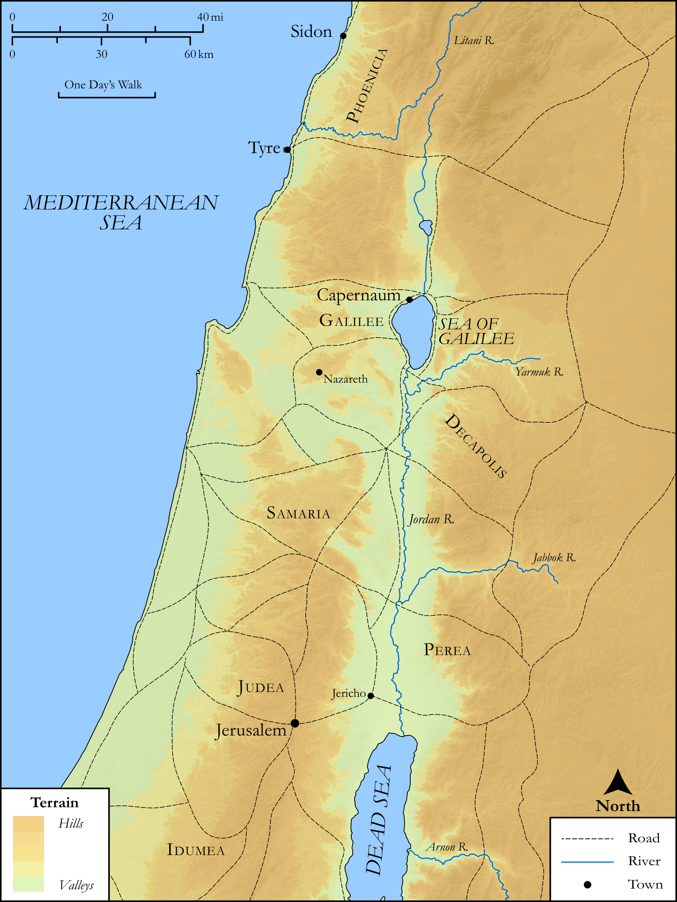

# Biblica Open Bible Maps

## License Information

Biblica Open Bible Maps, © 2023–2025 Biblica, Inc. This work is licensed under Creative Commons Attribution-ShareAlike 4.0 International (<a href="https://creativecommons.org/licenses/by-sa/4.0/">https://creativecommons.org/licenses/by-sa/4.0/</a>). More Information: <a href="https://docs.google.com/document/d/1Pp44yZ0Zdnd59vJHTrt2rPYq0SppfX5rZbPBt6mz37U/edit?tab=t.0#heading=h.oev9aj1ksvk2">https://docs.google.com/document/d/1Pp44yZ0Zdnd59vJHTrt2rPYq0SppfX5rZbPBt6mz37U/edit?tab=t.0#heading=h.oev9aj1ksvk2</a>

--------------------------------

## SRV Luke: Luke 6:17–18 (id: NT211)

### Image Content

[link](images/NT211.png)

Original: [SRV Luke: Luke 6:17\-18](https://drive.google.com/open?id=1On0IAgByfFjvlKB-g2RLy_tdf5r2Q27Q&usp=drive_copy)

* **Associated Passages:** Luke 6:1-49

* **Associated ACAI Concepts:** Sabbath (ID: `keyterm:Sabbath`); LORD (ID: `deity:Lord`); Be a Disciple (ID: `keyterm:Disciple`); Do Good (ID: `keyterm:DoGood`); Happy (ID: `keyterm:Happy`); Disaster (ID: `keyterm:Disaster`); Favor (ID: `keyterm:Favor`); Love (ID: `keyterm:Love`); Jesus (ID: `person:Jesus.2`); Be Lawful (ID: `keyterm:Lawful`); Pray (ID: `keyterm:Pray`); Serve (ID: `keyterm:Serve`); James (ID: `person:James.2`); Pharisees (ID: `group:Pharisee`); Good (ID: `keyterm:Good`); House (ID: `realia:House`); Chosen (ID: `keyterm:Chosen`); Compassionate (ID: `keyterm:Compassionate`); Condemn (ID: `keyterm:Condemn`); Simon (ID: `person:Simon.2`); Judas (ID: `person:Judas`); Matthew (ID: `person:Matthew`); Judea (ID: `place:Judea`); Jerusalem (ID: `place:Jerusalem`); Heart (ID: `keyterm:Heart`); Parable (ID: `keyterm:Parable`); Tyre (ID: `place:Tyre`); Sidon (ID: `place:Sidon`); Andrew (ID: `person:Andrew`); Alphaeus (ID: `person:Alphaeus`); Judas (ID: `person:Judas.2`); Salvation (ID: `keyterm:Salvation`); Decided (ID: `keyterm:Decided`); Sky (ID: `keyterm:Heaven`); David (ID: `person:David`); John (ID: `person:John.2`); Bartholomew (ID: `person:Bartholomew`); Bless (ID: `keyterm:Bless`); Peter (ID: `person:Peter`); Hope (ID: `keyterm:Hope`); Kingdom (ID: `keyterm:Kingdom`); Forgive (ID: `keyterm:Forgive`); James (ID: `person:James`); Name (ID: `keyterm:Name`); Ask for (ID: `keyterm:AskFor`); Thomas (ID: `person:Thomas`); Life (ID: `keyterm:Life`); Philip (ID: `person:Philip`); Ability (ID: `keyterm:Ability`); Beam (ID: `realia:Beam`); Foundation (ID: `realia:Foundation`); Storeroom (ID: `realia:Storeroom`); Cloak (ID: `realia:Cloak`); Wheat (ID: `flora:Wheat`); Grain (ID: `flora:Grain`); Thistle (ID: `flora:Thistle`); Brier (ID: `flora:Brier`); Boxthorn (ID: `flora:Boxthorn`); Fig (ID: `flora:Fig`); Temple (ID: `realia:Temple`); Tunic (ID: `realia:Tunic.2`); Synagogue (ID: `realia:Synagogue`); Acacia (ID: `flora:Acacia`); Vine (ID: `flora:Vine`)
