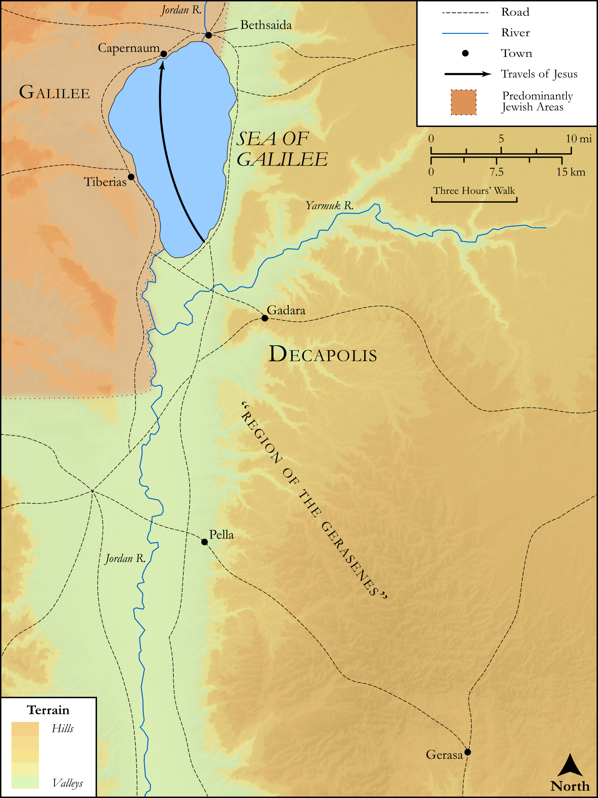

# Biblica Open Bible Maps

## License Information

Biblica Open Bible Maps, © 2023–2025 Biblica, Inc. This work is licensed under Creative Commons Attribution-ShareAlike 4.0 International (<a href="https://creativecommons.org/licenses/by-sa/4.0/">https://creativecommons.org/licenses/by-sa/4.0/</a>). More Information: <a href="https://docs.google.com/document/d/1Pp44yZ0Zdnd59vJHTrt2rPYq0SppfX5rZbPBt6mz37U/edit?tab=t.0#heading=h.oev9aj1ksvk2">https://docs.google.com/document/d/1Pp44yZ0Zdnd59vJHTrt2rPYq0SppfX5rZbPBt6mz37U/edit?tab=t.0#heading=h.oev9aj1ksvk2</a>

--------------------------------

## SRV Luke: Luke 8:40–55 (id: NT216)

### Image Content

[link](images/NT216.png)

Original: [SRV Luke: Luke 8:40\-55](https://drive.google.com/open?id=1AXLytuapOtv2Hy5B6rBFskNkndrfqbQl&usp=drive_copy)

* **Associated Passages:** Luke 8:1-56

* **Associated ACAI Concepts:** Jesus (ID: `person:Jesus.2`); Demons (ID: `deity:Demons`); LORD (ID: `deity:Lord`); Believe (ID: `keyterm:Believe`); Parable (ID: `keyterm:Parable`); Salvation (ID: `keyterm:Salvation`); Fear (ID: `keyterm:Fear`); Ask for (ID: `keyterm:AskFor`); Serve (ID: `keyterm:Serve`); House (ID: `realia:House`); Gerasa (ID: `place:Gerasa`); Daily Life (ID: `keyterm:DailyLife`); Heart (ID: `keyterm:Heart`); Proclaim (ID: `keyterm:Proclaim`); Peter (ID: `person:Peter`); Kingdom (ID: `keyterm:Kingdom`); Name (ID: `keyterm:Name`); Blood (ID: `keyterm:Blood`); Be a Disciple (ID: `keyterm:Disciple`); Be Demon Possessed (ID: `keyterm:DemonPossessed`); Legion (ID: `deity:Legion`); Susanna (ID: `person:Susanna`); Mary Magdalene (ID: `person:Marymagdalene`); Jairus (ID: `person:Jairus`); Honest (ID: `keyterm:Honest`); Abyss (ID: `keyterm:Abyss`); Chuza (ID: `person:Chuza`); Joanna (ID: `person:Joanna`); A Man (ID: `person:GenericMale`); Herod Antipas (ID: `person:Herod.2`)
