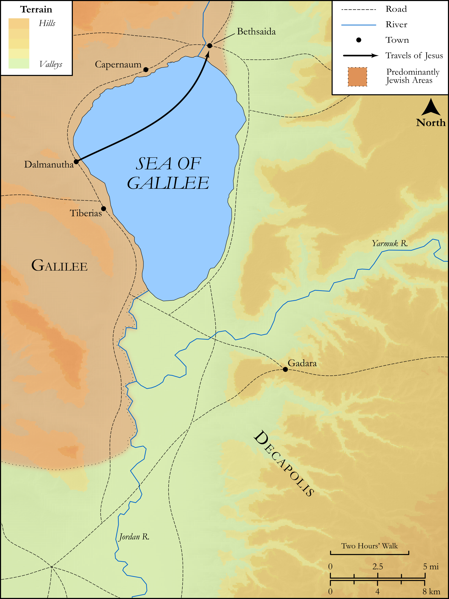

# Biblica Open Bible Maps

## License Information

Biblica Open Bible Maps, © 2023–2025 Biblica, Inc. This work is licensed under Creative Commons Attribution-ShareAlike 4.0 International (<a href="https://creativecommons.org/licenses/by-sa/4.0/">https://creativecommons.org/licenses/by-sa/4.0/</a>). More Information: <a href="https://docs.google.com/document/d/1Pp44yZ0Zdnd59vJHTrt2rPYq0SppfX5rZbPBt6mz37U/edit?tab=t.0#heading=h.oev9aj1ksvk2">https://docs.google.com/document/d/1Pp44yZ0Zdnd59vJHTrt2rPYq0SppfX5rZbPBt6mz37U/edit?tab=t.0#heading=h.oev9aj1ksvk2</a>

--------------------------------

## SRV Luke: Luke 9:1–16 (id: NT217)

### Image Content

[link](images/NT217.png)

Original: [SRV Luke: Luke 9:1\-16](https://drive.google.com/open?id=1VQWZHhAhOdyYUybDZuZ9jqpDZlX_pSkX&usp=drive_copy)

* **Associated Passages:** Mark 8:1-38

* **Associated ACAI Concepts:** Be a Disciple (ID: `keyterm:Disciple`); Peter (ID: `person:Peter`); Life (ID: `keyterm:Life`); To Command (ID: `keyterm:Command`); Basket (ID: `realia:Basket`); A Group of Disciples (ID: `group:GenericDisciples`); LORD (ID: `deity:Lord`); Symbol (ID: `keyterm:Example`); Jesus (ID: `person:Jesus.2`); Ask for (ID: `keyterm:AskFor`); Pharisees (ID: `group:Pharisee`); Bethsaida (ID: `place:Bethsaida`); Baptist (ID: `keyterm:Baptist`); Caesarea Philippi (ID: `place:CaesareaPhilippi`); House (ID: `realia:House`); Temple (ID: `realia:Temple`); Ship (ID: `realia:Ship`); Heart (ID: `keyterm:Heart`); Elijah (ID: `person:Elijah`); Satan (ID: `deity:Satan`); Affection (ID: `keyterm:Affection`); Think (ID: `keyterm:Think`); Herod Antipas (ID: `person:Herod.2`); Spirit (ID: `keyterm:Spirit.2`); John (ID: `person:John`); Magadan (ID: `place:Magadan`); Salvation (ID: `keyterm:Salvation`); Sky (ID: `keyterm:Heaven`); Good News (ID: `keyterm:GoodNews`); Reject (ID: `keyterm:Reject`); Bless (ID: `keyterm:Bless`); Surely! (ID: `keyterm:Surely`); Glory (ID: `keyterm:Glory`); Holy (ID: `keyterm:Holy`); An Angel (ID: `deity:Angel`); Be Unfaithful (ID: `keyterm:Unfaithful`); Ability (ID: `keyterm:Ability`); Cross (ID: `realia:Cross`); Fish (ID: `fauna:Fish`)
