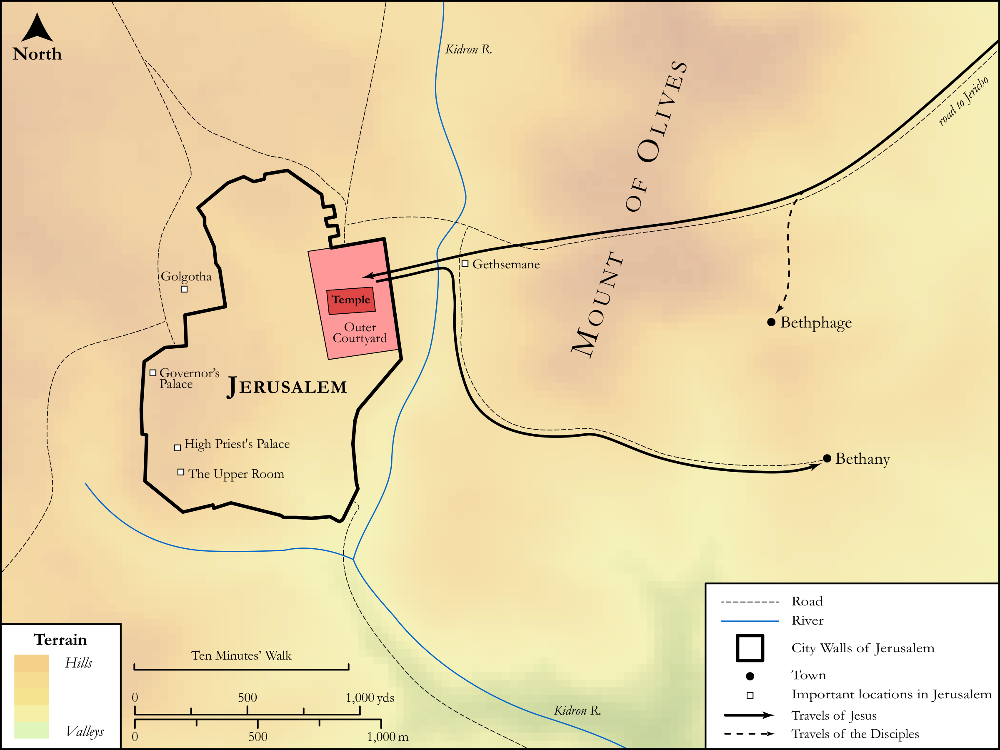

# Biblica Open Bible Maps

## License Information

Biblica Open Bible Maps, © 2023–2025 Biblica, Inc. This work is licensed under Creative Commons Attribution-ShareAlike 4.0 International (<a href="https://creativecommons.org/licenses/by-sa/4.0/">https://creativecommons.org/licenses/by-sa/4.0/</a>). More Information: <a href="https://docs.google.com/document/d/1Pp44yZ0Zdnd59vJHTrt2rPYq0SppfX5rZbPBt6mz37U/edit?tab=t.0#heading=h.oev9aj1ksvk2">https://docs.google.com/document/d/1Pp44yZ0Zdnd59vJHTrt2rPYq0SppfX5rZbPBt6mz37U/edit?tab=t.0#heading=h.oev9aj1ksvk2</a>

--------------------------------

## SRV Luke: Luke 19:28–43 (id: NT227)

### Image Content

[link](images/NT227.png)

Original: [SRV Luke: Luke 19:28\-43](https://drive.google.com/open?id=1kI70EZwwE7l3eHRsip52A3BKH0jRmpwI&usp=drive_copy)

* **Associated Passages:** Mark 11:1-33

* **Associated ACAI Concepts:** Jesus (ID: `person:Jesus.2`); Temple (ID: `realia:Temple`); Jerusalem (ID: `place:Jerusalem`); Believe (ID: `keyterm:Believe`); Bethany (ID: `place:Bethany`); Donkey (ID: `fauna:Donkey`); Pray (ID: `keyterm:Pray`); LORD (ID: `deity:Lord`); Sky (ID: `keyterm:Heaven`); Authority (ID: `keyterm:Authority.2`); Ability (ID: `keyterm:Ability`); Hosanna (ID: `keyterm:Hosanna`); Fig (ID: `flora:Fig`); A Group of People (ID: `group:GenericGroup`); John (ID: `person:John`); Fear (ID: `keyterm:Fear`); Bless (ID: `keyterm:Bless`); Be a Disciple (ID: `keyterm:Disciple`); Bethphage (ID: `place:Bethphage`); Cloak (ID: `realia:Cloak`); Heart (ID: `keyterm:Heart`); Height (ID: `keyterm:Height`); Discern (ID: `keyterm:Discern`); Religious Officials (ID: `group:ReligiousOfficials`); Always (ID: `keyterm:Always`); David (ID: `person:David`); Baptism (ID: `keyterm:Baptism`); Peter (ID: `person:Peter`); Surely! (ID: `keyterm:Surely`); Priests (ID: `group:GenericPriests`); Kingdom (ID: `keyterm:Kingdom`); Forgive (ID: `keyterm:Forgive`); Name (ID: `keyterm:Name`); Elders (ID: `group:GenericElders`); Rush (ID: `flora:Rush`); Seat (ID: `realia:Seat`); Dove (ID: `fauna:Dove`); House (ID: `realia:House`); Olive Tree (ID: `flora:OliveTree`)
